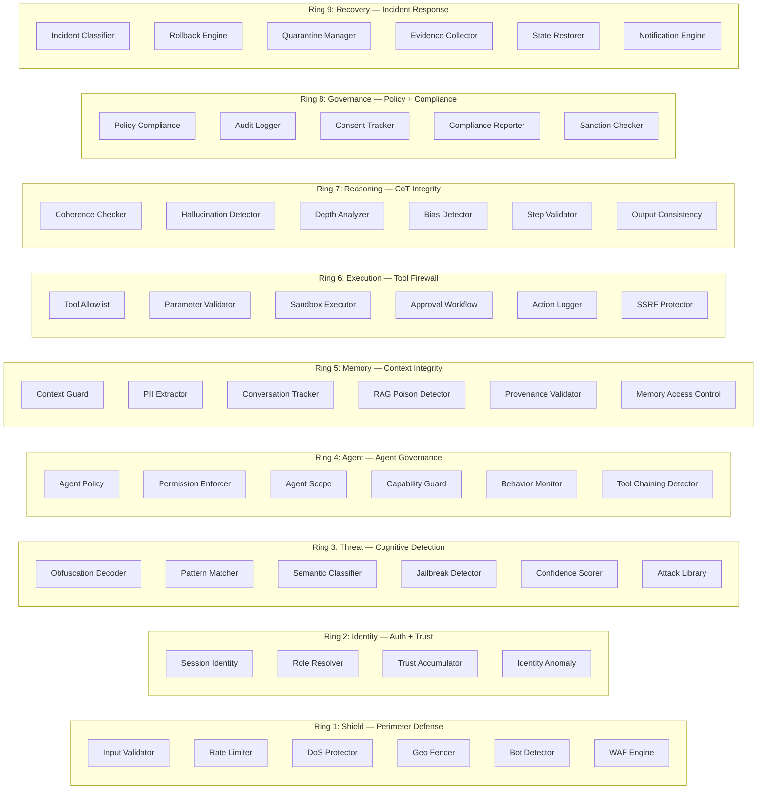

# Product Overview

> **Purpose:** A comprehensive reference of CHAKRAVYUH's capabilities — ring-by-ring feature summary, OWASP LLM Top 10 coverage, performance highlights, security guarantees, and a comparison with alternative approaches.

---

## Feature Matrix

### Core System

| Feature | Status | Notes |
|---|---|---|
| 9 Security Rings | Complete | Shield, Identity, Threat, Agent, Memory, Execution, Reasoning, Governance, Recovery |
| 5 Cross Rings | Complete | Command, Intel, Control, Communication, Recovery |
| Keshav Core (Decide) | Complete | Rule-based policy engine, YAML-configurable |
| Keshav Core (Risk) | Complete | 8-dimension composite risk scoring with static weights |
| Keshav Core (Learn) | Complete | ML-based risk scoring, anomaly detection, pattern learning, feedback loop |
| Keshav Core (Orchestrate) | Complete | Static routing with parallel/sequential ring evaluation |
| Policy Compiler | Complete | YAML to bytecode VM, versioned policies |
| ANANTA Trust Plane | Complete | 18 subsystems, independent config, zero hot-path impact |
| HTTP API (axum) | Complete | 20+ endpoints including evaluate, proxy, execute |
| gRPC API (tonic) | Complete | Protobuf service for ring-to-ring communication |
| CLI | Complete | 14+ subcommands for offline and online operations |
| In-Memory Storage | Complete | Zero-dependency default |
| Redis Storage | Complete | Optional via `--features redis` |
| Built-in TLS | Complete | Optional via `--features tls`, rustls 0.23 |
| Config Hot-Reload | Complete | File watcher via notify 8.0 |
| Tamper-Evident Audit | Complete | SHA-256 hash-chained decision log |
| API Key Auth | Complete | HMAC-SHA256 signed keys |
| Prometheus Metrics | Complete | `/metrics` endpoint |
| OpenTelemetry | Complete | Trace integration |
| Multi-Tenant | Complete | Per-tenant quotas, policies, context isolation |
| WASM Plugin System | Complete | Sandboxed plugin runtime, marketplace support |
| Security Digital Twin | Complete | Scenario simulation and prediction |
| Federated Threat Intel | Complete | FedAvg, differential privacy, threat sync |
| Incident Response | Complete | Playbooks, webhooks, evidence chain |

### Validation Platform (Phase D)

| Feature | Status | Notes |
|---|---|---|
| Red Team OS | Complete | 10 attack categories, generators, encoders, combinatorial mutators |
| Soak Testing | Complete | Long-running stability, memory leak detection, drift detection |
| Performance Profiling | Complete | Load generation, metrics collection, report generation |
| Chaos Engineering | Complete | Fault injection, health monitoring, recovery metrics |
| Comparative Benchmarks | Complete | A/B comparison store and benchmark runner |
| Security Twin Verification | Complete | Twin-based verification with predictor and comparator |
| Formal Verification | Complete | Evidence-based verification with metrics |
| ANANTA Verification | Complete | Corruption detection, drift injection, spec runner |
| Property-Based Tests | Complete | proptest-based property invariants |
| Fuzz Testing | Complete | 16 libFuzzer targets with seed corpora |

---

## Ring Summary

CHAKRAVYUH's 9 security rings form a layered defense. Each ring contains multiple engines that run independently and produce verdicts that Keshav Core combines into a final decision.



### Ring Detail Table

| Ring | # Engines | Key Engines | p99 Budget | Status |
|---|---|---|---|---|
| Shield (1) | 6 | WAF, Rate Limiter, DoS Protector, Geo Fencer, Bot Detector, Input Validator | <10ms | Complete |
| Identity (2) | 4 | Session Identity, Role Resolver, Trust Accumulator, Identity Anomaly | <1ms | Complete |
| Threat (3) | 6 | Pattern Matcher, Semantic Classifier, Jailbreak Detector, Obfuscation Decoder, Confidence Scorer, Attack Library | <20ms | Complete |
| Agent (4) | 6 | Agent Policy, Permission Enforcer, Agent Scope, Capability Guard, Behavior Monitor, Tool Chaining Detector | <1ms | Complete |
| Memory (5) | 6 | Context Guard, PII Extractor, Conversation Tracker, RAG Poison Detector, Provenance Validator, Memory Access Control | <1ms | Complete |
| Execution (6) | 6 | Tool Allowlist, Parameter Validator, Sandbox Executor, Approval Workflow, Action Logger, SSRF Protector | <1ms | Complete |
| Reasoning (7) | 6 | Coherence Checker, Hallucination Detector, Depth Analyzer, Bias Detector, Step Validator, Output Consistency | <1ms | Complete |
| Governance (8) | 5 | Policy Compliance, Audit Logger, Consent Tracker, Compliance Reporter, Sanction Checker | <1ms | Complete |
| Recovery (9) | 6 | Incident Classifier, Rollback Engine, Quarantine Manager, Evidence Collector, State Restorer, Notification Engine | <1ms | Complete |
| **Total** | **51** | | | |

---

## OWASP LLM Top 10 Coverage

CHAKRAVYUH maps directly to the OWASP LLM Top 10 (2025) taxonomy:

| OWASP LLM | Risk | CHAKRAVYUH Defense | Ring(s) | Coverage |
|---|---|---|---|---|
| **LLM01** | Prompt Injection | WAF (40+ regex rules), Pattern Matcher, Semantic Classifier, Jailbreak Detector, Obfuscation Decoder | Shield + Threat | **100% detection, 0% FP** |
| **LLM02** | Insecure Output Handling | Parameter Validator, Sandbox Executor, Action Logger | Execution | Covered |
| **LLM03** | Training Data Poisoning | Out of scope (pre-training) | — | N/A |
| **LLM04** | Model DoS | Rate Limiter (token bucket), DoS Protector (5-sigma anomaly detection) | Shield | Covered |
| **LLM05** | Supply Chain Vulnerabilities | Governance Ring (compliance reporting), Plugin System (WASM sandbox) | Governance + Plugin | Covered |
| **LLM06** | Sensitive Information Disclosure | PII Extractor (SSN, email, phone, etc.), Memory Access Control | Memory | Covered |
| **LLM07** | Insecure Plugin Design | Agent Policy, Capability Guard, Permission Enforcer | Agent + Plugin | Covered |
| **LLM08** | Excessive Agency | Agent Scope, Behavior Monitor, Tool Chaining Detector, Execution Ring full pipeline | Agent + Execution | Covered |
| **LLM09** | Overreliance on LLM | Reasoning Ring (coherence, hallucination, bias, step validation) | Reasoning | Covered |
| **LLM10** | Model Theft | Identity Ring (auth, trust scoring), Governance Ring (audit, compliance) | Identity + Governance | Covered |

**Result:** 9 of 10 OWASP LLM Top 10 risks covered. LLM03 (Training Data Poisoning) is out of scope as it occurs during model training, not inference.

---

## Performance Highlights

### OWASP LLM01 Benchmark

529 attack patterns (15 categories) + 103 benign prompts through the full pipeline (Shield → Threat → Keshav-Decide → Keshav-Risk):

| Metric | Result | Target | Status |
|---|---|---|---|
| Detection Rate | **100.00%** | >= 90% | PASS |
| False Positive Rate | **0.00%** | <= 1% | PASS |
| p99 Latency | **0.74ms** | < 25ms | PASS |

Run the benchmark:

```bash
cargo test --release --test owasp_llm01_benchmark -- --nocapture
```

### Per-Ring Latency

| Ring | Warm Latency | Cold (First Request) | Budget | Status |
|---|---|---|---|---|
| Shield (6 engines) | 0.05–7ms | ~7ms (regex compilation) | <10ms p99 | Met |
| Threat (6 engines) | 0.3–0.6ms | — | <20ms p99 | Met |
| Identity (4 engines) | <0.3ms | — | <1ms p99 | Met |
| Agent (6 engines) | <0.6ms | — | <1ms p99 | Met |
| Memory (6 engines) | <0.7ms | — | <1ms p99 | Met |
| Execution (6 engines) | <0.5ms | — | <1ms p99 | Met |

### Full Pipeline

| Metric | Value |
|---|---|
| Simple prompt (Shield + Threat + Keshav) | <1ms typical |
| Full evaluation (all 9 rings + Keshav) | <10ms typical |
| Architecture budget: simple | <10ms |
| Architecture budget: full | <50ms |

### Build Profile

The release binary is optimized for production:

```toml
[profile.release]
opt-level = 3
lto = "thin"
codegen-units = 1
strip = true
panic = "abort"
```

---

## Security Guarantees

### Code-Level Guarantees

| Guarantee | Implementation |
|---|---|
| No unsafe code | `#![deny(unsafe_code)]` at crate root |
| Memory safety | Rust's ownership system (no GC, no data races) |
| Zero vulnerabilities | `cargo audit` clean — 0 advisories |
| Clippy clean | `cargo clippy --all-targets --all-features -- -D warnings` passes |
| 3200+ tests | Unit, integration, property-based, fuzz, benchmark |

### Architecture-Level Guarantees

| Principle | Guarantee |
|---|---|
| Decide-without-Learn | Keshav-Decide uses rules, not ML. Works without Keshav-Learn. |
| Fail Secure | Any ring error → default deny. No silent fallback to allow. |
| Independent Deployment | Each ring is a separate module with its own config section. |
| ANANTA Isolation | ANANTA loads from its own config file. Never depends on Keshav. |
| Latency Budget | <10ms simple, <50ms full. Every ring has a per-ring budget. |
| Observability | Every evaluation produces a `DecisionRecord` with full provenance. |
| Backward Compatibility | v1.0.0 FROZEN — no breaking changes without major version. |
| No Magic | Every deny is explainable via engine results and reasoning strings. |

### Dependency Security

Key security dependencies with their versions and notes:

| Dependency | Version | Purpose |
|---|---|---|
| rustls | 0.23 | TLS termination (no OpenSSL) |
| ed25519-dalek | 2.1 | ANANTA cryptographic signatures |
| aes-gcm | 0.10 | ANANTA encryption (AES-256-GCM) |
| blake3 | 1.5 | ANANTA hashing |
| sha2 | 0.10 | Integrity verification (SHA-256/512) |
| hmac | 0.12 | API key authentication |
| subtle | 2.6 | Constant-time comparisons |
| pbkdf2 | 0.12 | Key derivation |

Run `cargo audit` at any time to verify zero vulnerabilities.

---

## Comparison with Alternatives

### CHAKRAVYUH vs. Traditional WAFs

| Dimension | Traditional WAF (ModSecurity, Cloudflare WAF) | CHAKRAVYUH |
|---|---|---|
| Threat model | HTTP-layer attacks (SQLi, XSS, RFI) | Cognitive AI attacks (prompt injection, agent hijacking, memory poisoning, tool abuse) |
| Detection method | Regex on HTTP requests | 51 engines across 9 rings, semantic analysis, obfuscation decoding |
| Tool call protection | None | Execution Ring with allowlist, parameter validation, sandbox, SSRF protection |
| Agent governance | None | Agent Ring with per-type policies, capability gating, behavior monitoring |
| Memory security | None | Memory Ring with RAG poison detection, context integrity, PII extraction |
| Trust scoring | IP reputation | Per-identity trust scoring with decay, anomaly detection |
| Policy engine | Rule files | Keshav Core: rule-based + ML-augmented, composite risk scoring |
| Self-protection | None | ANANTA Trust Plane: integrity verification, drift detection, attestation |

### CHAKRAVYUH vs. LLM-Specific Gateways

| Dimension | LLM Gateway (LiteLLM, Langfuse) | CHAKRAVYUH |
|---|---|---|
| Primary purpose | Routing, logging, cost tracking | Security enforcement |
| Prompt injection defense | Basic content filtering | Shield WAF + Threat Ring (6 engines, 62 attack signatures, 9 jailbreak families) |
| Agent security | None | Agent + Execution rings (12 engines) |
| Memory poisoning | None | Memory Ring (6 engines including RAG poison detector) |
| OWASP LLM coverage | Partial | 9/10 risks covered |
| Self-protection | None | ANANTA (18 subsystems) |
| Architecture | Proxy + middleware | 9-ring operating system with cross-ring coordination |
| Latency | Network-dependent | <1ms typical (in-process) |
| Deployment | Python-based, containerized | Rust binary, zero runtime dependencies |
| Open source | Yes | Yes (Apache-2.0) |

### CHAKRAVYUH vs. Cloud AI Security Products

| Dimension | Cloud AI Security (Azure AI Safety, AWS Bedrock Guardrails) | CHAKRAVYUH |
|---|---|---|
| Vendor lock-in | Tied to cloud provider | Runs on your infrastructure, your terms |
| Transparency | Black-box models | Every deny is explainable, full source code available |
| Customization | Limited to provider's options | YAML config, policy compiler, WASM plugins |
| Multi-provider | Provider-specific | OpenAI-compatible proxy, works with any LLM |
| Self-hosting | Not possible | Single Rust binary, no database required |
| ANANTA | No equivalent | Independent trust plane for self-verification |

---

## Decision Types

Every CHAKRAVYUH evaluation produces one of four decisions:

```mermaid
digraph DecisionTypes {
    rankdir=LR
    node [shape=box, style=rounded]

    Allow [label="Allow\nHTTP 200\nRequest proceeds"]
    Deny [label="Deny\nHTTP 403\nRequest blocked\ncode + retry_after"]
    Challenge [label="Challenge\nHTTP 401\nCAPTCHA / JS / 2FA / Email"]
    Escalate [label="Escalate\nHTTP 202\nHuman approval\napprover_role + timeout"]

    Allow [color="#2d8a4e"]
    Deny [color="#c0392b"]
    Challenge [color="#d4a017"]
    Escalate [color="#2e86c1"]
}
```

### Code Example: Working with Decisions

```rust
use chakravyuh::{Decision, RiskScore};

// Check decision type
let decision = Decision::Deny {
    code: "THREAT_PROMPT_INJECTION".into(),
    retry_after: None,
};
assert!(!decision.is_allow());
assert!(decision.is_deny());
assert_eq!(decision.http_status(), 403);

// Risk score with 8 dimensions
let risk = RiskScore {
    overall: 0.85,
    threat: 0.92,
    identity: 0.1,
    behavior: 0.0,
    memory: 0.0,
    execution: 0.0,
    context: 0.3,
    confidence: 0.97,
};

// Default risk score (all zeros, confidence 1.0)
let safe = RiskScore::default();
assert_eq!(safe.overall, 0.0);
assert_eq!(safe.confidence, 1.0);
```

---

## Keshav Core Subsystems

| Subsystem | What it does | Phase |
|---|---|---|
| Keshav-Decide | Rule-based policy engine with YAML-configurable rules | 2 |
| Keshav-Risk | Composite risk scoring (8 weighted signals) | 3 |
| Keshav-Learn | ML-based risk scoring, anomaly detection, pattern learning | 4 |
| Keshav-Orchestrate | Ring coordination with static routing | 3 |
| Policy Engine | YAML rules, default deny on any ring deny | 2 |
| Decision Logger | Append-only audit log with JSON + CSV export | 2 |
| Fallback Rules | Hardcoded safety net (Fail Secure principle) | 2 |
| Threshold Optimizer | Adaptive threshold tuning from traffic patterns | 4 |
| Anomaly Profiler | Behavioral baselining and anomaly scoring | 4 |
| Feedback Collector | Decision feedback loop (FP/FN/approve/reject) | 4 |
| Pattern Store | Versioned attack pattern storage and retrieval | 4 |
| Policy Manager | Hot-reload policy management with file watching | 7 |
| Policy Compiler | YAML to bytecode VM for compiled policy execution | 7 |

---

## Best Practices

### 1. Enable Rings Incrementally

Start with Shield + Threat (covers OWASP LLM01/LLM04). Add Identity for authenticated environments, Memory for RAG-based agents, and Execution/Agent for tool-calling agents.

### 2. Use the /v1/proxy Endpoint for OpenAI Compatibility

CHAKRAVYUH's `/v1/proxy` is a drop-in OpenAI-compatible reverse proxy. Point your existing LLM client at CHAKRAVYUH instead of OpenAI, and every request gets evaluated automatically.

```yaml
upstream:
  url: "https://api.openai.com/v1/chat/completions"
  api_key: "sk-your-key-here"
  timeout_secs: 60
```

### 3. Use /v1/execute for Tool-Calling Agents

For AI agents that make tool calls, use `/v1/execute` instead of `/v1/evaluate`. This activates the Agent Ring and Execution Ring in addition to the standard pipeline.

### 4. Monitor Decision Records

Every evaluation produces a `DecisionRecord` with ring verdicts, risk scores, reasoning, and latency. Export via `/v1/decisions/export` for analysis.

### 5. Run the OWASP Benchmark in Your Environment

```bash
cargo test --release --test owasp_llm01_benchmark -- --nocapture
```

This validates that your configuration maintains detection and latency targets.

---

## Troubleshooting

### Decision quality issues

1. **Too many false positives:** Check which engine is firing via `/v1/decisions`. Tune the relevant ring's `deny_threshold`.
2. **Missed attacks:** Run `chakravyuh evaluate prompt "attack text" --verbose` to see per-engine scores. The attack may need a new pattern in the Attack Library.
3. **All requests denied:** Check that your Identity Ring config allows your API key prefix. The default requires keys starting with `sk-` or `pk-`.

### Performance issues

1. **High latency on first request:** WAF regex compilation on first use (~7ms cold, 0.05ms warm). Expected behavior.
2. **Rate limiter blocking legitimate traffic:** Increase `per_ip` or `per_api_key` limits in `shield.rate_limiter.limits`.
3. **High memory usage:** The in-memory rate limiter stores state for up to 10K identities. Switch to Redis for multi-instance deployments.

### ANANTA issues

1. **ANANTA not starting:** Ensure `ananta_config_path` is set in your main config and the file is a valid ANANTA config. Check startup logs for `ANANTA initialization failed`.
2. **System works without ANANTA:** This is by design. ANANTA is optional. The base 9 rings + Keshav Core function independently.

---

## Cross-References

| Topic | Document |
|---|---|
| Why CHAKRAVYUH exists, design philosophy | [Introduction](./INTRODUCTION.md) |
| Installation and first requests | [Quick Start Guide](./QUICK_START.md) |
| API stability guarantee | [API Stability](../API_STABILITY.md) |
| Public API surface | [API Surface v1](../api_surface_v1.md) |
| Full configuration reference | [config.example.yaml](../../configs/config.example.yaml) |
| ANANTA configuration | [ananta.example.yaml](../../configs/ananta.example.yaml) |
| gRPC service definitions | [chakravyuh.proto](../../proto/chakravyuh.proto) |
| Source repository | [github.com/vinomoid/chakravyuh](https://github.com/vinomoid/chakravyuh) |

---

*CHAKRAVYUH v1.0.0 FROZEN — Apache-2.0 License — [VINOMOID](https://github.com/vinomoid)*
