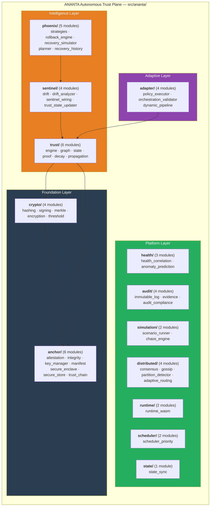
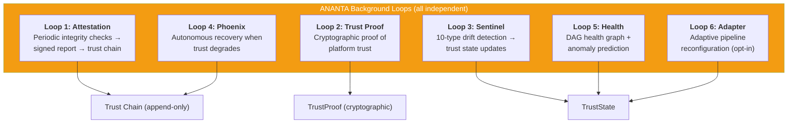
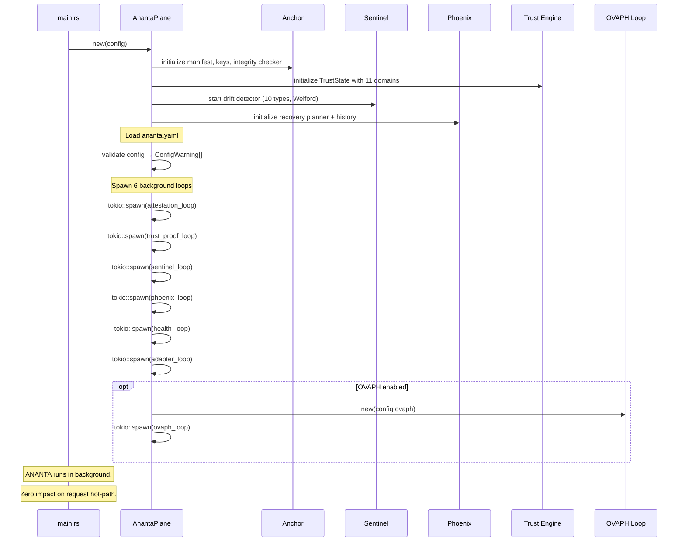

# ANANTA — Autonomous Trust Plane

> **Source**: `src/ananta/`
> **Config**: `configs/ananta.example.yaml` (independent from Keshav)
> **Cross-References**: [Architecture](./ARCHITECTURE.md) · [Sentinel](./SENTINEL.md) · [Phoenix](./PHOENIX.md) · [Trust Engine](./TRUST_ENGINE.md) · [OVAPH Loop](./OVAPH.md)

---

## 1. Overview

ANANTA is NOT a ring. It is a supervisory plane that exists **above and outside** the 9 defense rings and Keshav Core. It answers the question:

> **"Can the security system itself still be trusted?"**

The name ANANTA ("The Infinite One") reflects its role as the ever-present guardian of the guardian. It monitors, verifies, and autonomously recovers the security system without ever impacting the hot path.

### Critical Design Constraints

| Constraint | Implementation |
|-----------|---------------|
| ANANTA never depends on Keshav | No imports from `src/keshav/` |
| Independent configuration | Separate `ananta.yaml`; `AnantaConfig::from_yaml()` |
| Zero hot-path impact | All work is async background (`tokio::spawn`) |
| Optional | System works without it in degraded mode |
| Separate state directory | `state_path` must be on different mount point |

---

## 2. 13 Subsystems Across 18 Modules



---

## 3. Independent Configuration

> **Source**: `src/ananta/config.rs`

ANANTA loads from a separate `ananta.yaml` file. It cannot trust Keshav's config because ANANTA's job is to protect Keshav.

### Top-Level Structure

```rust
pub struct AnantaConfig {
    pub enabled: bool,                          // Master switch
    pub sentinel: SentinelConfig,               // Drift detection
    pub phoenix: PhoenixConfig,                 // Recovery
    pub anchor: AnchorConfig,                   // Root of trust
    pub adapter: AdapterConfig,                 // Adaptive orchestration
    pub trust_proof: TrustProofConfig,          // Trust proof generation
    pub health: HealthConfig,                   // Health graph
    pub audit: AuditConfig,                     // Immutable audit
    pub distributed: DistributedConfig,         // Multi-node
    pub state_path: String,                     // Separate from Keshav
    pub crypto: CryptoConfig,                   // Algorithm suite
}
```

### Configuration Validation

The `AnantaConfig::validate()` method returns `Vec<ConfigWarning>` for questionable values:

| Field | Warning | Severity |
|-------|---------|----------|
| `sentinel.check_interval_ms < 100` | Excessive CPU usage | Warning |
| `trust_proof.generation_interval_ms < 1000` | Performance impact | Warning |
| `phoenix.max_recovery_actions_per_hour > 100` | Instability indicator | Info |
| `distributed.quorum_size < 2` | No fault tolerance | Warning |

### Subsystem Config Defaults

| Subsystem | Key Defaults |
|-----------|-------------|
| **Sentinel** | `check_interval_ms: 1000`, `drift_window_size: 1000`, `drift_sigma_threshold: 3.0`, `enable_full_drift_detection: true` |
| **Phoenix** | `autonomous: true`, `max_recovery_actions_per_hour: 20`, `recovery_cooldown_ms: 30000`, `action_confidence_threshold: 0.85` |
| **Anchor** | `verify_runtime_integrity: true`, `key_rotation_hours: 720`, `encrypted_store: true` |
| **Adapter** | `enabled: false` (opt-in safety), `require_signed_changes: true`, `adaptation_grace_period_ms: 300000` |
| **Trust Proof** | `enabled: true`, `generation_interval_ms: 5000`, `retention_count: 1000` |
| **Health** | `enabled: true`, `computation_interval_ms: 2000`, `prediction_window_secs: 300` |
| **Audit** | `enabled: true`, `max_entries_before_compaction: 100000`, `chained_entries: true` |
| **Crypto** | `hash_algorithm: Sha256`, `kdf_iterations: 100000` |

---

## 4. Background Loops

ANANTA runs 6 independent background loops. All are `tokio::spawn` tasks with zero hot-path impact.



---

## 5. AnantaPlane — Top-Level Orchestrator

> **Source**: `src/ananta/mod.rs`

The `AnantaPlane` struct owns all subsystem state behind `Arc<RwLock<>>`. Each background loop is an independent tokio task. Loops communicate through shared `trust_state` and audit log.

```rust
pub struct AnantaPlane {
    config: AnantaConfig,

    // Anchor: Root of Trust
    manifest: Arc<RwLock<Manifest>>,
    key_manager: Arc<RwLock<KeyManager>>,
    integrity_checker: Arc<RwLock<IntegrityChecker>>,
    secure_store: Arc<RwLock<SecureStore>>,

    // Trust Engine
    trust_state: Arc<RwLock<TrustState>>,

    // Trust Chains (append-only, tamper-evident)
    attestation_chain: Arc<RwLock<TrustChain>>,
    recovery_chain: Arc<RwLock<TrustChain>>,
    // ... additional subsystems
}
```

---

## 6. Startup Flow



---

## 7. Crypto Subsystem

> **Source**: `src/ananta/crypto/`

Provides the cryptographic primitives used across all ANANTA subsystems:

| Module | Purpose |
|--------|---------|
| `hashing.rs` | Hash functions (SHA-256/384/512, BLAKE3) via `hash_combined()` → `HashDigest` |
| `signing.rs` | Ed25519 key generation, signing, verification (`KeyPair`, `Signature`) |
| `merkle.rs` | Merkle tree construction and verification |
| `encryption.rs` | AES-256-GCM encryption/decryption |
| `threshold.rs` | Threshold cryptography (multi-party signing) |

The hash algorithm is configurable via `CryptoConfig.hash_algorithm`:

```rust
pub enum HashAlgorithm {
    Sha256,    // Default
    Sha384,
    Sha512,
    Blake3,
}
```

---

## 8. Anchor — Root of Trust

> **Source**: `src/ananta/anchor/`

Anchor is the cryptographic root of trust for the entire ANANTA plane.

| Module | Purpose |
|--------|---------|
| `manifest.rs` | Immutable manifest of trusted binary/config hashes |
| `attestation.rs` | `AttestationReport` — signed integrity snapshot |
| `integrity.rs` | Runtime integrity verification (hash policies, configs) |
| `key_manager.rs` | Key generation, rotation, storage |
| `secure_enclave.rs` | Secure enclave abstraction (TPM/TEE) |
| `secure_store.rs` | Encrypted on-disk key/value store |
| `trust_chain.rs` | Append-only, tamper-evident chain of attestations |

Key rotation interval: 720 hours (30 days) by default.

---

## 9. Health Subsystem

> **Source**: `src/ananta/health/`

| Module | Purpose |
|--------|---------|
| `health_correlation.rs` | DAG-based health graph with dependency correlation |
| `anomaly_prediction.rs` | Look-ahead anomaly prediction (default 300s window) |

The health graph computes a composite platform-wide health score considering inter-component dependencies.

---

## 10. Audit Subsystem

> **Source**: `src/ananta/audit/`

ANANTA maintains its own immutable audit trail, **separate** from Keshav's DecisionLogger.

| Module | Purpose |
|--------|---------|
| `immutable_log.rs` | Append-only audit log (separate from Keshav's) |
| `evidence.rs` | Evidence chain for forensic analysis |
| `audit_compliance.rs` | Compliance report generation |

Features:
- Cryptographic chaining of entries (tamper evidence)
- Compaction at 100,000 entries
- `AuditCategory` and `AuditSeverity` classification

---

## 11. Simulation Subsystem

> **Source**: `src/ananta/simulation/`

| Module | Purpose |
|--------|---------|
| `scenario_runner.rs` | Security twin scenario execution |
| `chaos_engine.rs` | Fault injection and chaos testing |

The simulation subsystem enables "what-if" analysis: run failure scenarios against a virtual model of the system before they occur in production.

---

## 12. Distributed Subsystem

> **Source**: `src/ananta/distributed/`

| Module | Purpose |
|--------|---------|
| `consensus.rs` | Multi-node trust consensus |
| `gossip.rs` | Gossip protocol for state propagation |
| `partition_detector.rs` | Network partition detection |
| `adaptive_routing.rs` | Adaptive message routing |

Distributed mode is **disabled by default**. When enabled, requires `quorum_size >= 2` for fault tolerance.

---

## 13. Adapter — Adaptive Security Orchestration

> **Source**: `src/ananta/adapter/`

| Module | Purpose |
|--------|---------|
| `policy_executor.rs` | Execute adapted policies |
| `orchestration_validator.rs` | Validate pipeline changes |
| `dynamic_pipeline.rs` | Runtime pipeline reconfiguration |

**Disabled by default** — must be explicitly opted in. Requires cryptographic signing for all pipeline changes. Has a 5-minute grace period before adapted pipelines are reverted if no improvement is detected.

---

## 14. Scheduler

> **Source**: `src/ananta/scheduler/`

Background task scheduling with jitter to prevent thundering herd. Provides priority-based scheduling for all 6 ANANTA background loops.

---

## 15. Trend Direction

All ANANTA subsystems share a canonical `TrendDirection` enum:

```rust
pub enum TrendDirection {
    Improving,   // Values improving over time
    Stable,      // Relatively stable
    Degrading,   // Values degrading
    Unknown,     // Insufficient data
}
```
