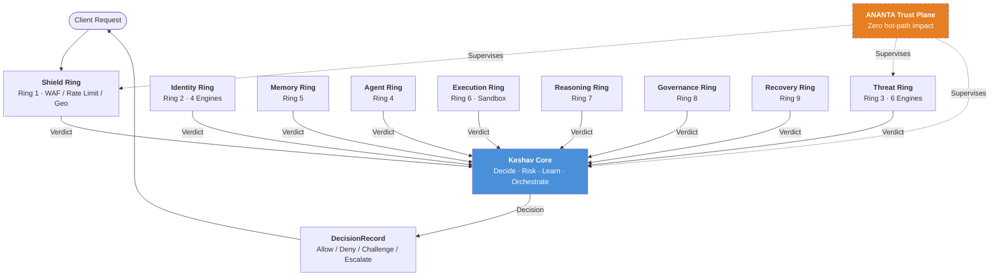
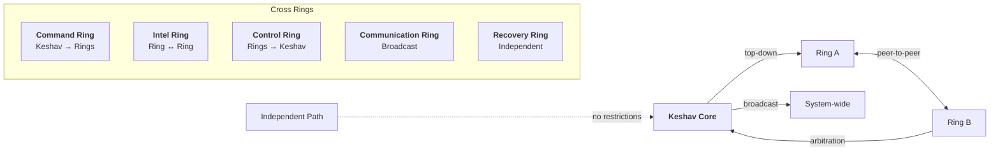
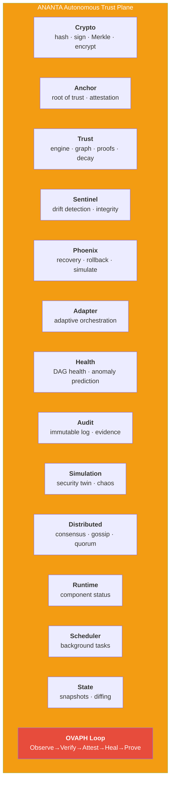
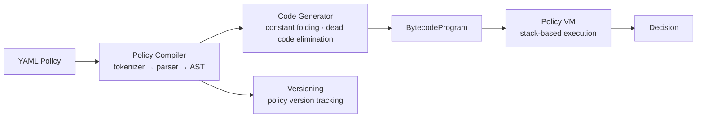
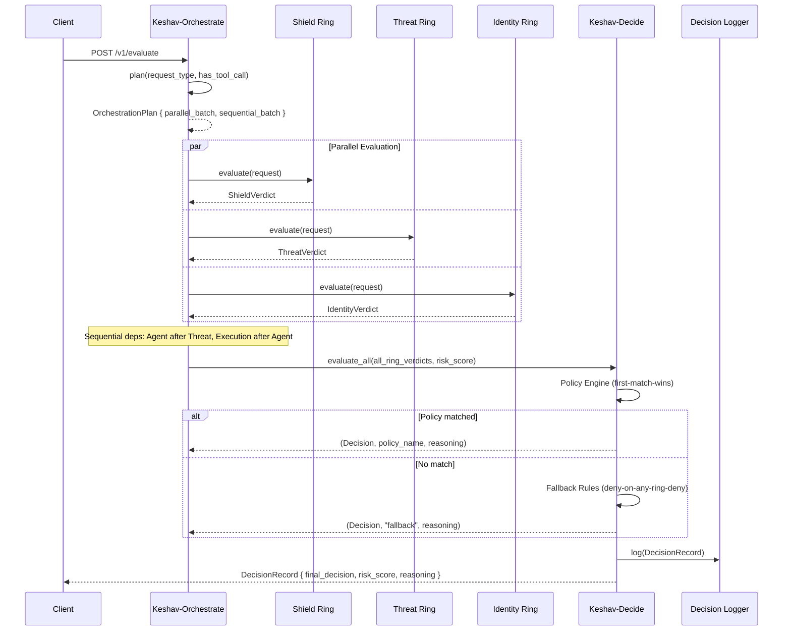
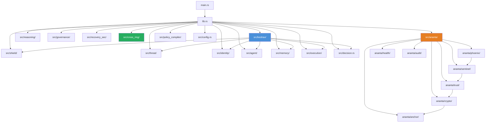
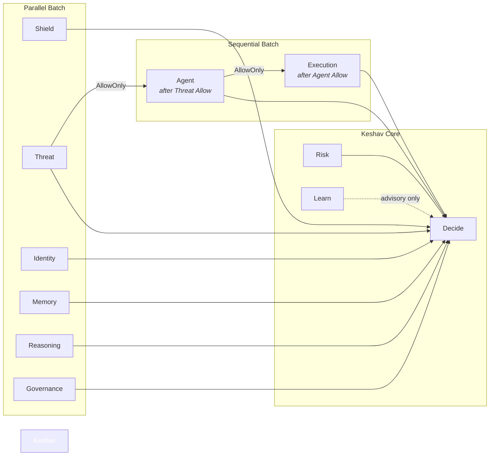
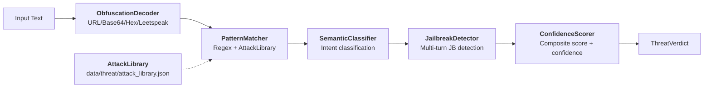
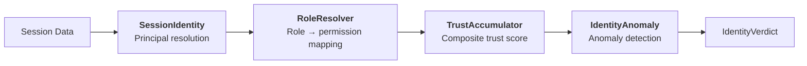

# CHAKRAVYUH OS — System Architecture

> **Version**: Current (see `env!("CARGO_PKG_VERSION")` in source)
> **Last Updated**: Auto-generated from source
> **Cross-References**: [Keshav Core](./KESHAV.md) · [ANANTA](./ANANTA.md) · [Sentinel](./SENTINEL.md) · [Phoenix](./PHOENIX.md) · [Trust Engine](./TRUST_ENGINE.md) · [OVAPH Loop](./OVAPH.md)

---

## 1. Overview

CHAKRAVYUH OS is a layered AI security operating system built in Rust. It protects LLM-powered applications through 9 concentric defense rings, a central decision brain (Keshav Core), 5 cross-ring communication channels, and an autonomous trust plane (ANANTA) that verifies the security system itself.

The name "Chakravyuh" comes from the ancient Indian military formation — concentric, impenetrable layers. Each ring is independently functional; the system is designed so that the failure of any ring or subsystem never results in a security bypass.

---

## 2. High-Level Data Flow



---

## 3. The 9 Defense Rings

Each ring is an independently testable module under `src/`. Rings produce a verdict (`Allow`, `Deny`, `Challenge`, `Escalate`) for each request. Keshav Core combines all verdicts into a final decision.

| # | Ring | Module | Purpose | Key Engines/Components |
|---|------|--------|---------|------------------------|
| 1 | **Shield** | `src/shield/` | First line of defense | WAF Engine, Rate Limiter, Geo Fencer, Bot Detector, DoS Protector, Input Validator |
| 2 | **Identity** | `src/identity/` | Who is asking? | SessionIdentity, RoleResolver, TrustAccumulator, IdentityAnomaly |
| 3 | **Threat** | `src/threat/` | What are they asking? | ObfuscationDecoder, PatternMatcher, SemanticClassifier, JailbreakDetector, ConfidenceScorer, AttackLibrary |
| 4 | **Agent** | `src/agent/` | Is the agent behaving? | BehaviorMonitor, CapabilityGuard, PermissionEnforcer, ToolChainingDetector |
| 5 | **Memory** | `src/memory/` | Is memory access safe? | ContextGuard, RAGPoisonDetector, PIIExtractor, ConversationTracker |
| 6 | **Execution** | `src/execution/` | Is the tool call safe? | SandboxExecutor, SSRFProtector, ParameterValidator, ToolAllowlist |
| 7 | **Reasoning** | `src/reasoning/` | Is reasoning sound? | Reasoning risk assessment |
| 8 | **Governance** | `src/governance/` | Policy compliance | GovernanceVerdict generation |
| 9 | **Recovery** | `src/recovery_sec/` | Recovery security | RecoveryVerdict generation |

### Ring Ordering

Rings are identified by the `RingId` enum in `src/keshav/orchestrate.rs`:

```rust
pub enum RingId {
    Shield,      // Ring 1
    Identity,    // Ring 2
    Threat,      // Ring 3
    Agent,       // Ring 4
    Memory,      // Ring 5
    Execution,   // Ring 6
    Reasoning,   // Ring 7
    Governance,  // Ring 8
    Recovery,    // Ring 9
}
```

---

## 4. Keshav Core — The Decision Brain

> **Deep Dive**: [KESHAV.md](./KESHAV.md)

Keshav is the central nervous system. It contains four subsystems:

| Subsystem | Source File | Phase | Latency Budget |
|-----------|-------------|-------|----------------|
| **Decide** | `src/keshav/decide.rs` | 2 | < 1ms |
| **Risk** | `src/keshav/risk.rs` | 3 | < 0.5ms p99 |
| **Learn** | `src/keshav/learn.rs` | 6 | < 1ms overhead |
| **Orchestrate** | `src/keshav/orchestrate.rs` | 3 | < 1ms overhead |

Supporting modules:

- `policy_engine.rs` — YAML rule evaluation, first-match-wins, default deny
- `policy_manager.rs` — Hot-reload policies at runtime (RwLock-protected)
- `decision_logger.rs` — Append-only JSON+CSV audit log (SOC 2, ISO 27001)
- `fallback_rules.rs` — Hardcoded Fail Secure rules (cannot be modified)
- `threshold_optimizer.rs` — Per-ring threshold tuning from feedback
- `anomaly_profiler.rs` — Behavioral anomaly detection by IP/user/agent
- `pattern_store.rs` — Attack pattern persistence and recall
- `feedback_collector.rs` — Operator feedback intake (FP/FN reports)
- `executor.rs` — Pipeline execution coordinator

### Core Principle: Decide-without-Learn

> **Principle 1**: Decide MUST work without Learn, without Risk, and without any ring. If all rings are disabled or fail to initialize, Decide still returns a valid Decision using its Fallback Rules.

> **Principle 2** (Fail Secure): If ANY ring returned Deny, the system denies. The system never fails open.

---

## 5. The 5 Cross Rings

> **Source**: `src/cross_ring/`

Cross rings are communication channels between the defense rings and Keshav. Each has directional semantics enforced at the message level.



| Cross Ring | Direction | Source | Transport |
|-----------|-----------|--------|-----------|
| **Command** | Keshav → Rings (top-down) | `command_ring.rs` | `InProcessTransport` (mpsc) |
| **Intel** | Ring ↔ Ring (peer-to-peer) | `intel_ring.rs` | `InProcessTransport` (multi-subscriber) |
| **Control** | Rings → Keshav (arbitration) | `control_ring.rs` | `InProcessTransport` (mpsc) |
| **Communication** | System-wide broadcast | `communication_ring.rs` | `BroadcastTransport` (fan-out) |
| **Recovery** | Independent path | `recovery_ring.rs` | `InProcessTransport` (mpsc) |

### Cross Ring Message Structure

Every message is a `CrossRingMessage` (defined in `src/cross_ring/message.rs`):

```rust
pub struct CrossRingMessage {
    pub message_id: String,           // UUID v4
    pub timestamp: String,            // ISO 8601
    pub source: String,               // "keshav" or ring name
    pub destination: String,          // ring name, "keshav", or "broadcast"
    pub cross_ring_type: CrossRingType,
    pub msg_type: String,             // e.g., "policy_update", "attack_pattern"
    pub payload: serde_json::Value,
    pub priority: MessagePriority,    // Low / Normal / High / Critical
    pub version: String,              // Keshav version
}
```

Directional validation is enforced by `CrossRingMessage::validate_direction()`:

- **Command**: `source` must be `"keshav"`
- **Control**: `destination` must be `"keshav"`
- **Intel**: `source` must NOT be `"keshav"` (Keshav subscribes but doesn't publish)
- **Communication**: `destination` must be `"broadcast"`
- **Recovery**: No directional restrictions

### Transport Layer

The `RingTransport` trait (`src/cross_ring/transport.rs`) abstracts the communication backend:

| Implementation | Use Case |
|---------------|----------|
| `InProcessTransport` | Default, single-process (bounded mpsc channels) |
| `BroadcastTransport` | Communication Ring (fan-out with history replay) |
| `GrpcTransport` | Production distributed (gRPC + TLS + mTLS) |
| `NatsTransport` | Distributed pub/sub (NATS JetStream) |
| `RedisTransport` | Distributed (Redis Streams) |

---

## 6. ANANTA — Autonomous Trust Plane

> **Deep Dive**: [ANANTA.md](./ANANTA.md)

ANANTA is NOT a ring. It is a supervisory plane that exists above and outside the 9 defense rings and Keshav Core. It answers: **"Can the security system itself still be trusted?"**

### Critical Design Constraints

1. ANANTA never depends on Keshav (no circular dependency)
2. ANANTA has its own config file (`ananta.yaml`) — it cannot trust Keshav's config
3. ANANTA's hot-path impact is **ZERO** (all background tasks only)
4. ANANTA is optional (system works without it in degraded mode)

### 13 Subsystems across 18 Modules



---

## 7. Policy Compiler

> **Source**: `src/policy_compiler/`

The Policy Compiler transforms human-readable YAML policy definitions into bytecode for the Policy VM:



Modules:

| Module | Purpose |
|--------|---------|
| `compiler.rs` | YAML → AST → bytecode compilation with optimizer |
| `vm.rs` | Stack-based bytecode VM for policy evaluation |
| `bytecode.rs` | `OpCode`, `Instruction`, `Constant`, `BytecodeProgram` |
| `versioning.rs` | Policy version tracking and change detection |

---

## 8. Request Lifecycle — End to End



---

## 9. Module Dependency Graph



---

## 10. Ring Interaction Diagram



---

## 11. Configuration

CHAKRAVYUH uses two independent configuration files:

| Config File | Format | Controls |
|------------|--------|----------|
| `config.yaml` | YAML | Keshav Core, all 9 rings, API settings |
| `ananta.yaml` | YAML | ANANTA Trust Plane (independent) |

ANANTA's config is deliberately separate — since ANANTA protects Keshav, it cannot trust Keshav's configuration.

### Example Config Paths

- Main config: `configs/config.example.yaml`
- ANANTA config: `configs/ananta.example.yaml`

---

## 12. Threat Ring Engine Pipeline

The Threat Ring (`src/threat/`) runs 6 engines in sequence:



---

## 13. Identity Ring Engine Pipeline



---

## 14. Key Architectural Guarantees

| Guarantee | Mechanism | Source |
|-----------|-----------|--------|
| **Never fail open** | Fallback Rules are hardcoded; deny-on-any-ring-deny | `fallback_rules.rs` |
| **Decide without Learn** | Learn can only advise, never override Fallback Rules | `learn.rs` |
| **Zero ANANTA hot-path impact** | ANANTA runs as background tokio tasks only | `ananta/mod.rs` |
| **Independent ANANTA config** | Separate `ananta.yaml`, cannot depend on Keshav config | `ananta/config.rs` |
| **Append-only audit** | DecisionLogger, ANANTA AuditLog — records cannot be modified | `decision_logger.rs`, `ananta/audit/` |
| **Hot-reload policies** | PolicyManager uses RwLock for atomic swap; failure preserves old policy | `policy_manager.rs` |
| **Directional cross rings** | `validate_direction()` enforces message flow rules | `cross_ring/message.rs` |
| **Statistical drift detection** | Welford's online algorithm, not threshold-based alerting | `ananta/sentinel/drift.rs` |

---

## 15. Source Tree Layout

```
src/
├── main.rs                    # Binary entry point
├── lib.rs                     # Library root
├── config.rs                  # Main configuration
├── decision.rs                # Decision, DecisionRecord, RiskScore
├── error.rs                   # Error types
├── keshav/                    # Keshav Core — Central Decision Brain
├── cross_ring/                # 5 Cross Rings (Command, Intel, Control, Communication, Recovery)
├── shield/                    # Ring 1 — Shield (WAF, rate limit, geo, bot, DoS)
├── identity/                  # Ring 2 — Identity (session, role, trust, anomaly)
├── threat/                    # Ring 3 — Threat (6 engines)
├── agent/                     # Ring 4 — Agent (behavior, capability, permission)
├── memory/                    # Ring 5 — Memory (context, RAG, PII, conversation)
├── execution/                 # Ring 6 — Execution (sandbox, SSRF, parameter)
├── reasoning/                 # Ring 7 — Reasoning
├── governance/                # Ring 8 — Governance
├── recovery_sec/              # Ring 9 — Recovery Security
├── ananta/                    # ANANTA — Autonomous Trust Plane (13 subsystems)
├── policy_compiler/           # YAML → Bytecode compiler + VM
├── validation/                # Testing, verification, benchmarks, red team
├── storage/                   # Memory + Redis stores
├── observability/              # Metrics, OpenTelemetry, alerting
├── incident_response/         # Playbooks, webhooks, evidence chains
├── federated/                 # Federated learning, differential privacy
├── twin/                      # Digital twin engine
├── plugin/                    # WASM plugin runtime
├── tenant/                    # Multi-tenancy
├── cli/                       # CLI commands
└── api/                       # API handlers
```
