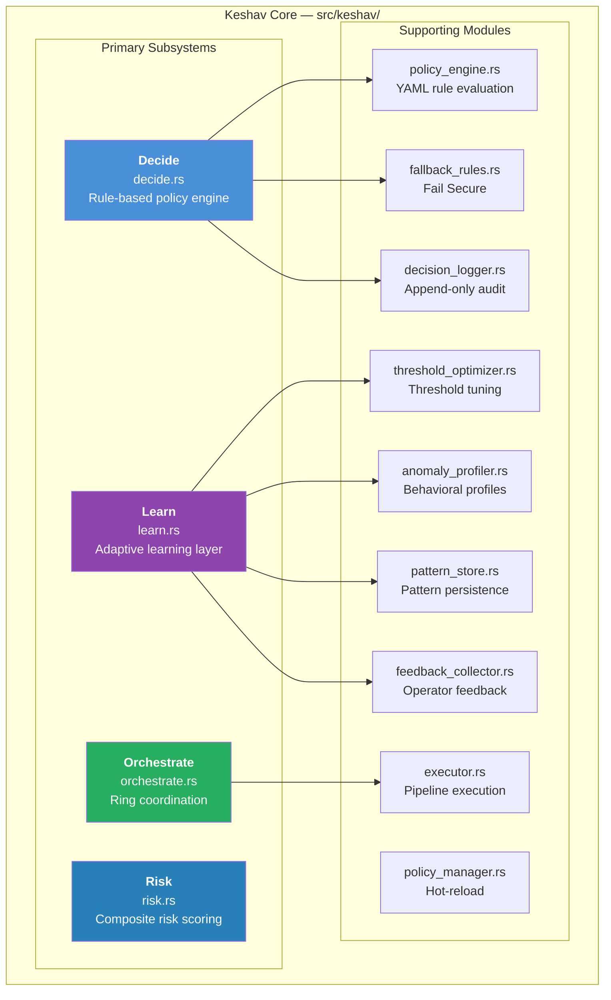
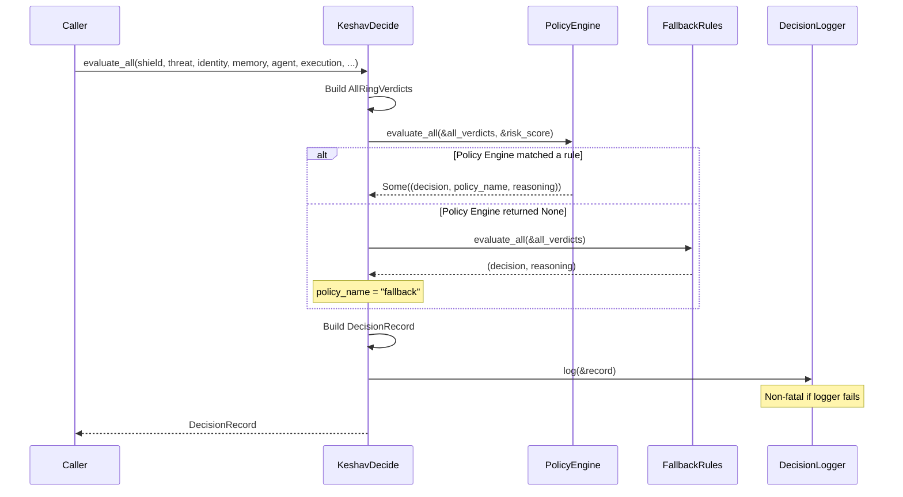
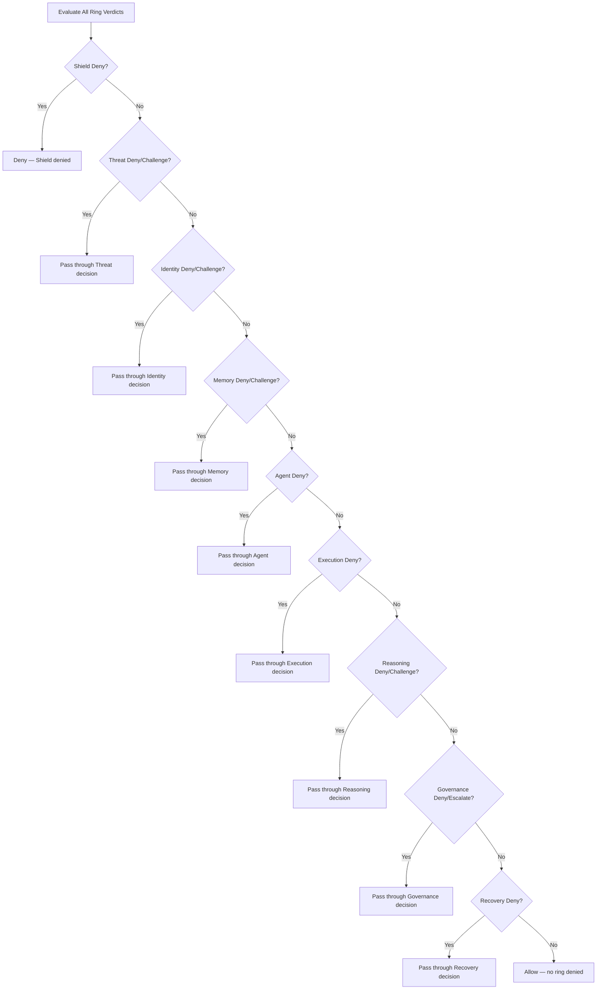
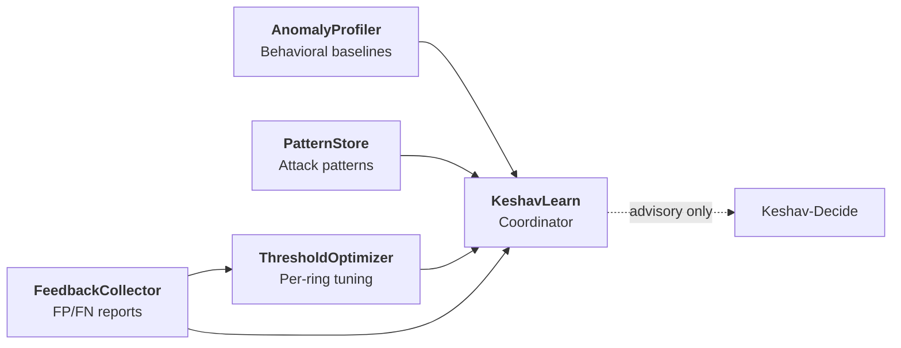
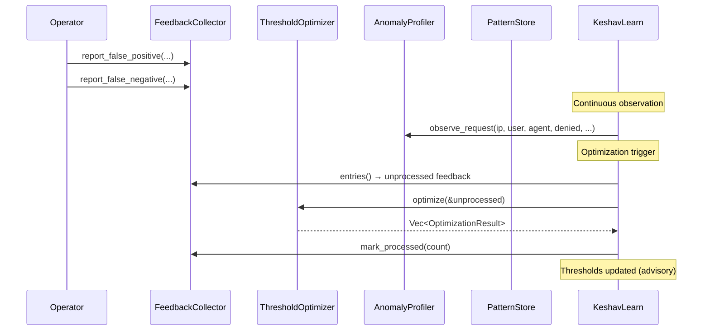
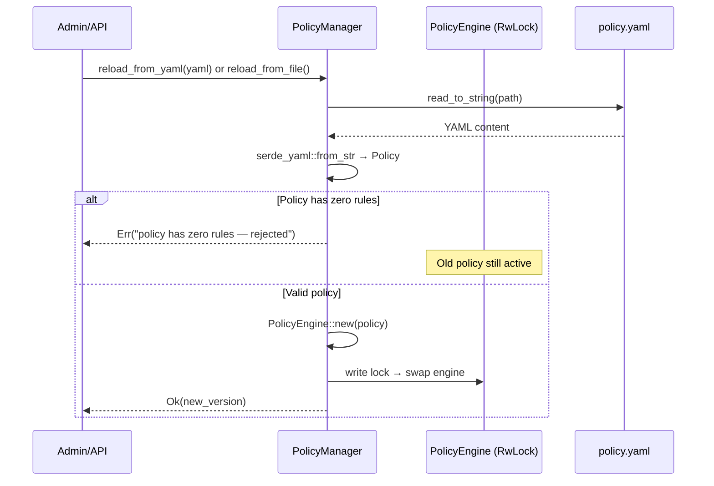

# Keshav Core — Central Decision Brain

> **Source**: `src/keshav/`
> **Cross-References**: [Architecture](./ARCHITECTURE.md) · [ANANTA](./ANANTA.md) · [OVAPH Loop](./OVAPH.md)

---

## 1. Overview

Keshav is the central decision-making brain of CHAKRAVYUH OS. Named after the legendary archer from the Mahabharata, it combines ring verdicts into a final security decision using rule-based policies, composite risk scoring, and adaptive learning.

The module is organized into four primary subsystems and eight supporting modules:



---

## 2. Keshav Configuration

The `KeshavConfig` struct controls all subsystems:

```rust
pub struct KeshavConfig {
    pub enabled: bool,
    pub policy_path: Option<String>,
    pub risk: RiskConfig,
    pub orchestrate: OrchestrateConfig,
    pub learn: LearnConfig,
}
```

---

## 3. Keshav-Decide — Rule-Based Policy Engine

> **Source**: `src/keshav/decide.rs`
> **Latency Budget**: < 1ms

### 3.1 Architecture Principle

> **CRITICAL (Principle 1)**: Decide MUST work without Learn, without Risk, and without any ring. If all rings are disabled or fail to initialize, Decide still returns a valid Decision using its Fallback Rules. This is the architectural guarantee that the system never fails open.

### 3.2 Decision Pipeline



### 3.3 AllRingVerdicts

All 9 ring verdicts are collected in the `AllRingVerdicts` struct. `Shield` is required; all others are `Option<>`:

```rust
pub struct AllRingVerdicts<'a> {
    pub shield: &'a ShieldVerdict,           // Required
    pub threat: Option<&'a ThreatVerdict>,
    pub identity: Option<&'a IdentityVerdict>,
    pub memory: Option<&'a MemoryVerdict>,
    pub agent: Option<&'a AgentVerdict>,
    pub execution: Option<&'a ExecutionVerdict>,
    pub reasoning: Option<&'a ReasoningVerdict>,
    pub governance: Option<&'a GovernanceVerdict>,
    pub recovery: Option<&'a RecoveryVerdict>,
}
```

### 3.4 Policy Engine

> **Source**: `src/keshav/policy_engine.rs`

The Policy Engine evaluates rules in order — **first match wins**. If no rule matches, it returns `None` (triggering Fallback Rules).

#### Default Policy (v2.0.0)

| # | Rule Name | Condition | Action |
|---|-----------|-----------|--------|
| 1 | `deny_on_shield_deny` | ShieldDeny | PassThrough |
| 2 | `deny_on_threat_deny` | ThreatDeny | PassThrough |
| 3 | `deny_on_identity_deny` | IdentityDeny | PassThrough |
| 4 | `deny_on_memory_deny` | MemoryDeny | PassThrough |
| 5 | `deny_on_agent_deny` | AgentDeny | PassThrough |
| 6 | `deny_on_execution_deny` | ExecutionDeny | PassThrough |
| 7 | `deny_on_risk_above_8` | RiskAbove(8.0) | Deny("COMPOSITE_RISK_HIGH") |
| 8 | `challenge_on_threat_challenge` | ThreatChallenge | PassThrough |
| 9 | `challenge_on_identity_challenge` | IdentityChallenge | PassThrough |
| 10 | `challenge_on_memory_challenge` | MemoryChallenge | PassThrough |
| 11 | `allow_default` | AllRingsAllow | Allow |

#### Rule Conditions

```rust
pub enum RuleCondition {
    ShieldDeny,                // Shield Ring returned Deny
    ThreatDeny,                // Threat Ring returned Deny
    ThreatChallenge,           // Threat Ring returned Challenge
    IdentityDeny,              // Identity Ring returned Deny
    IdentityChallenge,         // Identity Ring returned Challenge
    MemoryDeny,                // Memory Ring returned Deny
    MemoryChallenge,           // Memory Ring returned Challenge
    AgentDeny,                 // Agent Ring returned Deny
    ExecutionDeny,             // Execution Ring returned Deny
    AllRingsAllow,             // All evaluated rings returned Allow
    RiskAbove(f64),            // Risk score exceeds threshold
}
```

#### Rule Actions

```rust
pub enum RuleAction {
    PassThrough,               // Use the ring's own decision
    Allow,                     // Force allow
    Deny(String),              // Force deny with code
    Challenge,                 // Force challenge
    Escalate,                  // Escalate to human review
}
```

### 3.5 Fallback Rules

> **Source**: `src/keshav/fallback_rules.rs`

Fallback Rules are **hardcoded** — they cannot be modified by configuration or by Keshav-Learn. This is the Fail Secure guarantee.



---

## 4. Keshav-Risk — Composite Risk Scoring

> **Source**: `src/keshav/risk.rs`
> **Latency Budget**: < 0.5ms p99

### 4.1 Scoring Model

Risk is computed as a weighted average of 9 signal dimensions (8 ring scores + context):

```
risk_overall = w_threat    × threat_score
             + w_identity  × identity_score
             + w_behavior  × agent_score
             + w_memory    × memory_score
             + w_execution × execution_score
             + w_reasoning × reasoning_score
             + w_governance × governance_score
             + w_recovery  × recovery_score
             + w_context   × context_score
```

### 4.2 Default Weights

| Signal | Weight | Default |
|--------|--------|---------|
| Threat | `w_threat` | 0.30 |
| Identity | `w_identity` | 0.15 |
| Behavior (Agent) | `w_behavior` | 0.15 |
| Execution | `w_execution` | 0.15 |
| Context | `w_context` | 0.10 |
| Memory | `w_memory` | 0.10 |
| Reasoning | `w_reasoning` | 0.05 |
| Governance | `w_governance` | 0.05 |
| Recovery | `w_recovery` | 0.05 |
| **Total** | | **1.00** |

### 4.3 Context Signals

```rust
pub struct ContextSignals {
    pub time_of_day_risk: f64,   // 0.0-1.0, higher during off-hours
    pub rate_anomaly: f64,       // 0.0-1.0, higher for burst patterns
    pub source_reputation: f64,  // 0.0-1.0, higher = more trusted
}
```

Context score formula: `(time_of_day_risk × 0.4 + rate_anomaly × 0.3 + (1 - source_reputation) × 0.3) × 10.0`

### 4.4 Confidence Calculation

Confidence increases with the number of contributing signals:

```rust
confidence = (contributing_signals as f64 / 10.0).clamp(0.11, 1.0)
```

All scores are clamped to `[0.0, 10.0]`.

### 4.5 Score Conversion

The `execution_to_risk_score()` function maps Execution Ring decisions:

| Decision | Risk Score |
|----------|-----------|
| Allow | 0.0 |
| Challenge | 4.0 |
| Escalate | 7.0 |
| Deny | 10.0 |

---

## 5. Keshav-Orchestrate — Ring Coordination

> **Source**: `src/keshav/orchestrate.rs`
> **Latency Budget**: < 1ms overhead

### 5.1 Request Classification

```rust
pub enum RequestType {
    HealthCheck,      // No rings needed
    SimplePrompt,     // Cognitive rings in parallel
    ToolCall,         // All 9 rings
    AuthRequest,      // Shield → Identity (sequential)
    AdminOperation,   // Shield → Identity (sequential)
    Unknown,          // All 9 rings (Fail Secure)
}
```

### 5.2 Routing Table

| Request Type | Parallel Batch | Sequential Batch | Total Rings |
|-------------|----------------|-------------------|-------------|
| HealthCheck | _(none)_ | _(none)_ | 0 |
| SimplePrompt | Shield, Threat, Identity, Memory, Reasoning, Governance | _(none)_ | 6 |
| ToolCall | Shield, Threat, Identity, Memory, Reasoning, Governance, Recovery | Agent (after Threat), Execution (after Agent) | 9 |
| AuthRequest | Shield | Identity (after Shield) | 2 |
| AdminOperation | Shield | Identity (after Shield) | 2 |
| Unknown | All 9 | Agent (after Threat), Execution (after Agent) | 9 |

### 5.3 Sequential Dependencies

Dependencies use the `DepCondition` enum:

```rust
pub enum DepCondition {
    AllowOnly,    // Only evaluate if dependency returned Allow
    DenyOnly,     // Only evaluate if dependency returned Deny
    Always,       // Always evaluate regardless
}
```

For ToolCall requests, the critical chain is:


The tool call override: if `has_tool_call` is `true`, orchestration always routes as `ToolCall` regardless of the classified `RequestType`.

### 5.4 OrchestrationPlan Output

```rust
pub struct OrchestrationPlan {
    pub request_type: RequestType,
    pub parallel_batch: Vec<RingId>,
    pub sequential_batch: Vec<(RingId, RingId, DepCondition)>,
    pub total_rings: usize,
}
```

---

## 6. Keshav-Learn — Adaptive Learning Layer

> **Source**: `src/keshav/learn.rs`
> **Latency Budget**: < 1ms total overhead per request

### 6.1 Architecture Principle

> **Principle 1 (Decide-without-Learn)**: If Keshav-Learn is disabled, removed, or corrupt:
> - Keshav-Decide still returns valid Decisions
> - Keshav-Risk still returns valid RiskScores
> - All rings still function independently
> - The system degrades gracefully to Phase 5 behavior

Learn can NEVER override Keshav-Decide's Fallback Rules.

### 6.2 Four Subsystems



#### FeedbackCollector

Collects operator feedback on decisions. Supports false positive and false negative reports:

```rust
learn.report_false_positive("req-1", "shield", "deny:WAF", "benign", "admin");
learn.report_false_negative("req-2", "threat", "allow", "malicious", "admin");
```

#### ThresholdOptimizer

Maintains per-ring deny and challenge thresholds. Registers all 9 rings with defaults:

```rust
optimizer.register_ring("shield", 9.0, 6.0);     // (deny, challenge)
optimizer.register_ring("threat", 9.0, 7.0);
optimizer.register_ring("identity", 9.0, 6.0);
// ... all 9 rings
```

#### AnomalyProfiler

Profiles behavior by three entity types (IP, User, Agent). Tracks deny rates, prompt length distributions, and tool usage patterns.

```rust
learn.observe_request("1.2.3.4", Some("user-1"), None, false, 50, Some("file_read"));
let assessment = learn.assess_anomaly("1.2.3.4");
```

#### PatternStore

Persistent attack pattern storage with type classification, tags, confidence scoring, and match tracking:

```rust
learn.add_pattern(Pattern {
    id: "p1".to_string(),
    pattern_type: PatternType::Learned,
    name: "Learned safe pattern".to_string(),
    rings: vec!["shield".to_string()],
    pattern: "safe_request_pattern".to_string(),
    tags: vec!["learned".to_string()],
    confidence: 0.5,
    source: PatternSource::Learned,
    ..Default::default()
});
```

### 6.3 Learning Loop



---

## 7. Policy Manager — Hot Reload

> **Source**: `src/keshav/policy_manager.rs`

### 7.1 Thread Safety

The `PolicyManager` uses `RwLock` for interior mutability. A reload failure **never** affects the currently running policy.

### 7.2 Reload Mechanism



### 7.3 API Surface

```rust
impl PolicyManager {
    pub fn new(policy: Policy, policy_path: Option<String>) -> Self;
    pub fn with_defaults() -> Self;
    pub fn evaluate_all(&self, all: &AllRingVerdicts, risk: &RiskScore) -> Option<...>;
    pub fn policy_version(&self) -> String;
    pub fn rule_count(&self) -> usize;
    pub fn reload_from_file(&self) -> Result<String, String>;
    pub fn reload_from_yaml(&self, yaml: &str) -> Result<String, String>;
    pub fn export_policy_yaml(&self) -> String;
    pub fn policy_info(&self) -> PolicyInfo;
}
```

---

## 8. Decision Logger — Append-Only Audit

> **Source**: `src/keshav/decision_logger.rs`

Every `KeshavDecide::evaluate()` call produces a `DecisionRecord` logged here. The log is append-only — records cannot be modified or deleted.

### Storage Backends

| Backend | Status | Notes |
|---------|--------|-------|
| In-memory (VecDeque) | Default | Bounded to `max_entries` (default 10,000) |
| File (JSONL) | Future (Phase 3) | Append to file |
| SQLite | Future (Phase 5) | Structured query |
| Network (SIEM) | Future (Phase 5) | Splunk/Datadog |

### Log Entry Structure

```rust
pub struct DecisionLogEntry {
    pub record: DecisionRecord,  // Full decision with ring verdicts
    pub logged_at: String,       // ISO 8601
    pub seq: u64,                // Monotonic sequence number
}
```

### Non-Fatal Guarantee

If the logger fails (e.g., lock poisoned), the request still succeeds:

```rust
if let Err(e) = self.decision_logger.log(&record) {
    tracing::warn!(error = %e, "decision logger failed (non-fatal)");
}
```

---

## 9. DecisionRecord Structure

Every decision produces a comprehensive `DecisionRecord`:

```rust
pub struct DecisionRecord {
    pub request_id: String,
    pub timestamp: String,          // RFC 3339
    pub source: DecisionSource,     // { ip, user_id, agent_id, api_key }
    pub risk_score: RiskScore,      // { overall, threat, identity, ... }
    pub rings_evaluated: Vec<u8>,   // [1, 3, 2, 5, 4, 6]
    pub ring_verdicts: serde_json::Value,
    pub policy_applied: Option<String>,  // "fallback" or policy rule name
    pub final_decision: Decision,
    pub reasoning: String,
    pub latency_ms: f64,
    pub keshav_version: String,
    pub policy_version: String,
}
```
