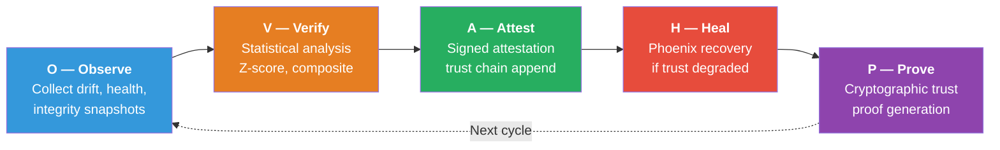

# OVAPH — Continuous Trust Verification Loop

> **Source**: `src/ananta/ovaph_loop.rs`
> **Consumers**: `AnantaPlane` (Loop 7 in `src/ananta/mod.rs`), `OvaphLoopBridge`
> **Cross-References**: [ANANTA](./ANANTA.md) · [Sentinel](./SENTINEL.md) · [Phoenix](./PHOENIX.md) · [Architecture](./ARCHITECTURE.md)

---

## 1. Purpose

OVAPH (Observe → Verify → Attest → Heal → Prove) is the unified trust verification cycle at the heart of ANANTA. Before Phase B, ANANTA ran 6 independent background loops but had no single state machine that chained their work into one verifiable, end-to-end cycle.

OVAPH enforces a strict five-stage pipeline that **always completes all five stages**, even if individual stages fail or produce no-ops. Every cycle is audited in the immutable log and optionally produces a cryptographic trust proof.

### Design Invariants

1. Every cycle completes **all five stages** (even if some are no-ops or failures).
2. Each stage has explicit pre/post conditions.
3. The loop is self-healing: failures in one stage don't prevent others.
4. Every cycle is audited end-to-end in the immutable log.
5. The loop is **additive** — it does not replace the existing 6 independent loops.
6. Zero hot-path impact: runs as a `tokio::spawn` background task.

---

## 2. Architecture — The Five Phases



### O — Observe (500 ms hint)

Collects the platform state into an `OvaphObservation`:

- **Drift snapshots** (`Vec<DriftSnapshot>`): For each of Sentinel's 10 drift types (`Decision`, `Policy`, `Model`, `Orchestration`, `Learning`, `Memory`, `Configuration`, `Plugin`, `Runtime`, `Trust`), reads running mean, stddev, sample count from `DriftDetector`.
- **Health snapshot** (`HealthSnapshot`): Overall health score from `HealthGraph`, plus degraded/failed component lists.
- **Integrity snapshot** (`IntegritySnapshot`): Pass/fail counts from `IntegrityChecker`.

### V — Verify (2000 ms hint)

Runs statistical analysis via `OvaphVerificationResult::from_observation()`. Produces `Vec<VerifiedSignal>` per drift type using Z-score analysis against `verify_drift_sigma_threshold`. Classifies severity as `None`, `Low`, `Medium`, `High`, or `Critical`. Also generates health-based signals (if `overall_health < 0.5`) and integrity-based signals (if any domains failed). Composite severity is the maximum; healing is required when `High` or `Critical`.

### A — Attest (1000 ms hint)

Generates trust attestation via `OvaphAttestationResult::from_verification()`. Maps severity to trust level:

| Severity | Trust Level | Attestation Passes |
|----------|-------------|-------------------|
| `None` | 1.0 | Yes |
| `Low` | 0.8 | Yes |
| `Medium` | 0.5 | Yes |
| `High` | 0.3 | Yes |
| `Critical` | 0.1 | **No** |

When integrated with `AnantaPlane`, delegates to `run_attestation_cycle()` which performs actual integrity checks and appends to `TrustChain`.

### H — Heal (5000 ms hint)

If `verification.requires_healing` is true **and** `OvaphConfig::heal_autonomous` is enabled, Phoenix plans recovery. Tracks `actions_planned/executed/succeeded/failed` and `strategies_used`. When autonomous healing is disabled (the default), the stage is `Skipped` with rationale "Autonomous healing disabled by config".

### P — Prove (1000 ms hint)

Generates a cryptographic trust proof via `OvaphProofResult::from_attestation()`. If `prove_generate_proof: true` and attestation passed, produces `proof_generated: true`, a UUID `proof_id`, trust score, and chain verification status. Delegates to `AnantaPlane::run_trust_proof_generation()`.

---

## 3. Internal Workflow

### Stage Machine

The `OvaphLoop` struct is the core state machine:

```rust
pub struct OvaphLoop {
    config: OvaphConfig,
    metrics: Mutex<OvaphMetrics>,
    cycle_counter: AtomicU64,
    running: AtomicBool,
}
```

Each stage method returns a `(StageResult, StageOutput)` tuple. Stages are chained sequentially in `run_full_cycle()` with two timeout layers:

1. **Per-stage timeout**: `execute_with_timeout()` uses `tokio::time::timeout` with `stage_timeout_ms` (default 10 s).
2. **Cycle-level timeout**: `check_max_duration()` checks elapsed against `max_cycle_duration_ms` (default 60 s). If exceeded, remaining stages are marked `Failed`.

A `RunningGuard` RAII struct sets the `running: AtomicBool` to `false` on drop, preventing stuck flags on panic.

### Scheduling (AnantaPlane Loop 7)

OVAPH is spawned in `AnantaPlane::start()` as the 7th background loop:

1. Waits for initial attestation (`config.sentinel.check_interval_ms`).
2. Creates `tokio::time::interval` of **30 seconds** with `MissedTickBehavior::Skip`.
3. On each tick, calls `AnantaPlane::run_ovaph_cycle()`.
4. On `shutdown.notified()`, breaks the loop.

### OvaphLoopBridge

The `OvaphLoopBridge` adapter wraps `OvaphLoop` for `AnantaPlane` integration, providing `submit_*`/`take_*` methods for each stage's result so `AnantaPlane` can feed real subsystem data into the pipeline.

---

## 4. Full OVAPH Cycle Sequence

```mermaid
sequenceDiagram
    participant Timer as tokio interval (30s)
    participant Plane as AnantaPlane
    participant DD as DriftDetector
    participant HG as HealthGraph
    participant Loop as OvaphLoop
    participant Attest as Attestation Cycle
    participant TP as Trust Proof Gen
    participant Audit as AuditLog

    Timer->>Plane: tick()
    Note over Plane: Stage O — Observe
    Plane->>DD: stats(DriftType::all())
    DD-->>Plane: (mean, stddev, count) per type
    Plane->>HG: overall_health()
    HG-->>Plane: f64
    Plane->>Plane: build OvaphObservation

    Note over Plane: Stage V — Verify
    Plane->>Loop: run_verify(&observation)
    Loop-->>Plane: OvaphVerificationResult

    Note over Plane: Stage A — Attest
    Plane->>Attest: run_attestation_cycle()
    Attest-->>Plane: AttestationReport
    Plane->>Plane: map to OvaphAttestationResult

    Note over Plane: Stage H — Heal
    Plane->>Loop: run_heal(&verification)
    alt healing required && autonomous
        Loop-->>Plane: OvaphHealingResult
    else disabled or not required
        Loop-->>Plane: StageResult::Skipped
    end

    Note over Plane: Stage P — Prove
    Plane->>TP: run_trust_proof_generation()
    TP-->>Plane: TrustProof
    Plane->>Plane: map to OvaphProofResult

    Note over Plane: Assemble OvaphCycleReport
    Plane->>Loop: metrics_lock().record_cycle(&report)
    Plane->>Audit: append(Lifecycle, OVAPH cycle complete)
```

---

## 5. Code Example — Starting the OVAPH Loop

The following is the actual code from `src/ananta/mod.rs` showing initialization and spawning:

```rust
// In AnantaPlane::new():
let ovaph_config = OvaphConfig {
    enabled: config.enabled,
    heal_autonomous: config.phoenix.autonomous,
    ..OvaphConfig::default()
};
let ovaph_loop = Arc::new(Mutex::new(OvaphLoop::new(ovaph_config)));
```

```rust
// In AnantaPlane::start(), Loop 7:
let ovaph_plane = Arc::clone(&plane);
let ovaph_shutdown = plane.shutdown.clone();
tokio::spawn(async move {
    tokio::time::sleep(Duration::from_millis(
        config.sentinel.check_interval_ms,
    )).await;
    let mut interval = tokio::time::interval(Duration::from_secs(30));
    interval.set_missed_tick_behavior(MissedTickBehavior::Skip);
    loop {
        tokio::select! {
            _ = interval.tick() => {
                match ovaph_plane.run_ovaph_cycle().await {
                    Ok(report) => tracing::debug!(
                        cycle_id = %report.cycle_id,
                        outcome = ?report.overall_outcome,
                        "OVAPH cycle completed"
                    ),
                    Err(e) => tracing::error!(error = %e, "OVAPH cycle error"),
                }
            }
            _ = ovaph_shutdown.notified() => {
                tracing::info!("OVAPH loop shutting down");
                break;
            }
        }
    }
});
```

### Querying OVAPH State

```rust
let report: Option<OvaphCycleReport> = plane.latest_ovaph_report().await;
let metrics: OvaphMetrics = plane.ovaph_metrics().await;
println!("Success rate: {:.1}%", metrics.success_rate() * 100.0);
println!("Avg duration: {:.0}ms", metrics.avg_cycle_duration_ms);
```

---

## 6. Configuration

`OvaphConfig` is defined in `ovaph_loop.rs` and is **not** a field of `AnantaConfig`. Instead, `AnantaPlane::new()` constructs it from ANANTA-level values:

| Field | Type | Default | Source |
|-------|------|---------|--------|
| `enabled` | `bool` | `false` | `AnantaConfig::enabled` |
| `interval_ms` | `u64` | `30_000` | Hardcoded 30s in `start()` |
| `verify_drift_sigma_threshold` | `f64` | `3.0` | `OvaphConfig::default()` |
| `heal_autonomous` | `bool` | `false` | `AnantaConfig::phoenix.autonomous` |
| `prove_generate_proof` | `bool` | `true` | `OvaphConfig::default()` |
| `attest_sign_reports` | `bool` | `true` | `OvaphConfig::default()` |
| `max_cycle_duration_ms` | `u64` | `60_000` | `OvaphConfig::default()` |
| `stage_timeout_ms` | `u64` | `10_000` | `OvaphConfig::default()` |

### Relevant ananta.example.yaml Sections

```yaml
enabled: true
sentinel:
  check_interval_ms: 30000       # Initial delay before OVAPH starts
  drift_sigma_threshold: 3.0      # Verify stage sensitivity
phoenix:
  autonomous: false               # Must be true for Heal to execute
trust_proof:
  enabled: true
  generation_interval_ms: 60000
```

### Validation Rules

`OvaphConfig::validate()` enforces: all millisecond fields > 0, `verify_drift_sigma_threshold` > 0.0, and `stage_timeout_ms * 5` <= `max_cycle_duration_ms`.

---

## 7. Best Practices for Tuning OVAPH Intervals

| Scenario | Cycle Interval | Rationale |
|----------|---------------|-----------|
| Development / testing | 10 s | Faster feedback |
| Production (normal) | 30 s | Default; good balance |
| High-security | 10–15 s | Faster drift detection |
| Resource-constrained | 60 s | Lower CPU overhead |
| Large-scale (many rings) | 30–45 s | More data per Observe stage |

**Sigma threshold**: 3.0 (default, 99.7% confidence) is a good balance. Use 2.0 for higher sensitivity (more false positives) or 5.0 for extreme conservatism.

**Timeouts**: `stage_timeout_ms` (default 10 s) should exceed the longest stage. `max_cycle_duration_ms` (default 60 s) must be ≥ 5x `stage_timeout_ms`. Increase proportionally if cycles approach the limit.

**Autonomous healing**: Keep `heal_autonomous: false` until baselines are established, Phoenix strategies are validated in staging, and false-positive healing oscillation is ruled out.

---

## 8. Security Considerations

- **Independent configuration**: `OvaphConfig` derives from `AnantaConfig`, loaded from a separate `ananta.yaml`. ANANTA never trusts Keshav's config — an attacker compromising Keshav cannot disable OVAPH.
- **Attestation signing**: When `attest_sign_reports: true` (default), reports are signed and appended to `TrustChain` using the configured hash algorithm (SHA-256/384/512, BLAKE3).
- **Heal is opt-in**: Autonomous healing is disabled by default, preventing an attacker who triggers false drift from causing pipeline modifications.
- **Audit trail**: Every cycle is recorded in the immutable log under `Lifecycle` category.
- **Proof integrity**: Trust proofs (`TrustProof` with UUID `proof_id`) are only generated when attestation passed.

---

## 9. Troubleshooting

| Symptom | Likely Cause | Fix |
|---------|-------------|-----|
| No "OVAPH cycle completed" logs | `AnantaConfig::enabled` is `false` | Set `enabled: true` in `ananta.yaml` |
| All cycles show `Failed` | `stage_timeout_ms` too low | Check for "stage timed out" warnings; increase timeout |
| Heal always `Skipped` | `phoenix.autonomous` is `false` | This is expected. Enable only after validation |
| Prove generates no proof | Attestation failed (`Critical`) or `prove_generate_proof: false` | Investigate integrity domain failures |
| Cycles approaching 60 s | Lock contention on `DriftDetector`/`HealthGraph` | Increase `max_cycle_duration_ms` and `stage_timeout_ms` |
| "Failed to acquire metrics lock" | Previous cycle panicked holding `Mutex<OvaphMetrics>` | Metrics are best-effort; fix the panic and restart |

---

## 10. Cross-References

- **[ANANTA](./ANANTA.md)** — The parent trust plane. `AnantaPlane` owns `OvaphLoop`, spawns it as Loop 7, and provides `run_ovaph_cycle()` that feeds real subsystem data into OVAPH.
- **[Sentinel](./SENTINEL.md)** — Provides drift detection data (`DriftDetector`, `DriftType`) consumed by Observe/Verify. The `SentinelHubToOvaphBridge` in `sentinel_wiring.rs` maps `FusedDriftSignal` to `VerifiedSignal`.
- **[Phoenix](./PHOENIX.md)** — Executes recovery actions when Heal triggers. Controlled by `OvaphConfig::heal_autonomous` (sourced from `PhoenixConfig::autonomous`).
- **[Architecture](./ARCHITECTURE.md)** — Shows OVAPH as part of the ANANTA trust plane supervising the 9 defense rings and Keshav Core.
- **[KESHAV](./KESHAV.md)** — The central decision brain that OVAPH supervises. ANANTA never depends on Keshav — no circular dependency.
