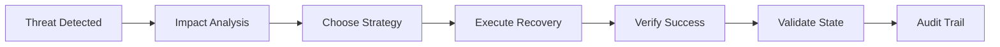
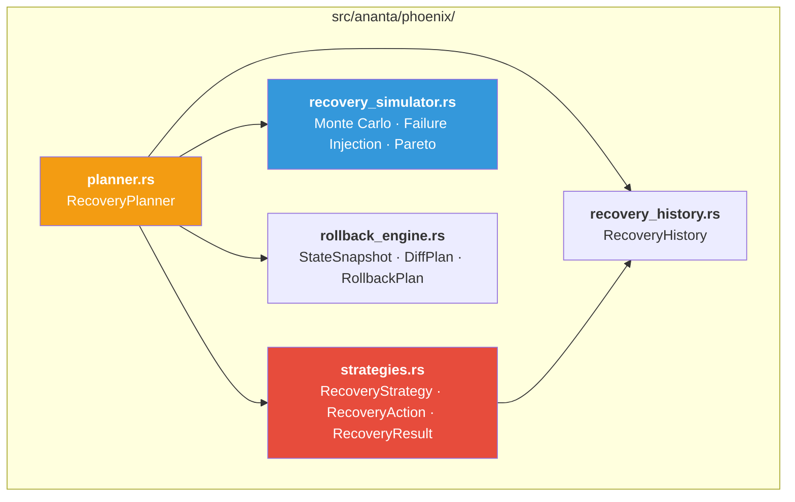
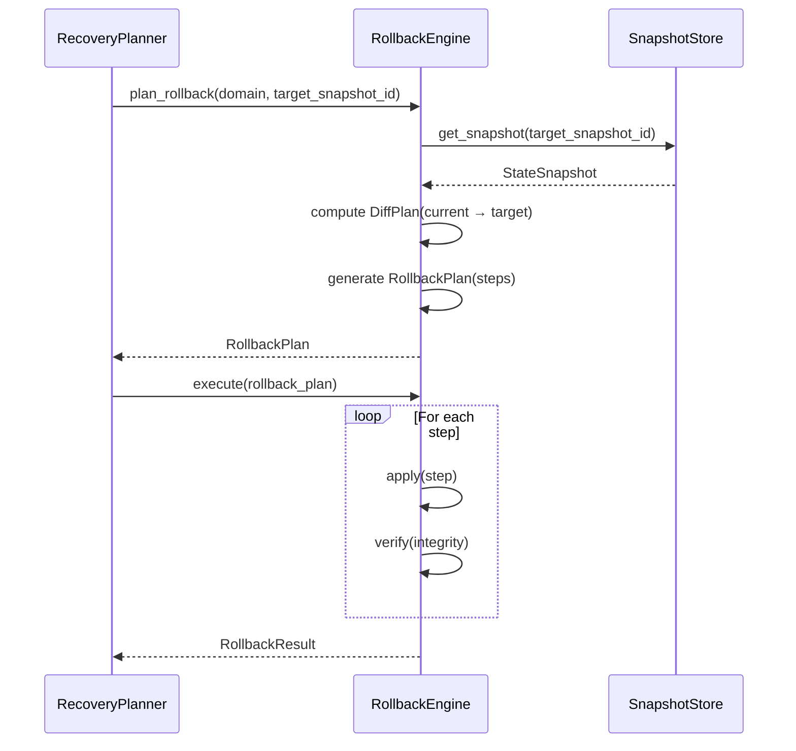
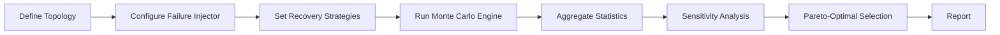
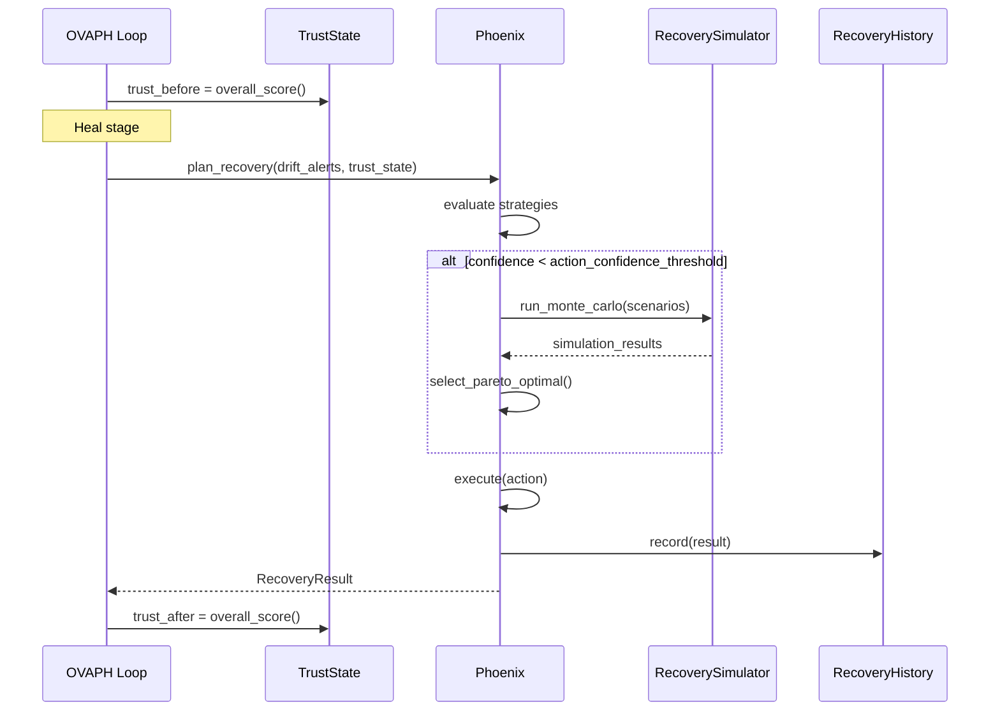

# Phoenix — Autonomous Recovery Intelligence

> **Source**: `src/ananta/phoenix/`
> **Cross-References**: [ANANTA](./ANANTA.md) · [Sentinel](./SENTINEL.md) · [Trust Engine](./TRUST_ENGINE.md) · [OVAPH Loop](./OVAPH.md)

---

## 1. Overview

Phoenix is ANANTA's autonomous recovery subsystem. It doesn't just heal — it **plans** recovery. Before committing to a recovery action in production, Phoenix can simulate thousands of failure scenarios, quantify risk, and select the optimal strategy.

The recovery pipeline follows a strict sequence:



### Design Philosophy

Every recovery action is:
1. **Intentional** — pre-condition check before acting
2. **Auditable** — full audit trail in recovery chain
3. **Reversible** — verification + rollback if it made things worse
4. **Rate-limited** — max 20 actions/hour, 30s cooldown

---

## 2. Module Structure



| Module | Purpose |
|--------|--------|
| `strategies.rs` | 8 recovery strategy types with action/result types |
| `planner.rs` | `RecoveryPlanner` — selects and executes strategies |
| `rollback_engine.rs` | State snapshotting, diffing, rollback planning, verification |
| `recovery_simulator.rs` | Monte Carlo simulation, failure injection, Pareto-optimal selection |
| `recovery_history.rs` | Append-only history of all recovery actions |

---

## 3. Recovery Strategies

> **Source**: `src/ananta/phoenix/strategies.rs`

### 3.1 Strategy Types

```rust
pub enum RecoveryStrategy {
    Restart,          // Restart a ring or subsystem
    Rollback,         // Revert config/policy to last-known-good
    Quarantine,       // Isolate a degraded component
    Observe,          // Do nothing — increase monitoring frequency
    Escalate,         // Alert human operator
    ResetThresholds,  // Reset learning thresholds to defaults
    ReloadPolicy,     // Reload policy from file
    ReconfigurePipeline, // Reconfigure the pipeline (via Adapter)
}
```

### 3.2 RecoveryAction

Each action carries metadata for traceability:

```rust
pub struct RecoveryAction {
    pub action_id: String,        // UUID v4
    pub strategy: RecoveryStrategy,
    pub target: String,            // e.g., "shield", "policy"
    pub reason: String,            // Why this recovery was triggered
    pub trigger: Option<String>,   // e.g., "drift:policy z=5.2"
    pub confidence: f64,           // 0.0-1.0 (success probability)
    pub priority: u8,              // Higher = more urgent
}
```

Builder pattern:

```rust
let action = RecoveryAction::new(
    RecoveryStrategy::Rollback,
    "policy",
    "policy integrity check failed",
)
.with_confidence(0.9)
.with_priority(8)
.with_trigger("drift:policy z=5.2");
```

### 3.3 RecoveryResult

```rust
pub struct RecoveryResult {
    pub action: RecoveryAction,
    pub outcome: RecoveryOutcome,  // Success / Failed / Skipped / Escalated
    pub message: String,
    pub duration_ms: f64,
    pub timestamp: String,
    pub post_trust_level: Option<f64>,
    pub requires_human_review: bool,  // true on Failed
}

pub enum RecoveryOutcome {
    Success,
    Failed,
    Skipped,
    Escalated,
}
```

Failed recovery automatically sets `requires_human_review: true`.

---

## 4. Recovery Planner

> **Source**: `src/ananta/phoenix/planner.rs`

The `RecoveryPlanner` is the decision-making component that:
1. Receives drift alerts and trust degradation events
2. Evaluates available strategies
3. Runs simulation when confidence is below threshold
4. Selects the optimal strategy
5. Executes and verifies

---

## 5. Rollback Engine

> **Source**: `src/ananta/phoenix/rollback_engine.rs`

The rollback engine provides point-in-time state capture, diffing, and rollback with SHA-256 integrity verification.

### 5.1 StateSnapshot

```rust
pub struct StateSnapshot {
    pub snapshot_id: String,      // UUID v4
    pub domain: String,           // e.g., "policy", "config"
    pub timestamp: String,        // RFC 3339
    pub data: HashMap<String, serde_json::Value>,
    pub checksum: String,         // SHA-256 of serialized data
    pub metadata: HashMap<String, String>,
    pub tags: Vec<String>,
}
```

The checksum is computed automatically over the serialized data using SHA-256. Empty domain names are rejected.

### 5.2 Rollback Pipeline



---

## 6. Recovery Simulator — Monte Carlo Engine

> **Source**: `src/ananta/phoenix/recovery_simulator.rs`

Before committing to a recovery action in production, Phoenix can simulate thousands of scenarios.

### 6.1 Simulation Pipeline



### 6.2 Core Capabilities

| Capability | Description |
|-----------|-------------|
| **Monte Carlo Simulation** | Run N independent recovery scenarios |
| **Failure Injection** | Random, cascading, targeted, correlated patterns |
| **Strategy Simulation** | Restart, rollback, failover, rebuild |
| **Sensitivity Analysis** | Vary parameters, compute numerical derivatives |
| **Pareto-Optimal Selection** | Multi-objective frontier across objectives |
| **Statistics** | Mean, std_dev, confidence interval, t-test |

### 6.3 Sample Statistics

```rust
pub struct SampleStatistics {
    pub n: usize,            // Number of observations
    pub mean: f64,           // Arithmetic mean
    pub std_dev: f64,        // Bessel-corrected (n-1 denominator)
    pub min: f64,
    pub max: f64,
    pub median: f64,         // 50th percentile
    pub q1: f64,             // 25th percentile
    pub q3: f64,             // 75th percentile
    pub p95: f64,            // 95th percentile
    pub p99: f64,            // 99th percentile
}
```

All statistics are O(n) or O(1) after construction.

---

## 7. Recovery History

> **Source**: `src/ananta/phoenix/recovery_history.rs`

The `RecoveryHistory` maintains an append-only log of all recovery actions. Retention is configurable (default: 168 hours / 7 days).

---

## 8. Configuration

Phoenix is configured via `AnantaConfig.phoenix`:

```yaml
phoenix:
  autonomous: true                        # Enable autonomous recovery
  max_recovery_actions_per_hour: 20        # Rate limit
  recovery_cooldown_ms: 30000             # 30s between actions
  history_retention_hours: 168             # 7 days
  action_confidence_threshold: 0.85        # Act only if confident
```

### Safety Defaults

| Setting | Default | Rationale |
|---------|---------|-----------|
| `autonomous` | `true` | Recovery runs without human approval |
| `max_recovery_actions_per_hour` | 20 | Prevents recovery loops |
| `recovery_cooldown_ms` | 30,000 | Prevents rapid successive actions |
| `action_confidence_threshold` | 0.85 | High confidence required to act |
| `history_retention_hours` | 168 | 7-day retention for audit |

---

## 9. Integration with OVAPH Loop

Phoenix is invoked during the OVAPH loop's **Heal** stage:



> See [OVAPH.md](./OVAPH.md) for the full verification cycle.

---

## 10. Strategy Selection Guide

| Situation | Recommended Strategy | Confidence |
|-----------|---------------------|------------|
| Ring latency spike | `Observe` | High |
| Policy integrity failure | `Rollback` | High (0.9) |
| Ring crash/panic | `Restart` | Medium-High |
| Learning threshold drift | `ResetThresholds` | Medium |
| Unknown anomaly | `Escalate` | N/A |
| Component misbehaving | `Quarantine` | Medium |
| Policy file updated externally | `ReloadPolicy` | High |
| Pipeline misconfiguration | `ReconfigurePipeline` | Medium |
