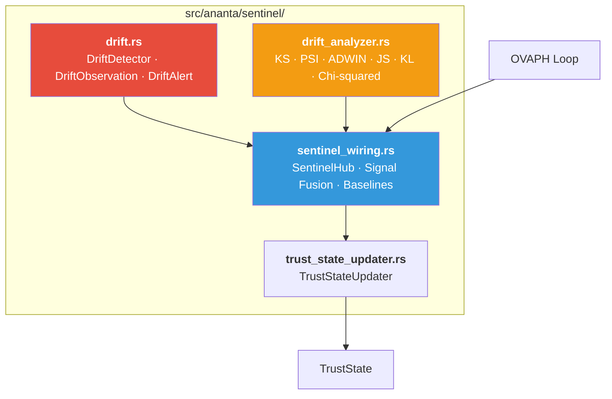
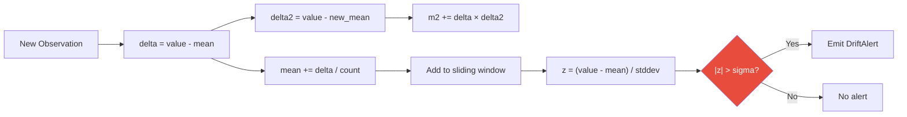
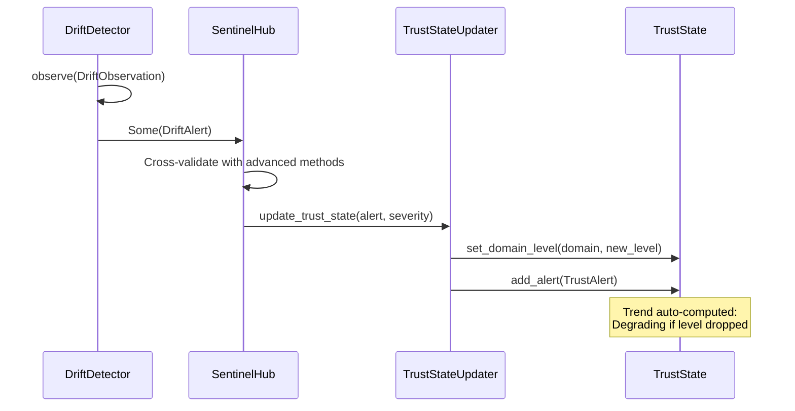
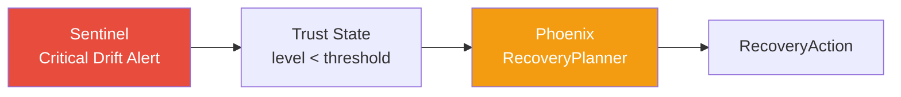

# Sentinel — Continuous Integrity Verification

> **Source**: `src/ananta/sentinel/`
> **Cross-References**: [ANANTA](./ANANTA.md) · [Trust Engine](./TRUST_ENGINE.md) · [Phoenix](./PHOENIX.md) · [OVAPH Loop](./OVAPH.md)

---

## 1. Overview

Sentinel is ANANTA's continuous integrity verification subsystem. It monitors **10 types of drift** across the entire security platform using statistical methods — not simple threshold-based alerting.

The core algorithm is **Welford's online algorithm** for computing running mean and variance over a sliding window, then detecting drift when the z-score exceeds a configurable sigma threshold.

### What Sentinel Monitors

| # | Drift Type | What It Detects |
|---|-----------|-----------------|
| 1 | `Decision` | Allow/deny ratio shifting unexpectedly |
| 2 | `Policy` | Policy rules changing unexpectedly |
| 3 | `Model` | Ring behavior patterns changing |
| 4 | `Orchestration` | Pipeline configuration changing |
| 5 | `Learning` | Threshold/model adaptation going wrong |
| 6 | `Memory` | Memory access patterns becoming anomalous |
| 7 | `Configuration` | Config changes outside policy |
| 8 | `Plugin` | Loaded modules changing |
| 9 | `Runtime` | Performance characteristics changing |
| 10 | `Trust` | Trust levels degrading |

---

## 2. Module Structure



| Module | Purpose |
|--------|--------|
| `drift.rs` | Core z-score drift detector (Welford's algorithm) |
| `drift_analyzer.rs` | Advanced statistical methods (KS, PSI, ADWIN, JS, KL, Chi-squared) |
| `sentinel_wiring.rs` | `SentinelHub` — unified interface bridging both detectors |
| `trust_state_updater.rs` | Converts drift alerts into trust state updates |

---

## 3. Core Drift Detector

> **Source**: `src/ananta/sentinel/drift.rs`

### 3.1 Data Structures

```rust
/// A single observation fed into the drift detector.
pub struct DriftObservation {
    pub drift_type: DriftType,
    pub value: f64,           // e.g., allow_ratio = 0.85
    pub context: String,      // e.g., ring name, policy version
    pub timestamp: String,    // ISO 8601
}

/// A drift alert generated when z-score exceeds threshold.
pub struct DriftAlert {
    pub drift_type: DriftType,
    pub z_score: f64,
    pub current_mean: f64,
    pub current_stddev: f64,
    pub observed_value: f64,
    pub context: String,
    pub timestamp: String,
    pub severity: AlertSeverity,  // Info / Warning / Critical
}
```

### 3.2 DriftDetector

```rust
pub struct DriftDetector {
    detectors: HashMap<DriftType, TypeDetector>,
    sigma_threshold: f64,       // default: 3.0
    window_size: usize,         // default: 1000
}
```

Each `DriftType` gets its own `TypeDetector` that maintains:
- A sliding `VecDeque<f64>` window
- Welford's online statistics: `count`, `mean`, `m2`

### 3.3 Welford's Online Algorithm



### 3.4 Severity Classification

Severity is determined by how far the z-score exceeds the threshold:

| Condition | Severity |
|-----------|----------|
| `|z| > sigma × 2.0` | `Critical` |
| `|z| > sigma × 1.5` | `Warning` |
| `|z| > sigma` (and `count > 10`) | `Info` |
| `|z| <= sigma` or `count <= 10` | _(no alert)_ |

The `count > 10` guard prevents false positives before enough baseline data is collected.

### 3.5 Alert Summary Format

```
[DRIFT] type=Decision z=4.52 mean=0.8500 std=0.0120 value=0.9100 context=shield
```

### 3.6 Reset

Detectors can be reset individually or all at once — useful after a known policy change:

```rust
detector.reset(&DriftType::Policy);   // Reset one type
detector.reset_all();                 // Reset all 10 types
```

---

## 4. Advanced Drift Analyzer

> **Source**: `src/ananta/sentinel/drift_analyzer.rs`

The advanced analyzer provides statistical methods beyond simple z-score:

| Method | Type | Purpose |
|--------|------|--------|
| Kolmogorov-Smirnov (KS) | Statistical | Two-sample distribution comparison |
| Population Stability Index (PSI) | Statistical | Baseline vs. current distribution stability |
| ADWIN (Adaptive Windowing) | Concept Drift | Detects changes in data streams |
| Jensen-Shannon (JS) | Information-Theoretic | Symmetric divergence between distributions |
| Kullback-Leibler (KL) | Information-Theoretic | Asymmetric divergence |
| Chi-squared | Statistical | Categorical distribution comparison |

### Drift Severity Levels

```rust
pub enum DriftSeverity {
    None,       // 0.0
    Low,        // 0.25
    Medium,     // 0.50
    High,       // 0.75
    Critical,   // 1.0
}
```

### Drift Pattern Classification

Drift patterns are classified into types for appropriate response:

- **Sudden** — Abrupt distribution shift
- **Gradual** — Slow shift over time
- **Recurring** — Periodic pattern
- **Incremental** — Step-by-step change

---

## 5. SentinelHub — Unified Wiring

> **Source**: `src/ananta/sentinel/sentinel_wiring.rs`

The `SentinelHub` bridges the simple z-score detector (`drift.rs`) and the advanced analyzer (`drift_analyzer.rs`) into a unified interface used by the OVAPH loop and AnantaPlane.

### Responsibilities

1. **Run both detectors** — z-score and advanced methods on the same observations
2. **Signal fusion** — combine results from multiple detection methods
3. **Multi-method verification** — cross-validate with multiple statistical methods
4. **Baseline management** — maintain reference distributions for advanced detectors
5. **Alert correlation** — deduplicate and correlate alerts from both detectors

### Baseline Management

```rust
const MAX_BASELINE_VALUES: usize = 10_000;
```

Baselines store raw values for advanced statistical methods. Capped at 10,000 to prevent unbounded memory growth.

---

## 6. Trust State Updater

> **Source**: `src/ananta/sentinel/trust_state_updater.rs`

The `TrustStateUpdater` converts drift alerts into trust state modifications.

### Trust Domain Mapping

Each of the 10 drift types maps to a trust domain:

| Drift Type | Trust Domain | Default Weight |
|-----------|-------------|----------------|
| Decision | `decision` | 2.0 |
| Policy | `policy` | 2.5 |
| Model | `model` | 1.5 |
| Orchestration | `orchestration` | 2.0 |
| Learning | `learning` | 1.5 |
| Memory | `memory` | 1.0 |
| Configuration | `configuration` | 2.0 |
| Plugin | `plugin` | 1.0 |
| Runtime | `runtime` | 1.0 |
| Trust | `trust` | 3.0 |

The `trust` domain has the highest weight (3.0) because it represents meta-trust — trust in the trust system itself.

### Update Flow



---

## 7. Configuration

Sentinel is configured via `AnantaConfig.sentinel`:

```yaml
sentinel:
  check_interval_ms: 1000          # How often to run full check
  drift_window_size: 1000          # Sliding window size
  drift_sigma_threshold: 3.0       # Standard deviations for alert
  enable_full_drift_detection: true # All 10 drift types
  trust_state_interval_ms: 5000    # Trust state computation interval
```

---

## 8. Integration with OVAPH Loop

Sentinel is the primary data source for the OVAPH loop's **Observe** and **Verify** stages:

- **Observe**: Collects drift observations and health metrics
- **Verify**: Runs `DriftAnalyzer` statistical analysis, cross-validates signals

> See [OVAPH.md](./OVAPH.md) for the full verification cycle.

---

## 9. Integration with Phoenix

When Sentinel detects critical drift, it feeds into Phoenix (autonomous recovery):



> See [Phoenix](./PHOENIX.md) for recovery strategies.

---

## 10. Alert Severity in Trust State

```rust
pub enum AlertSeverity {
    Info,
    Warning,
    Critical,
}

pub enum AlertType {
    TrustDegradation,
    IntegrityFailure,
    DecisionDrift,
    PolicyChange,
    RecoveryTriggered,
    AnomalyDetected,
    RateAnomaly,
    ConfigChange,
}
```

Alerts are stored both per-domain and globally. The `clear_alerts_below()` method prunes less severe alerts.
