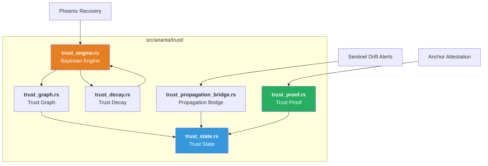
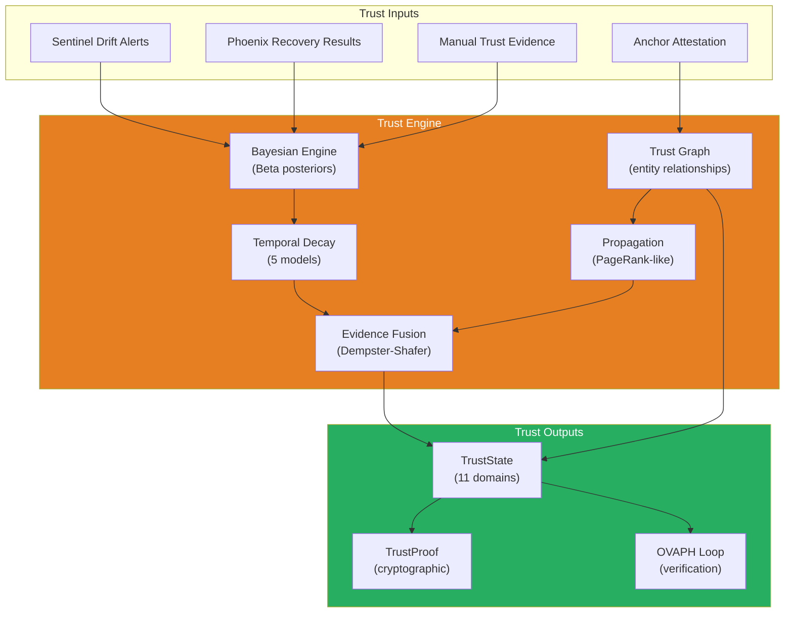

# Trust Engine — Probabilistic Trust Model

> **Source**: `src/ananta/trust/`
> **Cross-References**: [ANANTA](./ANANTA.md) · [Sentinel](./SENTINEL.md) · [Phoenix](./PHOENIX.md) · [OVAPH Loop](./OVAPH.md)

---

## 1. Overview

The Trust Engine is the probabilistic heart of ANANTA's trust model. It replaces a simple exponential moving average (EMA) with a production-grade **Bayesian trust engine** that uses Beta distribution posteriors, temporal decay, PageRank-like propagation, Dempster-Shafer evidence fusion, and Holt-Winters trend prediction.

### Components

| # | Module | Purpose |
|---|--------|--------|
| 1 | `trust_state.rs` | Platform-wide trust snapshot (11 domains) |
| 2 | `trust_graph.rs` | Entity-to-entity trust relationships |
| 3 | `trust_proof.rs` | Cryptographic proof of platform integrity |
| 4 | `trust_engine.rs` | Bayesian trust engine (Beta posterior, decay, propagation, fusion) |
| 5 | `trust_decay.rs` | Temporal trust decay (5 models, 5 schedule types) |
| 6 | `trust_propagation_bridge.rs` | Bridges Bayesian engine into TrustState updates |



---

## 2. Trust State — Platform Snapshot

> **Source**: `src/ananta/trust/trust_state.rs`

### 2.1 Structure

The `TrustState` is the current trust snapshot of the entire platform — not a single score, but a structured state with 11 per-domain trust levels.

```rust
pub struct TrustState {
    pub domains: HashMap<String, DomainTrust>,  // 11 domains
    pub alerts: Vec<TrustAlert>,                // Active alerts
    pub last_updated: String,                    // RFC 3339
    pub cycle_count: u64,                        // Attestation cycles
}

pub struct DomainTrust {
    pub domain: String,        // e.g., "decision", "policy"
    pub level: f64,            // 0.0 (untrusted) to 1.0 (trusted)
    pub trend: TrendDirection, // Improving / Stable / Degrading
    pub observations: u64,    // Contributing observations
    pub alerts: Vec<TrustAlert>,
}
```

All domains start at level `1.0` (trusted). Trust must be **lost** through evidence.

### 2.2 The 11 Trust Domains

| Domain | Weight | What It Monitors |
|--------|--------|-----------------|
| `decision` | 2.0 | Decision drift (allow/deny ratio) |
| `policy` | 2.5 | Policy drift (rules changing) |
| `model` | 1.5 | Model drift (ring behavior patterns) |
| `orchestration` | 2.0 | Orchestration drift (pipeline config) |
| `learning` | 1.5 | Learning drift (threshold adaptation) |
| `memory` | 1.0 | Memory drift (access patterns) |
| `configuration` | 2.0 | Configuration drift (config changes) |
| `plugin` | 1.0 | Plugin drift (loaded modules) |
| `runtime` | 1.0 | Runtime drift (performance) |
| `performance` | 0.5 | Performance drift |
| `trust` | **3.0** | Trust drift (meta-trust — most important) |

### 2.3 Overall Trust Score

Computed as a weighted average:

```
overall = Σ(domain_level × weight) / Σ(weights)
```

The `trust` domain has the highest weight (3.0) because meta-trust — trust in the trust system — is the most critical. `performance` has the lowest weight (0.5) because it's informational.

### 2.4 Trend Auto-Detection

When `set_domain_level()` is called, the trend is automatically computed:

```rust
let old = d.level;
d.level = new_level.clamp(0.0, 1.0);
d.trend = if (d.level - old).abs() < 0.01 {
    TrendDirection::Stable
} else if d.level > old {
    TrendDirection::Improving
} else {
    TrendDirection::Degrading
};
```

---

## 3. Trust Graph — Entity Relationships

> **Source**: `src/ananta/trust/trust_graph.rs`

The trust graph models trust as a **living network** of entity-to-entity relationships, not a single score.

### 3.1 Node Types

```rust
pub enum NodeType {
    User,
    Agent,
    Model,
    Tool,
    Memory,
    Ring(String),    // e.g., Ring("shield"), Ring("threat")
    Keshav,
    Ananta,
    Policy,
    Infra,
}
```

### 3.2 Trust Edges

```rust
pub struct TrustEdge {
    pub from: String,          // Source node
    pub to: String,            // Target node
    pub weight: f64,           // 0.0 (no trust) to 1.0 (full trust)
    pub evidence_count: u64,  // Supporting evidence
    pub last_updated: String,
    pub last_event: Option<String>,
}
```

Edges start at weight `0.5` (neutral). Updates use exponential moving average:

```rust
pub fn update(&mut self, positive: bool, magnitude: f64, event: &str) {
    let delta = if positive { magnitude } else { -magnitude };
    let alpha = 0.1;
    self.weight = (self.weight + alpha * delta).clamp(0.0, 1.0);
    self.evidence_count += 1;
}
```

### 3.3 Trust Path Cost (Dijkstra)

The graph supports Dijkstra-like minimum trust path computation. Trust is inverted to cost: `cost = 1.0 - edge.weight`.

```rust
pub fn trust_path_cost(&self, from: &str, to: &str) -> Option<f64>
```

Returns `Some(cost)` where lower = more trusted, or `None` if no path exists.

### 3.4 Weak Link Detection

```rust
pub fn weak_links(&self, threshold: f64) -> Vec<&TrustEdge>
```

Returns all edges below the trust threshold — useful for identifying security weak points.

### 3.5 Aggregate Trust

```rust
pub fn node_trust(&self, node_id: &str) -> f64
```

Computes the average of all incoming trust edges for a node. Returns `0.5` (neutral) if no evidence exists.

---

## 4. Bayesian Trust Engine

> **Source**: `src/ananta/trust/trust_engine.rs`

The Bayesian engine replaces simple EMA with a mathematically rigorous probabilistic model.

### 4.1 Beta Distribution Model

Each entity-pair relationship is modeled as a Beta distribution. Trust is the posterior mean.

```
Beta(α, β) where:
  α = α₀ + positive_evidence
  β = β₀ + negative_evidence
  trust = E[X] = α / (α + β)
```

#### Beta Prior

```rust
pub struct BetaPrior {
    pub alpha_0: f64,  // Pseudo-count positive
    pub beta_0: f64,   // Pseudo-count negative
}
```

Default: **Beta(2, 2)** — a **skeptical prior** where trust starts at 0.5 and requires genuine evidence to move away from neutrality.

| Prior Type | α₀ | β₀ | Starting Trust |
|-----------|-----|-----|----------------|
| `default()` | 2.0 | 2.0 | 0.5 (skeptical) |
| `optimistic()` | 5.0 | 1.0 | 0.83 |
| `pessimistic()` | 1.0 | 5.0 | 0.17 |

#### Trust Evidence

```rust
pub struct TrustEvidence {
    pub is_positive: bool,
    pub weight: f64,        // (0.01, 1.0]
    pub timestamp: String,  // RFC 3339
    pub source: String,     // Human-readable
}
```

Convenience constructors:

```rust
TrustEvidence::positive("attestation_passed");
TrustEvidence::negative("integrity_check_failed");
TrustEvidence::new(true, 0.5, "partial_pass");
```

#### BetaTrustParams

```rust
pub struct BetaTrustParams {
    pub alpha: f64,            // positive evidence + prior
    pub beta: f64,             // negative evidence + prior
    pub raw_positive: f64,    // Audit: raw positive count
    pub raw_negative: f64,    // Audit: raw negative count
    pub prior: BetaPrior,
}
```

Key computations:

| Method | Formula |
|--------|---------|
| `posterior_mean()` | `α / (α + β)` |
| `posterior_variance()` | `αβ / ((α+β)² × (α+β+1))` |
| `posterior_std()` | `√variance` |
| `effective_sample_size()` | `raw_positive + raw_negative` |

### 4.2 Five Engine Capabilities

1. **Beta Distribution Posteriors** — per-edge trust with skeptical priors
2. **Temporal Decay** — configurable decay models applied to evidence
3. **Trust Propagation** — PageRank-like damping through the graph
4. **Evidence Fusion** — Dempster-Shafer combination for multi-path evidence
5. **Trend Prediction** — Holt-Winters smoothing for future trust prediction

---

## 5. Temporal Trust Decay

> **Source**: `src/ananta/trust/trust_decay.rs`

Trust decays over time. Each entity can use a different decay model, schedule, and policy.

### 5.1 Decay Models

| Model | Formula | Parameters |
|-------|---------|------------|
| **Exponential** | `e^(-λt)` | `lambda` (decay rate) |
| **Power Law** | `(1+t)^(-α)` | `alpha` (decay exponent) |
| **Step Function** | Discrete drops at boundaries | `boundaries: Vec<(f64, f64)>` |
| **Logarithmic** | `1 - b·ln(1+ct)` | `b`, `c` constants |
| **Custom** | Piecewise linear segments | `segments: Vec<(f64, f64)>` |

#### Exponential Decay Example

```rust
let params = ExponentialParams::new(0.001);
// Half-life = ln(2) / 0.001 = 693 seconds (~11.5 minutes)
let factor = params.decay_factor(693.0);  // ≈ 0.5
let factor = params.decay_factor(1386.0); // ≈ 0.25
```

### 5.2 Schedule Types

| Schedule | Description |
|----------|-------------|
| **Immediate** | Decay starts at evidence timestamp |
| **Deferred** | Delay before decay begins |
| **Periodic** | Decay applied at fixed intervals |
| **Event-driven** | Decay triggered by named events |
| **Cron-like** | Minute/hour/day/month patterns |

### 5.3 Audit Trail

Every decay computation is recorded in an immutable audit trail for compliance.

---

## 6. Trust Proof — Cryptographic Integrity

> **Source**: `src/ananta/trust/trust_proof.rs`

The Trust Proof is the **flagship technology** — it cryptographically proves: "I can prove the Security OS has not been compromised."

### 6.1 Proof Contents

```rust
pub struct TrustProof {
    pub proof_id: String,                    // UUID v4
    pub timestamp: String,                    // RFC 3339
    pub ananta_version: String,
    pub hash_algorithm: HashAlgorithm,        // Sha256/384/512/Blake3
    pub integrity_merkle_root: HashDigest,    // Merkle root of all integrity hashes
    pub trust_score: f64,                     // Overall trust at time of proof
    pub domain_trust: Vec<DomainTrustEntry>,  // Per-domain levels
    pub trust_chain_head: String,             // Hash of chain head
    pub attestation_cycles: u64,
    pub consecutive_passes: u64,
    pub all_passed: bool,                     // All integrity checks passed
    pub signature: Option<Signature>,         // Ed25519 signature
    proof_bytes: Vec<u8>,                     // Raw bytes for verification
}
```

### 6.2 Proof Generation

```rust
let proof = TrustProof::generate(
    &attestation_report,
    &trust_state,
    &trust_chain_head_hash,
    &key_pair,
);
```

The proof generation:
1. Collects domain trust levels from `TrustState`
2. Includes the Merkle root of all integrity domain hashes
3. Hashes the trust chain head
4. Signs the proof bytes with Ed25519

### 6.3 Configuration

| Setting | Default | Notes |
|---------|---------|-------|
| `enabled` | `true` | Master switch |
| `generation_interval_ms` | 5000 | New proof every 5 seconds |
| `retention_count` | 1000 | Proofs kept for audit |
| `include_runtime_hashes` | `false` | More expensive if true |

---

## 7. Trust Propagation Bridge

> **Source**: `src/ananta/trust/trust_propagation_bridge.rs`

The `TrustPropagationBridge` connects the Bayesian engine's outputs into `TrustState` updates. It propagates trust scores from the graph through the engine and writes results back to the platform-wide trust state.

---

## 8. Integration Points


