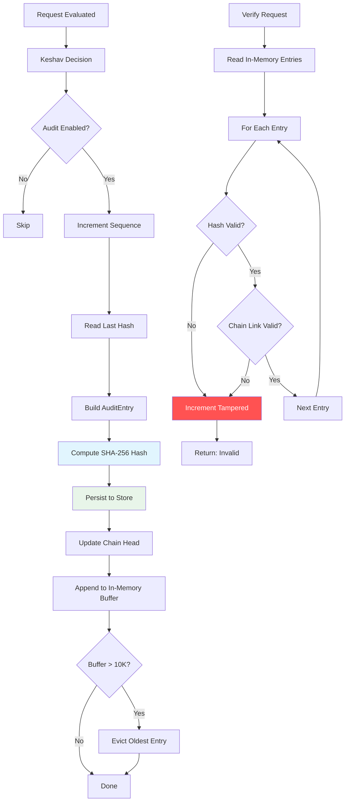

# Audit Trail System — Tamper-Evident Logging & Compliance

> **Source**: `src/infra/audit.rs`, `src/keshav/decision_logger.rs`, `src/cli/audit_export.rs`, `src/ananta/audit/`
> **Last Updated**: 2025-01
> **Related**: [ZERO_TRUST.md](./ZERO_TRUST.md) · [POLICY_ENGINE.md](./POLICY_ENGINE.md) · [THREAT_MODEL.md](./THREAT_MODEL.md) · [IDENTITY.md](./IDENTITY.md)

---

## 1. Overview

CHAKRAVYUH maintains two audit subsystems:

1. **Keshav Audit Trail** (`src/infra/audit.rs`) — SHA-256 hash-chained decision
   log for every evaluation, with in-memory buffer and persistent store.
2. **ANANTA Immutable Audit Log** (`src/ananta/audit/`) — Production-grade
   append-only storage with WAL, Merkle checkpoints, and compliance reporting.

Both systems share a common `DecisionRecord` structure and feed the
`/v1/decisions/export` endpoint for JSON/CSV export.

---

## 2. SHA-256 Hash Chain (Keshav Audit Trail)

### 2.1 AuditEntry Structure

Every decision is recorded as a hash-chained entry:

```rust
// src/infra/audit.rs
pub struct AuditEntry {
    pub seq: u64,              // Monotonically increasing
    pub timestamp: String,      // ISO 8601 (RFC 3339)
    pub trace_id: String,       // Correlation ID
    pub decision_json: String,  // Full DecisionRecord as JSON
    pub prev_hash: String,      // SHA-256 of previous entry
    pub hash: String,           // SHA-256 of this entry
    pub source_ip: String,      // Client IP
    pub path: String,           // Request endpoint
}
```

### 2.2 Hash Computation

Each entry's hash is computed over **all fields except the hash itself**:

```rust
fn compute_hash(&self) -> String {
    let mut hasher = Sha256::new();
    hasher.update(self.seq.to_le_bytes());
    hasher.update(self.timestamp.as_bytes());
    hasher.update(self.trace_id.as_bytes());
    hasher.update(self.decision_json.as_bytes());
    hasher.update(self.prev_hash.as_bytes());
    hasher.update(self.source_ip.as_bytes());
    hasher.update(self.path.as_bytes());
    hex::encode(hasher.finalize())
}
```

This creates an append-only, tamper-evident chain: modifying any historical
entry's `decision_json` breaks the hash chain and is detectable via
`verify_chain()`.

### 2.3 Chain Verification

```rust
// Returns (is_valid, total_entries, tampered_count)
let (valid, total, tampered) = trail.verify_chain();
// valid = true  → no tampering detected in in-memory entries
// valid = false → at least one entry has broken hash or chain link
```

---

## 3. Audit Flow



### 3.1 Storage Architecture

| Component | Key Pattern | Description |
|-----------|------------|-------------|
| Entry | `chakravyuh:audit:{seq}` | Individual audit entry (JSON) |
| Chain Head | `chakravyuh:audit:head` | `{seq}:{hash}` pointer |
| In-Memory | `VecDeque<AuditEntry>` | Ring buffer, max 10,000 entries |

On startup with a persistent store, the chain head is restored from
`chakravyuh:audit:head`, allowing the chain to continue across restarts.

---

## 4. DecisionRecord Structure

Every evaluation produces a `DecisionRecord` logged to the audit trail:

```rust
// src/decision.rs
pub struct DecisionRecord {
    pub request_id: String,           // Unique request identifier
    pub timestamp: String,             // ISO 8601
    pub source: DecisionSource,        // IP, user_id, agent_id, api_key
    pub risk_score: RiskScore,         // 8-dimension risk breakdown
    pub rings_evaluated: Vec<u8>,      // Which rings ran (by index)
    pub ring_verdicts: serde_json::Value,  // Per-ring detailed results
    pub policy_applied: Option<String>,// Policy rule name (or "fallback")
    pub final_decision: Decision,      // Allow/Deny/Challenge/Escalate
    pub reasoning: String,             // Human-readable explanation
    pub latency_ms: f64,               // Total evaluation time
    pub keshav_version: String,        // Keshav engine version
    pub policy_version: String,        // Active policy version
}
```

The `reasoning` field always contains the matched policy rule name or
`"fallback: ..."` when the safety net was used.

---

## 5. Export Formats

### 5.1 API Endpoint

```
GET /v1/decisions/export?format=json&severity=high&ring=threat&limit=100
```

### 5.2 Supported Formats

| Format | CLI Flag | Content-Type | Description |
|--------|----------|-------------|-------------|
| JSON | `--format json` | `application/json` | Pretty-printed array of entries |
| CSV | `--format csv` | `text/csv` | Header row + data rows, RFC 4180 escaping |
| Text | `--format text` | `text/plain` | Aligned table with column headers |

### 5.3 Query Filters

```rust
// src/cli/audit_export.rs
pub struct AuditQuery {
    pub start_time: Option<String>,          // ISO 8601 or YYYY-MM-DD
    pub end_time: Option<String>,            // ISO 8601 or YYYY-MM-DD
    pub severity_filter: Option<String>,     // "high", "medium", "low"
    pub source_ring_filter: Option<String>,  // "shield", "threat", "identity"
    pub decision_type_filter: Option<String>,// "allow", "deny", "challenge"
    pub limit: usize,                        // Default: 1000
    pub offset: usize,                       // Pagination offset
}
```

### 5.4 CSV Example Output

```csv
timestamp,source_ring,decision,risk_score,user_id,request_id,description,metadata
2024-01-15T10:30:00Z,shield,deny,8.50,user-001,req-001,"SQL injection detected","{\"severity\": \"high\"}"
2024-01-15T11:00:00Z,threat,allow,0.50,user-002,req-002,"Normal request passed","{\"severity\": \"low\"}"
```

---

## 6. ANANTA Immutable Audit Log

**File**: `src/ananta/audit/immutable_log.rs`

The ANANTA subsystem provides a hardened, production-grade audit log with:

- **Write-Ahead Log (WAL)**: CRC-32 protected entries for crash recovery
- **Lock-free ring buffer**: Atomic operations for concurrent reads/writes
- **Merkle checkpoints**: Periodic Merkle tree roots for O(log n) verification
- **Background compaction**: Automatic log segment compaction
- **Hash-chained entries**: Each entry references the previous entry's hash

### 6.1 WAL Integrity

```rust
// Each WAL entry has a CRC-32 checksum
pub enum WalError {
    CrcMismatch { expected: u32, actual: u32, offset: usize },
    TruncatedEntry { offset: usize, remaining: usize },
    BufferOverflow { required: usize, available: usize },
    CodecError(String),
}
```

---

## 7. Compliance Frameworks

**File**: `src/ananta/audit/audit_compliance.rs`

The ANANTA compliance engine supports five frameworks:

| Framework | Enum Variant | Key Controls |
|-----------|-------------|--------------|
| SOC 2 (Type I/II) | `Soc2` | Access logging, change detection, incident response |
| GDPR | `Gdpr` | Data minimization, right to erasure, consent tracking |
| HIPAA | `Hipaa` | PHI access logging, 6-year retention, breach notification |
| PCI-DSS | `PciDss` | Cardholder data access, audit trail integrity |
| Custom | `Custom(name)` | Organization-specific policies |

### 7.1 Compliance Rule Severity

| Level | Action | SLA |
|-------|--------|-----|
| Low | Informational, no action | — |
| Medium | Warning, should be addressed | 30 days |
| High | Must be addressed | 72 hours |
| Critical | Immediate action required | 4 hours |

---

## 8. API Key Security & Audit

**File**: `src/infra/api_keys.rs`

API keys contribute to the audit trail:

- Key creation, revocation, and deletion are logged
- Per-key authentication events are recorded in DecisionRecord
- Secrets are stored as SHA-256 hashes (never in plaintext)
- Key IDs follow the format `ak_{prefix}_{uuid8}`

```rust
// Authentication flow produces AuthResult which maps to audit events:
// Authenticated(key_id) → logged as successful auth
// InvalidKey → logged as auth failure
// Revoked → logged as revoked key usage attempt
// TimestampStale → logged as potential replay attack
```

---

## 9. Cross-References

| Topic | Document | Section |
|-------|----------|---------|
| Decision types | [ZERO_TRUST.md](./ZERO_TRUST.md) | Decision Types |
| Fallback rule logging | [POLICY_ENGINE.md](./POLICY_ENGINE.md) | Fallback Rules |
| RiskScore dimensions | [ZERO_TRUST.md](./ZERO_TRUST.md) | Risk Score Composition |
| Identity trust audit | [IDENTITY.md](./IDENTITY.md) | TrustAccumulator |
| Threat signature logging | [THREAT_MODEL.md](./THREAT_MODEL.md) | ConfidenceScorer |
| Policy version in records | [POLICY_ENGINE.md](./POLICY_ENGINE.md) | Default Policy v2.0.0 |
| ANANTA architecture | `docs/02-architecture/ANANTA.md` | — |
| Red-team audit validation | `tests/owasp_llm01_benchmark.rs` | — |