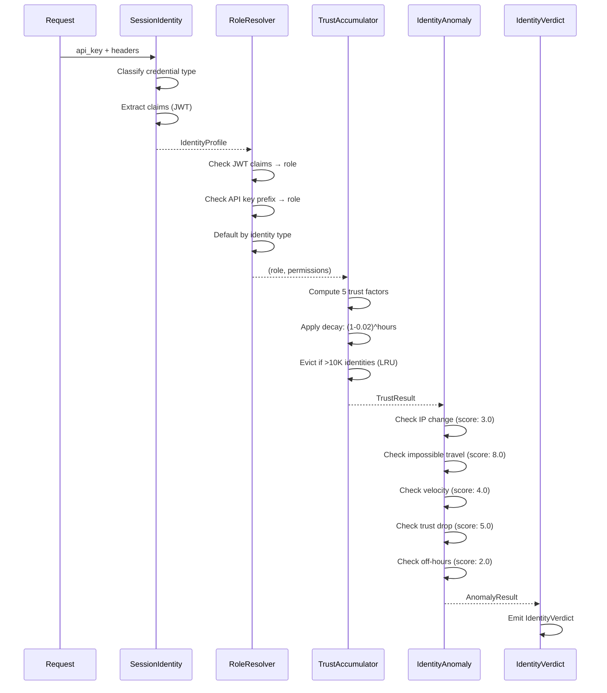

# Identity Ring — 4-Engine Pipeline, RBAC & Trust Scoring

> **Source**: `src/identity/session_identity.rs`, `src/identity/role_resolver.rs`, `src/identity/trust_accumulator.rs`, `src/identity/identity_anomaly.rs`
> **Last Updated**: 2025-01
> **Related**: [ZERO_TRUST.md](./ZERO_TRUST.md) · [THREAT_MODEL.md](./THREAT_MODEL.md) · [POLICY_ENGINE.md](./POLICY_ENGINE.md) · [AUDIT.md](./AUDIT.md)

---

## 1. Overview

The Identity Ring evaluates every request through a **4-engine sequential
pipeline** that classifies credentials, resolves roles, accumulates trust,
and detects anomalies. Total combined latency budget: <0.3ms p99.



---

## 2. Engine #1: SessionIdentity

**File**: `src/identity/session_identity.rs`
**Latency Budget**: <0.05ms

Classifies every request by authentication method. CHAKRAVYUH is a security
layer, not an identity provider — it validates credential **format** but does
NOT verify signatures (that is the upstream auth provider's responsibility).

### 2.1 Credential Types

| IdentityType | Detection Method | Default Trust | Header/Source |
|-------------|-----------------|---------------|---------------|
| `Internal` | `X-Internal-Identity` header | 1.0 | Ring-to-ring calls |
| `Mtls` | `X-Client-Cert-Fingerprint` header | 0.9 | mTLS proxy |
| `Jwt` | 3-dot structure in Authorization | 0.7 | Bearer token |
| `Session` | `X-Session-Token` header | 0.6 | Opaque token |
| `ApiKey` | Authorization header, non-JWT | 0.5 | Bearer token |
| `Anonymous` | No credentials | 0.1 | Fallback |

### 2.2 Detection Priority

```rust
// Evaluation order (first match wins):
// 1. X-Internal-Identity header → Internal (highest trust)
// 2. X-Client-Cert-Fingerprint → Mtls
// 3. X-Session-Token → Session
// 4. Authorization header with 3 dots → Jwt
// 5. Authorization header without dots → ApiKey
// 6. No credentials → Anonymous
```

### 2.3 JWT Claim Extraction

For JWT tokens, the SessionIdentity engine extracts claims without verifying
signatures (format-only parsing of the base64url-encoded payload):

```rust
// Extracted claims:
//   sub:<value>    — subject identifier → used as principal_id
//   iss:<value>    — issuer (compared against trusted_jwt_issuers)
//   aud:<value>    — audience
//   scope:<value>  — individual scopes (space-separated)
//   role:<value>   — individual roles (JSON array)
//   expired:true   — detected if exp < now
```

API key validation rules:
- Minimum length: 16 characters
- Maximum length: 256 characters
- Prefix check: `sk-`, `pk-` (configurable via `valid_api_key_prefixes`)
- Principal ID: first 4 bytes of SHA-256 hash of the key (hex)

---

## 3. Engine #2: RoleResolver

**File**: `src/identity/role_resolver.rs`
**Latency Budget**: <0.05ms

Maps identity profiles to RBAC roles with 3-tier resolution priority.

### 3.1 Role Hierarchy

| Role | Level | Description | Default Permissions |
|------|-------|-------------|-------------------|
| `admin` | 100 | Full system access | 11 permissions (all) |
| `operator` | 80 | Read + write, no config | 8 permissions |
| `auditor` | 60 | Read-only + audit logs | 4 permissions |
| `user` | 40 | Standard API access | 6 permissions |
| `service` | 30 | Machine-to-machine | 4 permissions |
| `anonymous` | 10 | Public endpoints only | 1 permission (Health) |

### 3.2 Resolution Priority

```rust
// Priority 1: JWT claims
//   "role:admin" in claims → Role::Admin
//   "role:auditor" in claims → Role::Auditor

// Priority 2: API key prefix mapping
//   "sk-admin-" → Role::Admin
//   "sk-op-"    → Role::Operator
//   "sk-audit-" → Role::Auditor
//   "sk-svc-"   → Role::Service

// Priority 3: Identity type defaults
//   Internal → Admin, Mtls → Operator
//   Jwt → User, Session → User, ApiKey → User, Anonymous → Anonymous
```

### 3.3 Permission Set (11 Permissions)

| Permission | Admin | Operator | Auditor | User | Service | Anonymous |
|-----------|-------|----------|---------|------|---------|----------|
| Read | ✓ | ✓ | ✓ | ✓ | ✓ | |
| Write | ✓ | ✓ | | | | |
| Delete | ✓ | | | | | |
| Execute | ✓ | ✓ | | ✓ | ✓ | |
| Configure | ✓ | | | | | |
| Audit | ✓ | ✓ | ✓ | | | |
| Health | ✓ | ✓ | ✓ | ✓ | ✓ | ✓ |
| Chat | ✓ | ✓ | | ✓ | ✓ | |
| Evaluate | ✓ | ✓ | ✓ | ✓ | | |
| Proxy | ✓ | ✓ | | ✓ | | |
| AdminOps | ✓ | | | | | |

---

## 4. Engine #3: TrustAccumulator

**File**: `src/identity/trust_accumulator.rs`
**Latency Budget**: <0.1ms

Stateful engine maintaining per-identity trust scores with LRU eviction.

### 4.1 Configuration

```yaml
identity:
  trust_accumulator:
    enabled: true
    max_identities: 10000      # LRU eviction cap
    decay_rate: 0.02           # 2% per hour of inactivity
    w_base: 0.25               # Weight: identity type
    w_age: 0.10                # Weight: account age
    w_consistency: 0.15        # Weight: IP/agent consistency
    w_volume: 0.20             # Weight: request volume
    w_denial: 0.30             # Weight: denial ratio
    excessive_rate: 60.0       # Requests/min threshold
```

### 4.2 Trust Score Formula

```
trust = w_base × base_trust
      + w_age × age_factor
      + w_consistency × consistency_factor
      + w_volume × volume_factor
      + w_denial × denial_factor

trust_score = clamp(trust × (1 - decay_rate)^hours_since_last, 0.0, 1.0)
```

Factor details:

- **age_factor**: `min(1 - e^(-hours_since_first / 24), 1.0)` — saturates at 24h
- **consistency_factor**: `(ip_consistency × 0.6) + (agent_consistency × 0.4)`
  where `ip_consistency = 1/N_unique_IPs`
- **volume_factor**: 1.0 if ≥10 requests, 0.8 if ≥3, 0.5 if new,
  `1/sqrt(excess)` if above excessive_rate
- **denial_factor**: `max(1 - denial_ratio × 3, 0.0)` — 3 consecutive denials = 0 trust

### 4.3 State Tracking

Per-identity `TrustState` tracks:
- `request_count` / `denial_count` — volume and denial ratio
- `first_seen` / `last_seen` — age and decay calculation
- `seen_ips` (max 10) / `seen_agents` (max 5) — consistency
- `rate_estimate` — exponentially weighted moving average

---

## 5. Engine #4: IdentityAnomaly

**File**: `src/identity/identity_anomaly.rs`
**Latency Budget**: <0.1ms

Detects 9 anomaly types. Each anomaly scored 0.0–10.0 with severity tiers:

| Tier | Score Range | Action | Examples |
|------|------------|--------|----------|
| Minor | 1.0–3.0 | Log only | NewIdentity (1.0), AgentChange (2.0), OffHours (2.0) |
| Moderate | 3.0–6.0 | Increase scrutiny | IpChange (3.0), HighVelocity (4.0), TrustDrop (5.0) |
| Severe | 6.0–10.0 | Challenge or Deny | ImpossibleTravel (8.0+) |

### 5.1 Impossible Travel Detection

```rust
// Distance estimation (IPv4 heuristic, no GeoIP DB in Phase 2):
//   Different /8 block  → ~5000 km (likely different region/country)
//   Different /16 block → ~500 km  (likely different city)
//   Different /24 block → ~50 km   (likely different subnet)
//   Same /24           → ~5 km    (nearby)

// Speed = distance_km / hours_elapsed
// Threshold: 800 km/h (faster than commercial flight)
// Score: min(impossible_travel_score × (speed / threshold), 10.0)
```

### 5.2 Velocity Detection

Tracks request timestamps in a 60-second sliding window. If count exceeds
`velocity_threshold` (default: 30 req/min), triggers HighVelocity anomaly.

### 5.3 State Management

Like TrustAccumulator, IdentityAnomaly maintains per-identity state with
LRU eviction at `max_identities: 10000`. State includes:
- `last_ip`, `last_agent`, `last_identity_type`, `last_timestamp`
- `request_timestamps` (sliding 60-second window)
- `previous_trusts` (rolling window of 20 trust scores)

---

## 6. Cross-References

| Topic | Document | Section |
|-------|----------|---------|
| API key HMAC auth | [ZERO_TRUST.md](./ZERO_TRUST.md) | API Key Authentication |
| Zero trust per-request model | [ZERO_TRUST.md](./ZERO_TRUST.md) | Per-Request Evaluation |
| Policy evaluation of identity | [POLICY_ENGINE.md](./POLICY_ENGINE.md) | Default Policy v2.0.0 |
| Risk score composition | [ZERO_TRUST.md](./ZERO_TRUST.md) | Risk Score Composition |
| Audit of identity decisions | [AUDIT.md](./AUDIT.md) | DecisionRecord |
| ANANTA compliance | [AUDIT.md](./AUDIT.md) | Compliance Frameworks |
| Threat detection interaction | [THREAT_MODEL.md](./THREAT_MODEL.md) | Composite Risk Score Flow |
| Fallback deny on identity | [POLICY_ENGINE.md](./POLICY_ENGINE.md) | Fallback Rules |