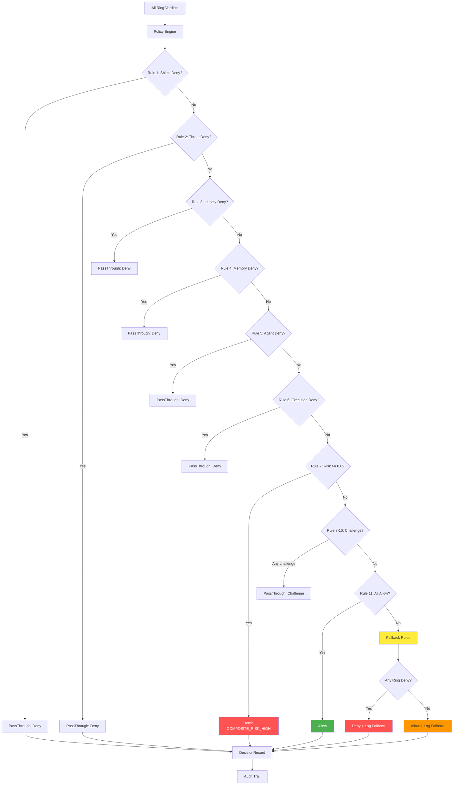
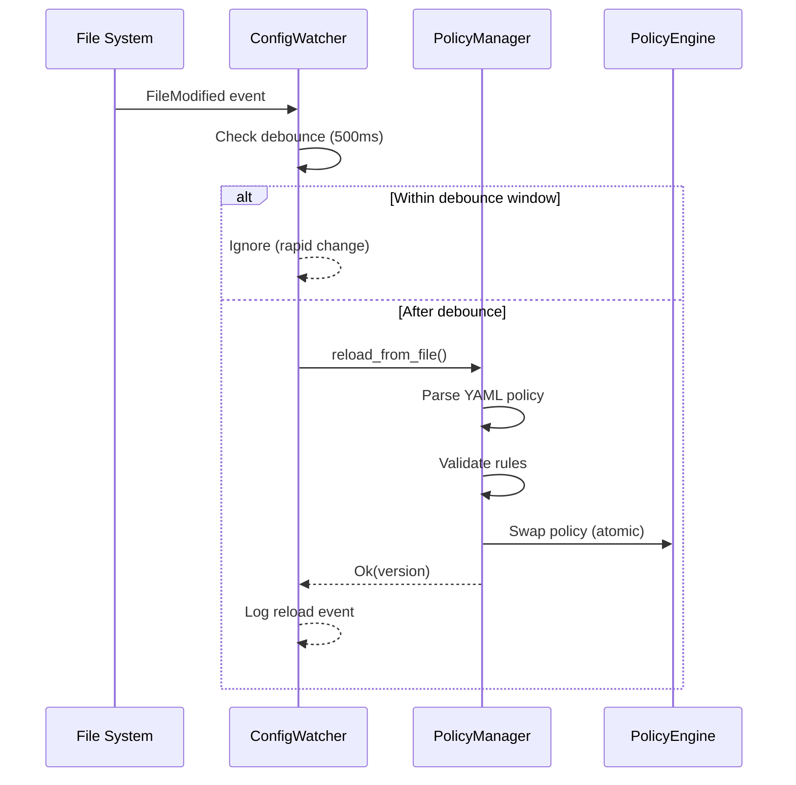
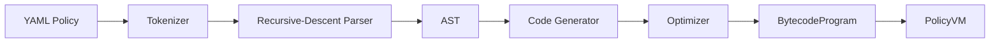

# Keshav Policy Engine — YAML Rules, Bytecode VM & Hot Reload

> **Source**: `src/keshav/policy_engine.rs`, `src/keshav/fallback_rules.rs`, `src/keshav/policy_manager.rs`, `src/policy_compiler/`, `src/infra/config_watcher.rs`
> **Last Updated**: 2025-01
> **Related**: [THREAT_MODEL.md](./THREAT_MODEL.md) · [ZERO_TRUST.md](./ZERO_TRUST.md) · [IDENTITY.md](./IDENTITY.md) · [AUDIT.md](./AUDIT.md)

---

## 1. Overview

The Keshav Policy Engine evaluates ring verdicts against a ordered list of
policy rules. The **first matching rule wins**. If no rule matches,
[hardcoded Fallback Rules](#5-fallback-rules) take over.

The policy engine operates at two levels:

1. **YAML Rule Engine** — Direct evaluation of `PolicyRule` structs (current default)
2. **Policy Compiler + Bytecode VM** — YAML → AST → bytecode → stack VM execution

---

## 2. YAML Rule Format

Each policy rule has four fields:

```yaml
# Conceptual YAML representation of a PolicyRule
name: "deny_on_threat_deny"
condition: "threat_deny"          # RuleCondition enum variant
action: "pass_through"           # RuleAction enum variant
reason: "Threat Ring denied the request"
```

### 2.1 RuleCondition Variants

| Condition | Trigger | Rings Checked |
|-----------|---------|---------------|
| `shield_deny` | Shield Ring returned Deny | Shield |
| `threat_deny` | Threat Ring returned Deny | Threat |
| `threat_challenge` | Threat Ring returned Challenge | Threat |
| `identity_deny` | Identity Ring returned Deny | Identity |
| `identity_challenge` | Identity Ring returned Challenge | Identity |
| `memory_deny` | Memory Ring returned Deny | Memory |
| `memory_challenge` | Memory Ring returned Challenge | Memory |
| `agent_deny` | Agent Ring returned Deny | Agent |
| `execution_deny` | Execution Ring returned Deny | Execution |
| `all_rings_allow` | All evaluated rings returned Allow | All |
| `risk_above(N)` | Composite risk score >= N | RiskScore |

### 2.2 RuleAction Variants

| Action | Effect | Example |
|--------|--------|---------|
| `pass_through` | Return the ring's own decision | Most deny rules |
| `allow` | Force allow | Override rules |
| `deny(code)` | Force deny with custom code | `"CUSTOM_DENY"` |
| `challenge` | Force JS challenge | MFA step-up |
| `escalate` | Route to human approver | `approver_role: "security_admin"` |

---

## 3. Default Policy (v2.0.0)

The hardcoded default policy contains 11 rules, ordered most-restrictive-first:

```rust
// src/keshav/policy_engine.rs — Policy::default()
// Version: "2.0.0"
// Rules (in evaluation order):
//   1. deny_on_shield_deny         → PassThrough  (Shield Deny)
//   2. deny_on_threat_deny         → PassThrough  (Threat Deny)
//   3. deny_on_identity_deny      → PassThrough  (Identity Deny)
//   4. deny_on_memory_deny         → PassThrough  (Memory Deny)
//   5. deny_on_agent_deny          → PassThrough  (Agent Deny)
//   6. deny_on_execution_deny      → PassThrough  (Execution Deny)
//   7. deny_on_risk_above_8        → Deny("COMPOSITE_RISK_HIGH")
//   8. challenge_on_threat_challenge → PassThrough
//   9. challenge_on_identity_challenge → PassThrough
//  10. challenge_on_memory_challenge → PassThrough
//  11. allow_default               → Allow (all rings allowed)
```

The default deny rule ensures that if ANY ring denies, the request is
denied — this is the **default deny on any ring deny** principle.

---

## 4. Decision Flow



### 4.1 PassThrough Semantics

When a rule's action is `PassThrough`, the engine returns the **most
restrictive** ring decision:

```rust
fn apply_action_all(rule, all) -> Decision {
    match rule.action {
        RuleAction::PassThrough => {
            // Priority order for most-restrictive selection:
            if all.shield.decision.is_deny() { return shield.decision; }
            if let Some(t) = all.threat {
                if t.decision.is_deny() { return t.decision; }
                if matches!(t.decision, Challenge { .. }) { return t.decision; }
            }
            // ... same pattern for identity, memory, agent, execution
            Decision::Allow
        }
        // ...
    }
}
```

---

## 5. Fallback Rules

**File**: `src/keshav/fallback_rules.rs`

Fallback Rules are the **hardcoded safety net** — they cannot be modified by
configuration files, YAML policies, or Keshav-Learn. They implement:

- **Principle 2 (Fail Secure)**: If ANY ring denied, deny.
- **Principle 1 (Decide-without-Learn)**: Pure functions of ring verdicts,
  no ML or risk scoring required.

The fallback evaluates rings in priority order:

| Priority | Ring | Checks |
|----------|------|--------|
| 1 | Shield | Deny, Challenge |
| 2 | Threat | Deny, Challenge |
| 3 | Identity | Deny, Challenge |
| 4 | Memory | Deny, Challenge |
| 5 | Agent | Deny |
| 6 | Execution | Deny |
| 7 | Reasoning | Deny, Challenge |
| 8 | Governance | Deny, Escalate |
| 9 | Recovery | Deny |
| 10 | — | Default: Allow (logged) |

Every fallback decision includes the string `"fallback: "` in its reasoning
so audit trails clearly indicate when the safety net was used.

---

## 6. Policy Hot-Reload via Config Watcher

**File**: `src/infra/config_watcher.rs`

The config watcher monitors the policy file for changes and triggers
automatic reload using the `notify 8.0` crate:

```yaml
# config.example.yaml
config_watcher:
  enabled: true
  debounce_ms: 500  # Rapid-change debounce window
```



Key behaviors:
- Only reacts to `Modify` and `Create` events (ignores `Remove`, `Rename`)
- If reload fails, the old policy remains active (no disruption)
- If the watcher fails to start (file missing), the system continues without
  auto-reload — manual reload via `/v1/policy/reload` still works
- Shutdown is graceful via `ConfigWatcherHandle::shutdown()`

---

## 7. Policy Compiler — YAML to Bytecode VM

**Files**: `src/policy_compiler/compiler.rs`, `src/policy_compiler/bytecode.rs`, `src/policy_compiler/vm.rs`

For advanced policies, a full compiler pipeline transforms YAML into bytecode
executed by a stack-based VM:



### 7.1 Bytecode Format

Compiled policies use the `CVPOL` magic header (5 bytes) with format version 1.

Key opcodes in the instruction set:

| Category | Opcodes | Description |
|----------|---------|-------------|
| Stack | `Push`, `PushStr`, `Load`, `Store` | Literals and variables |
| Arithmetic | `Add`, `Sub`, `Mul`, `Div`, `Mod` | Math operations |
| Comparison | `Gt`, `Lt`, `Ge`, `Le`, `Eq`, `Ne` | Comparisons |
| Logic | `And`, `Or`, `Not` | Boolean operations |
| Control | `Jump`, `JumpIfFalse`, `JumpIfTrue`, `Call`, `Return` | Flow control |
| String | `MatchRegex`, `Contains`, `StartsWith`, `EndsWith` | String ops |
| Risk | `RiskAdd`, `RiskMul`, `RiskMax` | Risk accumulation |
| Decision | `Deny`, `Allow`, `Escalate`, `Challenge` | Decision emission |
| Misc | `Halt`, `Nop` | Stop / no-op |

### 7.2 YAML Policy Example

```yaml
# Conceptual YAML policy for the compiler
version: "1.0"
name: "strict-threat-policy"
defaults:
  enabled: true
  risk_threshold: 7.0
  timeout_secs: 5
rules:
  - name: "deny-high-threat"
    action: "deny"
    condition: "threat.composite_score > 0.8"
    risk_weight: 1.5
    enabled: true
  - name: "challenge-medium-threat"
    action: "challenge"
    condition: "threat.composite_score > 0.5 AND identity.trust_score < 0.3"
    risk_weight: 0.8
    enabled: true
```

---

## 8. Cross-References

| Topic | Document | Section |
|-------|----------|---------|
| Threat Ring scores | [THREAT_MODEL.md](./THREAT_MODEL.md) | ConfidenceScorer |
| Identity trust scoring | [IDENTITY.md](./IDENTITY.md) | TrustAccumulator |
| Decision types | [ZERO_TRUST.md](./ZERO_TRUST.md) | Decision Types |
| RiskScore struct | [ZERO_TRUST.md](./ZERO_TRUST.md) | Risk Score Composition |
| Fallback fail-secure | [ZERO_TRUST.md](./ZERO_TRUST.md) | Fail Secure Principle |
| Audit of policy decisions | [AUDIT.md](./AUDIT.md) | DecisionRecord |
| ANANTA policy versioning | [AUDIT.md](./AUDIT.md) | ANANTA Immutable Log |