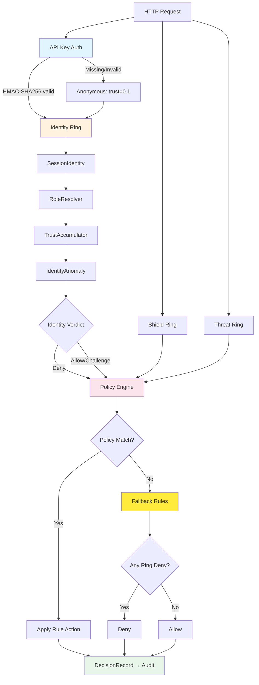

# Zero Trust Architecture — Never Trust, Always Verify

> **Source**: `src/identity/`, `src/keshav/decide.rs`, `src/keshav/fallback_rules.rs`
> **Last Updated**: 2025-01
> **Related**: [THREAT_MODEL.md](./THREAT_MODEL.md) · [IDENTITY.md](./IDENTITY.md) · [POLICY_ENGINE.md](./POLICY_ENGINE.md) · [AUDIT.md](./AUDIT.md)

---

## 1. Zero Trust Principles in CHAKRAVYUH

CHAKRAVYUH implements zero trust for AI workloads through five core principles:

1. **Never trust, always verify** — Every request is fully evaluated regardless
   of prior authentication state. No session-level caching of allow decisions.
2. **Per-request evaluation** — The full ring pipeline (Shield → Threat →
   Identity → Memory → Agent → Execution) runs on every single request.
3. **Default deny** — If no policy rule matches, Fallback Rules apply.
   If any ring denies, the request is denied. See [POLICY_ENGINE.md](./POLICY_ENGINE.md).
4. **Least privilege** — RBAC roles grant minimum permissions; anonymous
   identities receive only `/health` access. See [IDENTITY.md](./IDENTITY.md).
5. **Assume breach** — Anomaly detection (impossible travel, IP change, trust
   drops) treats every session as potentially compromised.

---

## 2. Per-Request Evaluation Flow



### 2.1 API Key Authentication

Every `/v1/*` request passes through HMAC-SHA256 API key authentication
(`src/infra/api_keys.rs`):

```rust
// Signature = HMAC-SHA256(master_secret, key_id + timestamp + method + path + body_hash)
// Header format: Authorization: Bearer <key_id>:<signature>

// Timestamp tolerance: 300 seconds (rejects replay attacks)
// Per-key rate limiting: configurable RPM per key
// Per-key permissions: Evaluate, Proxy, Execute, Decisions, Learn, Policy, Metrics, Admin
```

Authentication results map to `AuthResult` variants:

| Result | HTTP Semantics | Next Step |
|--------|---------------|-----------|
| `Ok` | Auth disabled | Proceed as anonymous |
| `Authenticated(key_id)` | 200 | Identity Ring evaluation |
| `Missing` | 401 | Deny (no credentials) |
| `InvalidKey` | 403 | Deny (unknown key) |
| `Revoked` | 403 | Deny (key deactivated) |
| `Expired` | 403 | Deny (key past expiry) |
| `InvalidSignature` | 403 | Deny (HMAC mismatch) |
| `TimestampStale` | 403 | Deny (replay detected) |
| `InsufficientPermissions` | 403 | Deny (wrong scope) |
| `RateLimited` | 429 | Deny (per-key quota) |

---

## 3. Identity Verification

After API key authentication, the Identity Ring performs 4-stage verification.
See [IDENTITY.md](./IDENTITY.md) for full engine details.

### 3.1 Trust Scoring Decay

Trust is not static — it decays with inactivity and must be continuously
earned through consistent, benign behavior.

```rust
// TrustAccumulator decay formula (src/identity/trust_accumulator.rs):
// decay = (1.0 - decay_rate).powf(hours_since_last)
// trust_score = clamp(trust * decay, 0.0, 1.0)
//
// Default decay_rate: 0.02 (2% per hour)
// → ~50% trust remaining after 34 hours of inactivity
// → ~82% trust remaining after 10 hours
```

The trust score is a weighted composite of 5 factors:

| Factor | Weight | Description |
|--------|--------|-------------|
| base_trust | 0.25 | From identity type (anonymous=0.1, mTLS=0.9, internal=1.0) |
| age_factor | 0.10 | Saturating exponential: `1 - e^(-hours/24)` |
| consistency_factor | 0.15 | IP consistency (0.6) + agent consistency (0.4) |
| volume_factor | 0.20 | Moderate volume=1.0, excessive=degraded, new=0.5 |
| denial_factor | 0.30 | `1 - (denial_ratio × 3)`, floored at 0.0 |

### 3.2 Anomaly Detection

The IdentityAnomaly engine (`src/identity/identity_anomaly.rs`) detects 9
anomaly types, each scored 0.0–10.0:

| Anomaly | Default Score | Trigger |
|---------|--------------|---------|
| NewIdentity | 1.0 | First request from this principal |
| IpChange | 3.0 | IP changed from last request |
| ImpossibleTravel | 8.0 | Distance/time > 800 km/h threshold |
| AgentChange | 2.0 | User-Agent string changed |
| HighVelocity | 4.0 | >30 requests in 60-second window |
| TrustDrop | 5.0 | Trust fell >30% from rolling average |
| IdentityTypeChange | 5.0 | Credential type changed for same principal |
| OffHoursAccess | 2.0 | Authenticated access outside 09:00–17:00 UTC |
| PrincipalOverlap | — | Multiple identity types for related principals |

Composite anomaly score = max of all individual anomaly scores.
Scores ≥ 6.0 are classified as **severe** and trigger deny/challenge.

---

## 4. Decision Types

CHAKRAVYUH produces four decision types (`src/decision.rs`):

```rust
pub enum Decision {
    Allow,                                    // → HTTP 200
    Deny { code: String, retry_after: Option<u32> },  // → HTTP 403
    Challenge { challenge_type: ChallengeType },      // → HTTP 401
    Escalate { approver_role: String, timeout_secs: u64 }, // → HTTP 202
}
```

| Decision | HTTP Status | Meaning |
|----------|-------------|---------|
| Allow | 200 | Request passes to LLM |
| Deny | 403 | Blocked with machine-readable code |
| Challenge | 401 | Must solve JS challenge / CAPTCHA / 2FA |
| Escalate | 202 | Requires human approval (default: 3600s timeout) |

Challenge types: `Javascript` (proof-of-work), `Captcha`, `TwoFactor`,
`EmailVerification`.

---

## 5. Risk Score Composition

The `RiskScore` struct aggregates scores across all rings:

```rust
pub struct RiskScore {
    pub overall: f64,    // Composite (0.0–10.0)
    pub threat: f64,     // From Threat Ring
    pub identity: f64,   // From Identity Ring
    pub behavior: f64,   // From Agent Ring
    pub memory: f64,     // From Memory Ring
    pub execution: f64,  // From Execution Ring
    pub context: f64,    // From context analysis
    pub confidence: f64, // Detection confidence (0.0–1.0)
}
```

The default policy denies when `risk.overall >= 8.0` via the
`deny_on_risk_above_8` rule.

---

## 6. Fail Secure Principle

When the policy engine fails to produce a decision (corrupted policy,
engine crash, timeout), Fallback Rules take over. These are **hardcoded** —
not modifiable by configuration or Keshav-Learn:

```rust
// FallbackRules::evaluate_all() — order matters:
// 1. Shield Deny/Challenge → pass through
// 2. Threat Deny/Challenge → pass through
// 3. Identity Deny/Challenge → pass through
// 4. Memory Deny/Challenge → pass through
// 5. Agent Deny → pass through
// 6. Execution Deny → pass through
// 7. Reasoning Deny/Challenge → pass through
// 8. Governance Deny/Escalate → pass through
// 9. Recovery Deny → pass through
// 10. Default: Allow (logged as fallback usage)
```

**Key guarantee**: The system never fails open. If ANY ring returned Deny,
the fallback denies. This is Principle 2 (Fail Secure).

---

## 7. Cross-References

| Topic | Document | Section |
|-------|----------|---------|
| Identity Ring engines | [IDENTITY.md](./IDENTITY.md) | Full engine pipeline |
| Threat detection | [THREAT_MODEL.md](./THREAT_MODEL.md) | 16 attack types |
| Policy rules & default deny | [POLICY_ENGINE.md](./POLICY_ENGINE.md) | Default Policy v2.0.0 |
| Fallback rules source | [POLICY_ENGINE.md](./POLICY_ENGINE.md) | Fallback Rules |
| Audit trail for decisions | [AUDIT.md](./AUDIT.md) | DecisionRecord |
| API key HMAC authentication | [AUDIT.md](./AUDIT.md) | API Key Security |
| ANANTA compliance | [AUDIT.md](./AUDIT.md) | Compliance Frameworks |
| RBAC roles & permissions | [IDENTITY.md](./IDENTITY.md) | RoleResolver |
| Trust scoring model | [IDENTITY.md](./IDENTITY.md) | TrustAccumulator |