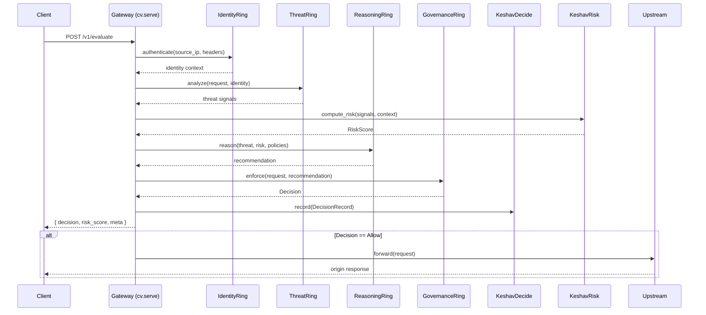

# Rust SDK — CHAKRAVYUH OS v1.0.0

> Native Rust client for the CHAKRAVYUH defensive decision engine.
> Source: [`src/lib.rs`](../../src/lib.rs) · License: Apache-2.0

## Purpose

The Rust SDK is the **primary, first-class interface** to CHAKRAVYUH OS. It exposes every ring,
plane, and subsystem as typed Rust structs so you can embed the decision engine directly
inside your service binary—no HTTP hop required.

---

## Dependency

```toml
# Cargo.toml
[dependencies]
chakravyuh = { version = "1.0.0", git = "https://github.com/vinomoid/chakravyuh" }

# Optional feature flags
# chakravyuh = { version = "1.0.0", features = ["tls", "redis"] }
```

| Feature | Effect |
|---------|--------|
| `tls`   | Enables `TlsConfig` and TLS listener support via rustls |
| `redis` | Enables Redis-backed `StorageRing` for distributed state |

---

## Public Types Reference

### Core

| Type | Kind | Description |
|------|------|-------------|
| `Config` | Struct | Top-level daemon configuration |
| `TlsConfig` | Struct | Certificate and key paths for TLS |
| `UpstreamConfig` | Struct | Origin server target configuration |
| `Error` | Enum | Library-level error variants |
| `Result<T>` | Type alias | `std::result::Result<T, Error>` |

### Decision & Risk

| Type | Kind | Description |
|------|------|-------------|
| `Decision` | Enum | Verdict output: `Allow`, `Deny`, `Challenge`, `Escalate` |
| `DecisionRecord` | Struct | Persisted audit record of a single decision |
| `RiskScore` | Struct | Multi-dimensional risk assessment |
| `Verdict` | Enum | High-level allow/deny classification |

### Rings

`ShieldRing` · `ThreatRing` · `AgentRing` · `MemoryRing` · `ExecutionRing` ·
`IdentityRing` · `ReasoningRing` · `GovernanceRing` · `RecoveryRing`

### Ananta Plane

| Type | Description |
|------|-------------|
| `AnantaPlane` | Top-level coordination plane |
| `AnantaConfig` | Configuration for the Ananta subsystem |

### Keshav Subsystems

`KeshavDecide` · `KeshavRisk` · `KeshavLearn` · `KeshavOrchestrate`

### Network, Storage & Policy

| Type | Description |
|------|-------------|
| `CrossRingNetwork` | Inter-ring communication bus |
| `Store` | Storage backend abstraction |
| `StorageConfig` | Storage backend configuration |
| `StoreHealth` | Health check response for storage |
| `ApiKeyManager` | API key lifecycle management |
| `PolicyManager` *(via `cv.policy_manager()`)* | Policy CRUD and evaluation |

### Observability & Security

| Type | Description |
|------|-------------|
| `ShutdownState` | Graceful shutdown signal state |
| `SystemHealth` | Aggregated system health report |
| `AuditTrail` | Immutable audit log accessor |
| `SecurityTwinService` | Digital-twin threat simulation |
| `Scenario` | Twin simulation scenario definition |
| `ScenarioResult` | Outcome of a twin scenario run |
| `TwinState` | Current state snapshot of a security twin |

---

## Decision Enum

```rust
pub enum Decision {
    Allow,
    Deny {
        code: u16,
        retry_after: Option<u64>,
    },
    Challenge {
        challenge_type: String,
    },
    Escalate {
        approver_role: String,
        timeout_secs: u64,
    },
}
```

## RiskScore Struct

```rust
pub struct RiskScore {
    pub overall:   f64,   // 0.0 – 1.0
    pub threat:    f64,
    pub identity:  f64,
    pub behavior:  f64,
    pub memory:    f64,
    pub execution: f64,
    pub context:   f64,
    pub confidence: f64,
}
```

---

## Quick Start

### 1. Build Configuration

```rust
use chakravyuh::{Config, UpstreamConfig};

let config = Config::builder()
    .upstream(UpstreamConfig {
        addr: "127.0.0.1:8080".into(),
    })
    .build()
    .expect("valid config");
```

### 2. Instantiate the Engine

```rust
use chakravyuh::Chakravyuh;

let cv = Chakravyuh::new(config)?;
```

### 3. Serve (Block the Current Thread)

```rust
cv.serve("0.0.0.0:9090")?;
```

### 4. Access Subsystems

```rust
let cfg          = cv.config();           // &Config
let agent        = cv.agent();            // &AgentRing
let mem          = cv.memory();           // &MemoryRing
let reasoning    = cv.reasoning();        // &ReasoningRing
let governance   = cv.governance();       // &GovernanceRing
let recovery     = cv.recovery_sec();     // &RecoveryRing
let identity     = cv.identity();         // &IdentityRing
let execution    = cv.execution();        // &ExecutionRing
let risk         = cv.risk();             // &KeshavRisk
let learn        = cv.learn();            // &KeshavLearn
let orchestrate  = cv.orchestrate();      // &KeshavOrchestrate
let cross_ring   = cv.cross_ring();       // &CrossRingNetwork
let storage      = cv.storage();          // &Store
let policy_mgr   = cv.policy_manager();   // &PolicyManager
let shutdown     = cv.shutdown();         // &ShutdownState
let ananta       = cv.ananta();           // &AnantaPlane
```

---

## Evaluate via HTTP Client

Once `cv.serve()` is running, external services call the REST API. Here is a
typical integration using `reqwest`:

```rust
use reqwest::Client;
use serde_json::json;

let client = Client::new();
let resp = client
    .post("http://127.0.0.1:9090/v1/evaluate")
    .json(&json!({
        "request": {
            "method": "GET",
            "path": "/api/users",
            "headers": { "authorization": "Bearer <token>" },
            "source_ip": "10.0.0.42"
        }
    }))
    .send()
    .await?
    .json::<serde_json::Value>()
    .await?;

println!("Decision: {}", resp["decision"]);
println!("Risk:    {}", resp["risk_score"]["overall"]);
```

---

## Request Lifecycle (Sequence Diagram)



---

## Error Handling

```rust
use chakravyuh::Error;

match Chakravyuh::new(config) {
    Ok(cv) => {
        if let Err(e) = cv.serve("0.0.0.0:9090") {
            match e {
                Error::BindFailed(addr) => {
                    eprintln!("Address {addr} already in use");
                }
                Error::ConfigInvalid(msg) => {
                    eprintln!("Configuration error: {msg}");
                }
                _ => eprintln!("Unexpected error: {e}"),
            }
        }
    }
    Err(e) => eprintln!("Failed to initialise: {e}"),
}
```

---

## Best Practices

1. **Enable only needed features.** If you do not need TLS or Redis, omit the
   feature flags to reduce compile time and attack surface.

2. **Bind to a specific interface.** In production, bind to `127.0.0.1:port` when
   CHAKRAVYUH sits behind a reverse proxy, or use `0.0.0.0:port` only with TLS
   enabled and network-layer restrictions.

3. **Graceful shutdown.** Use `cv.shutdown()` to signal the engine. Drop the
   `Chakravyuh` handle or propagate `Ctrl+C` through `tokio::signal`.

4. **Consult subsystems directly for advanced use.** The accessor methods let
   you call into individual rings (e.g., `cv.memory().lookup(...)`) without
   going through the HTTP API. Prefer this path for in-process integrations.

5. **Watch `SystemHealth`.** Poll `cv.ananta()` or the `/v1/health` endpoint
   to monitor ring saturation and storage lag.

---

## Security Notes

- API keys managed via `ApiKeyManager` are the primary authentication mechanism.
  Rotate keys regularly and never commit them to version control.
- TLS is **optional** via the `tls` feature. Always enable it when the gateway
  is exposed beyond localhost.
- `DecisionRecord` entries written by `KeshavDecide` form an immutable audit
  trail; use `AuditTrail` to export them for compliance.
- `SecurityTwinService` scenarios run in an isolated context and never affect
  live traffic decisions.

---

## Troubleshooting

| Symptom | Likely Cause | Fix |
|---------|-------------|-----|
| `BindFailed` on serve | Port already in use | `lsof -i :<port>`; pick a different port |
| `ConfigInvalid` | Missing or contradictory fields | Validate with `Config::validate()` before `new()` |
| High-latency decisions | Storage ring lag (Redis) | Check `StoreHealth`; increase pool size or add nodes |
| All requests denied | Empty or misconfigured policy set | Verify policies via `cv.policy_manager()` |
| `Decision::Escalate` timeouts | Approver unreachable | Increase `timeout_secs` or fix approver endpoint |

---

## Cross-References

- [API Reference](../04-api/README.md) — HTTP routes served by `cv.serve()`
- [Architecture Overview](../02-architecture/README.md) — Ring and plane diagrams
- [Configuration Guide](../03-configuration/README.md) — Full `Config` field reference
- [GitHub Repository](https://github.com/vinomoid/chakravyuh)
