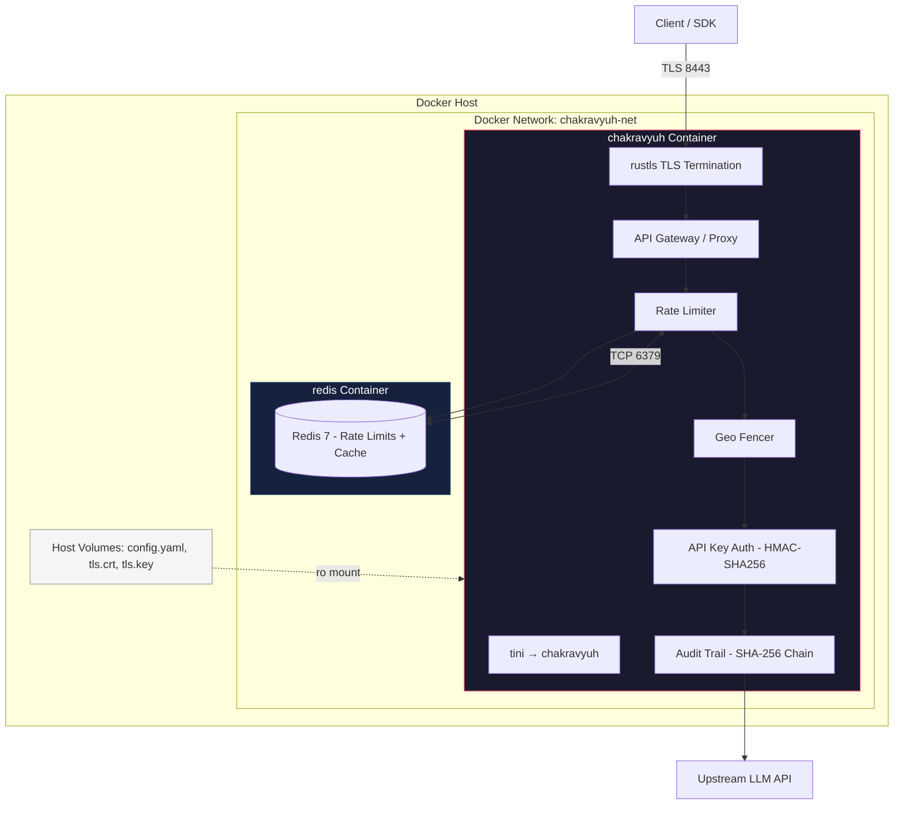

# Docker Deployment

> Containerised deployment for CHAKRAVYUH OS v1.0.0 by VINOMOID.

---

## Overview

CHAKRAVYUH OS compiles to a single Rust binary (`chakravyuh`) that reads a YAML
configuration file at startup. The container image uses a **multi-stage build**
(rust:1.75-slim → debian:bookworm-slim) to keep the final image under 80 MB.

Two optional Cargo features control compile-time capabilities:

| Feature   | Purpose                            | Default |
|-----------|------------------------------------|---------|
| `tls`     | Built-in TLS via `rustls`          | off     |
| `redis`   | Redis-backed rate limiting & cache | off     |

Enable with `--features tls,redis` during `cargo build`.

---

## Build from Source

```bash
cargo build --release
# or, with optional features:
cargo build --release --features tls,redis

# Output binary at target/release/chakravyuh
```

---

## Multi-Stage Dockerfile

Save as `Dockerfile` in the repository root:

```dockerfile
# Stage 1 – Build
FROM rust:1.75-slim AS builder

WORKDIR /build
RUN mkdir -p /usr/local/cargo/registry /usr/local/cargo/git

COPY Cargo.toml Cargo.lock ./
RUN mkdir src && \
    echo 'fn main() {}' > src/main.rs && \
    cargo build --release 2>/dev/null || true && \
    rm -rf src

COPY src/          src/
COPY configs/      configs/
COPY proto/        proto/
COPY Cargo.toml    Cargo.toml
COPY Cargo.lock    Cargo.lock

RUN cargo build --release \
    # --features tls,redis
    && strip target/release/chakravyuh

# Stage 2 – Runtime
FROM debian:bookworm-slim AS runtime

RUN apt-get update && \
    apt-get install -y --no-install-recommends ca-certificates libssl3 tini && \
    rm -rf /var/lib/apt/lists/*

RUN groupadd --gid 10001 chakravyuh && \
    useradd --uid 10001 --gid chakravyuh --shell /bin/false chakravyuh

WORKDIR /app
COPY --from=builder /build/target/release/chakravyuh /app/chakravyuh
COPY --from=builder /build/configs/config.yaml /app/configs/config.yaml
RUN mkdir -p /app/data /app/certs && chown -R chakravyuh:chakravyuh /app

USER chakravyuh
EXPOSE 8443/tcp

HEALTHCHECK --interval=30s --timeout=5s --start-period=10s --retries=3 \
    CMD ["/app/chakravyuh", "healthcheck"] || exit 1

ENTRYPOINT ["tini", "--"]
CMD ["/app/chakravyuh", "--config", "/app/configs/config.yaml"]
```

---

## Building the Image

```bash
docker build -t vinomoid/chakravyuh:1.0.0 .

# With optional features via build arg (add `ARG BUILD_FEATURES=""` to Dockerfile)
DOCKER_BUILDKIT=1 docker build \
  --build-arg BUILD_FEATURES="tls,redis" \
  -t vinomoid/chakravyuh:1.0.0-tls-redis .
```

---

## Running the Container

### Minimal

```bash
docker run -d --name chakravyuh -p 8443:8443 \
  -v ./config.yaml:/app/configs/config.yaml:ro \
  vinomoid/chakravyuh:1.0.0
```

### Full (TLS + Redis)

```bash
docker run -d --name chakravyuh -p 8443:8443 \
  -v ./config.yaml:/app/configs/config.yaml:ro \
  -v ./certs/tls.crt:/app/certs/tls.crt:ro \
  -v ./certs/tls.key:/app/certs/tls.key:ro \
  -e CHAKRAVYUH_UPSTREAM_API_KEY="sk-chakrav-xxxxxxxxxxxx" \
  -e RUST_LOG="chakravyuh=info,tower_http=debug" \
  vinomoid/chakravyuh:1.0.0-tls-redis
```

---

## Docker Compose (with Redis)

Save as `docker-compose.yaml`:

```yaml
version: "3.9"

services:
  chakravyuh:
    image: vinomoid/chakravyuh:1.0.0-tls-redis
    container_name: chakravyuh
    restart: unless-stopped
    ports:
      - "8443:8443"
    volumes:
      - ./config.yaml:/app/configs/config.yaml:ro
      - ./certs/tls.crt:/app/certs/tls.crt:ro
      - ./certs/tls.key:/app/certs/tls.key:ro
    environment:
      CHAKRAVYUH_UPSTREAM_API_KEY: ${CHAKRAVYUH_UPSTREAM_API_KEY}
      RUST_LOG: "chakravyuh=info"
      CHAKRAVYUH_CONFIG: /app/configs/config.yaml
    depends_on:
      redis:
        condition: service_healthy
    healthcheck:
      test: ["CMD", "/app/chakravyuh", "healthcheck"]
      interval: 30s
      timeout: 5s
      retries: 3
      start_period: 10s
    networks:
      - chakravyuh-net

  redis:
    image: redis:7-alpine
    container_name: chakravyuh-redis
    restart: unless-stopped
    command: redis-server --appendonly yes --maxmemory 256mb --maxmemory-policy allkeys-lru
    volumes:
      - redis-data:/data
    healthcheck:
      test: ["CMD", "redis-cli", "ping"]
      interval: 10s
      timeout: 3s
      retries: 5
    networks:
      - chakravyuh-net

volumes:
  redis-data:
    driver: local

networks:
  chakravyuh-net:
    driver: bridge
```

```bash
echo 'CHAKRAVYUH_UPSTREAM_API_KEY=sk-chakrav-your-key-here' > .env
docker compose up -d
docker compose logs -f chakravyuh
```

---

## Environment Variables

| Variable                       | Description                                      | Required |
|--------------------------------|--------------------------------------------------|----------|
| `CHAKRAVYUH_CONFIG`            | Path to YAML config (default: `/app/configs/config.yaml`) | No  |
| `CHAKRAVYUH_UPSTREAM_API_KEY`  | HMAC-SHA256 key for upstream LLM auth            | Yes      |
| `RUST_LOG`                     | Log filter (`env_logger` format)                 | No       |

---

## TLS Certificate Mount

When the `tls` feature is enabled, CHAKRAVYUH uses `rustls`. Mount certs as read-only:

```bash
-v /etc/ssl/certs/chakravyuh.crt:/app/certs/tls.crt:ro
-v /etc/ssl/private/chakravyuh.key:/app/certs/tls.key:ro
```

Reference in `config.yaml`:

```yaml
tls:
  enabled: true
  cert_path: /app/certs/tls.crt
  key_path: /app/certs/tls.key
```

---

## Health Checks

| Endpoint         | Purpose                          | Method |
|------------------|----------------------------------|--------|
| `/health/live`   | Binary is running                | GET    |
| `/health/ready`  | Upstream + Redis dependencies OK | GET    |

The Docker-level `HEALTHCHECK` calls `/app/chakravyuh healthcheck` which hits
`/health/live` internally. Orchestrators should use `/health/ready` for readiness.

---

## Architecture Diagram



---

*CHAKRAVYUH OS v1.0.0 · VINOMOID · Deployment Documentation*
