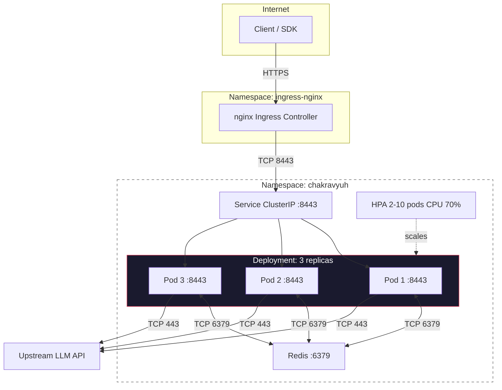

# Kubernetes Deployment

> Deploy CHAKRAVYUH OS v1.0.0 on Kubernetes with full manifest reference.

## Overview

Kubernetes manifests for CHAKRAVYUH OS: 3 replicas, Redis rate limiting,
nginx Ingress, HPA auto-scaling, and network policies in the `chakravyuh` namespace.

## Namespace & ConfigMap
```yaml
apiVersion: v1
kind: Namespace
metadata:
  name: chakravyuh
  labels:
    app.kubernetes.io/part-of: chakravyuh
---
apiVersion: v1
kind: ConfigMap
metadata:
  name: chakravyuh-config
  namespace: chakravyuh
  labels:
    app: chakravyuh
data:
  config.yaml: |
    server:
      listen: "0.0.0.0:8443"
    redis:
      url: "redis://chakravyuh-redis.chakravyuh.svc:6379"
    rate_limit:
      enabled: true
      requests_per_minute: 60
    geo_fence:
      enabled: true
      db_path: "/app/data/GeoLite2-City.mmdb"
    audit:
      enabled: true
    upstream:
      base_url: "https://api.upstream-llm.example.com"
```

## Secrets
```bash
kubectl create secret generic chakravyuh-tls \
  --from-file=tls.crt=/path/to/tls.crt \
  --from-file=tls.key=/path/to/tls.key -n chakravyuh

kubectl create secret generic chakravyuh-secrets \
  --from-literal=upstream_api_key="sk-chakrav-xxxxxxxxxxxx" -n chakravyuh
```

## Deployment
```yaml
apiVersion: apps/v1
kind: Deployment
metadata:
  name: chakravyuh
  namespace: chakravyuh
  labels:
    app: chakravyuh
spec:
  replicas: 3
  selector:
    matchLabels:
      app: chakravyuh
  strategy:
    type: RollingUpdate
    rollingUpdate: { maxUnavailable: 1, maxSurge: 1 }
  template:
    metadata:
      labels:
        app: chakravyuh
    spec:
      securityContext:
        runAsNonRoot: true
        runAsUser: 10001
        fsGroup: 10001
      containers:
        - name: chakravyuh
          image: vinomoid/chakravyuh:1.0.0-tls-redis
          ports:
            - containerPort: 8443
          env:
            - name: CHAKRAVYUH_CONFIG
              value: "/app/config/config.yaml"
            - name: CHAKRAVYUH_UPSTREAM_API_KEY
              valueFrom:
                secretKeyRef:
                  name: chakravyuh-secrets
                  key: upstream_api_key
            - name: RUST_LOG
              value: "chakravyuh=info"
          volumeMounts:
            - name: config
              mountPath: /app/config
              readOnly: true
            - name: tls-certs
              mountPath: /app/certs
              readOnly: true
          livenessProbe:
            httpGet: { path: /health/live, port: 8443 }
            initialDelaySeconds: 10
            periodSeconds: 30
            timeoutSeconds: 5
            failureThreshold: 3
          readinessProbe:
            httpGet: { path: /health/ready, port: 8443 }
            initialDelaySeconds: 5
            periodSeconds: 10
            timeoutSeconds: 3
            failureThreshold: 3
          resources:
            requests: { cpu: 500m, memory: 256Mi }
            limits: { cpu: "2", memory: 1Gi }
      volumes:
        - name: config
          configMap:
            name: chakravyuh-config
        - name: tls-certs
          secret:
            secretName: chakravyuh-tls
```

## Service
```yaml
apiVersion: v1
kind: Service
metadata:
  name: chakravyuh
  namespace: chakravyuh
spec:
  type: ClusterIP
  selector:
    app: chakravyuh
  ports:
    - port: 8443
      targetPort: 8443
```

## Ingress (nginx)

### TLS Termination at Ingress
```yaml
apiVersion: networking.k8s.io/v1
kind: Ingress
metadata:
  name: chakravyuh
  namespace: chakravyuh
  annotations:
    nginx.ingress.kubernetes.io/ssl-redirect: "true"
    nginx.ingress.kubernetes.io/proxy-read-timeout: "300"
spec:
  ingressClassName: nginx
  tls:
    - hosts: ["chakravyuh.example.com"]
      secretName: chakravyuh-tls
  rules:
    - host: chakravyuh.example.com
      http:
        paths:
          - path: /
            pathType: Prefix
            backend:
              service:
                name: chakravyuh
                port:
                  number: 8443
```

### TLS Passthrough (rustls in-container)

For end-to-end TLS, replace the annotations above with:

```yaml
  annotations:
    nginx.ingress.kubernetes.io/backend-protocol: "HTTPS"
    nginx.ingress.kubernetes.io/ssl-passthrough: "true"
```

Omit `tls.secretName` — the pod terminates TLS via rustls.

## Horizontal Pod Autoscaler
```yaml
apiVersion: autoscaling/v2
kind: HorizontalPodAutoscaler
metadata:
  name: chakravyuh
  namespace: chakravyuh
spec:
  scaleTargetRef:
    apiVersion: apps/v1
    kind: Deployment
    name: chakravyuh
  minReplicas: 2
  maxReplicas: 10
  metrics:
    - type: Resource
      resource:
        name: cpu
        target:
          type: Utilization
          averageUtilization: 70
```

## NetworkPolicy
```yaml
apiVersion: networking.k8s.io/v1
kind: NetworkPolicy
metadata:
  name: chakravyuh
  namespace: chakravyuh
spec:
  podSelector:
    matchLabels:
      app: chakravyuh
  policyTypes:
    - Ingress
    - Egress
  ingress:
    - from:
        - namespaceSelector:
            matchLabels:
              kubernetes.io/metadata.name: ingress-nginx
      ports:
        - protocol: TCP
          port: 8443
  egress:
    - to:
        - podSelector:
            matchLabels:
              app: chakravyuh-redis
      ports: [{ protocol: TCP, port: 6379 }]
    - to:
        - namespaceSelector: {}
          podSelector:
            matchLabels:
              k8s-app: kube-dns
      ports: [{ protocol: UDP, port: 53 }]
    - to: [{ ipBlock: { cidr: 0.0.0.0/0 } }]
      ports: [{ protocol: TCP, port: 443 }]
```

## Deploy

```bash
kubectl apply -f k8s/ && kubectl rollout status deployment/chakravyuh -n chakravyuh
kubectl get hpa,pods -l app=chakravyuh -n chakravyuh
```

## Resource Summary

| Resource | Name | Purpose |
|----------|------|----------|
| Namespace | `chakravyuh` | Resource isolation |
| ConfigMap | `chakravyuh-config` | `config.yaml` |
| Secret | `chakravyuh-tls` | TLS cert + private key |
| Secret | `chakravyuh-secrets` | Upstream API key |
| Deployment | `chakravyuh` | 3 replicas, rolling update |
| Service | `chakravyuh` | ClusterIP 8443/tcp |
| Ingress | `chakravyuh` | nginx TLS termination/passthrough |
| HPA | `chakravyuh` | CPU 70%, 2–10 replicas |
| NetworkPolicy | `chakravyuh` | Ingress 8443, egress 6379+DNS+443 |

## Architecture Diagram



*CHAKRAVYUH OS v1.0.0 · VINOMOID · Deployment Documentation*
