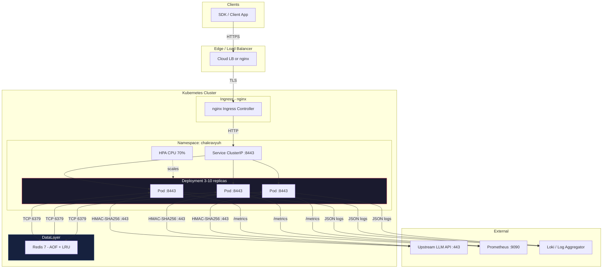

# Production Deployment Guide

> Hardening and operational checklist for CHAKRAVYUH OS v1.0.0 by VINOMOID.

---

## Pre-Flight Checklist

Complete every item before promoting to production traffic.

### TLS

| # | Item | Details |
|---|------|----------|
| 1 | **TLS mode selected** | Built-in `rustls` (compile `--features tls`) **or** reverse proxy termination |
| 2 | **Certificate valid** | Not expired, matches the public hostname |
| 3 | **Private key protected** | File mode 0600, owned by UID 10001 |
| 4 | **HSTS headers** | Set if terminating at reverse proxy |

If using a reverse proxy (nginx, Caddy, cloud LB) for TLS, disable the `tls`
feature and run CHAKRAVYUH on plain HTTP internally. The proxy handles certs.
If using built-in `rustls`, set `tls.enabled: true` in `config.yaml` and
mount cert paths into the container.

### Redis

| # | Item | Details |
|---|------|----------|
| 5 | **Persistence enabled** | `appendonly yes` in Redis config |
| 6 | **Memory bounded** | `maxmemory` set (e.g. 256 MB), `allkeys-lru` eviction |
| 7 | **Connection pool tuned** | Redis URL in `config.yaml` points to production instance |
| 8 | **Redis AUTH** | Password set, URL includes `redis://:pass@host:6379` |

### ANANTA Trust Plane

| # | Item | Details |
|---|------|----------|
| 9 | **Trust plane initialised** | ANANTA configuration loaded and verified |
| 10 | **Permit list active** | Only authorised API keys in the trust store |

### API Key Authentication (HMAC-SHA256)

| # | Item | Details |
|---|------|----------|
| 11 | **Key strength** | Minimum 32 bytes, stored in Kubernetes Secret or vault |
| 12 | **Key rotation plan** | Documented rotation procedure with zero-downtime window |
| 13 | **`CHAKRAVYUH_UPSTREAM_API_KEY` set** | Mounted from Secret, never in plaintext ConfigMap |

### Config Hot-Reload

| # | Item | Details |
|---|------|----------|
| 14 | **`notify` 8.0 feature enabled** | Config file changes are detected automatically |
| 15 | **Atomic writes** | Write new config to temp file, then `mv` to final path |

### Audit Trail (SHA-256 Chain)

| # | Item | Details |
|---|------|----------|
| 16 | **Audit enabled** | `audit.enabled: true` in `config.yaml` |
| 17 | **Chain integrity verifiable** | Each log entry's hash links to the previous entry |
| 18 | **Storage backed up** | Audit log volume included in backup schedule |

### Graceful Shutdown

| # | Item | Details |
|---|------|----------|
| 19 | **SIGTERM handler** | CHAKRAVYUH drains in-flight requests on SIGTERM |
| 20 | **PreStop hook set** | K8s `preStop` lifecycle hook calls `sleep 5` before SIGTERM |

### JSON Logging

| # | Item | Details |
|---|------|----------|
| 21 | **Structured logs** | JSON output enabled for log aggregator ingestion |
| 22 | **`RUST_LOG` set** | `chakravyuh=info` for production (no `debug`/`trace`) |

### Monitoring

| # | Item | Details |
|---|------|----------|
| 23 | **`/metrics` scraped** | Prometheus scrape target configured |
| 24 | **`/health/live` + `/health/ready`** | Health checks in load balancer and K8s probes |
| 25 | **Alert rules defined** | CPU > 80%, error rate > 1%, pod restarts |

### Rate Limiting

| # | Item | Details |
|---|------|----------|
| 26 | **Limits tuned** | `requests_per_minute` set per client tier |
| 27 | **Redis backing** | `--features redis` compiled in and Redis URL configured |

### Geo Fencing

| # | Item | Details |
|---|------|----------|
| 28 | **MaxMind GeoLite2 DB mounted** | `GeoLite2-City.mmdb` at the path in `config.yaml` |
| 29 | **Allowed regions defined** | Country/region ISO codes listed in config |
| 30 | **DB auto-update plan** | Weekly `geoipupdate` cron or CI download |

### Upstream LLM Proxy

| # | Item | Details |
|---|------|----------|
| 31 | **Upstream URL correct** | `upstream.base_url` in `config.yaml` |
| 32 | **API key valid** | Upstream provider key not expired or rate-limited |
| 33 | **Timeouts configured** | Read/write timeouts appropriate for LLM response times |

---

## Production Deployment Topology



---

## Recommended `config.yaml` for Production

```yaml
server:
  listen: "0.0.0.0:8443"

tls:
  enabled: true
  cert_path: "/app/certs/tls.crt"
  key_path: "/app/certs/tls.key"

redis:
  url: "redis://:password@redis.internal:6379"

rate_limit:
  enabled: true
  requests_per_minute: 60

geo_fence:
  enabled: true
  db_path: "/app/data/GeoLite2-City.mmdb"
  allowed_countries: ["US", "GB", "IN", "DE"]

audit:
  enabled: true
  chain_algorithm: "sha256"

upstream:
  base_url: "https://api.upstream-llm.example.com"
  timeout_seconds: 300
```

---

## Prometheus Scrape Config

```yaml
scrape_configs:
  - job_name: 'chakravyuh'
    kubernetes_sd_configs:
      - role: pod
        namespaces:
          names: ["chakravyuh"]
    relabel_configs:
      - source_labels: [__meta_kubernetes_pod_label_app]
        regex: chakravyuh
        action: keep
    metrics_path: /metrics
    scrape_interval: 15s
```

---

## Graceful Shutdown Configuration

### Kubernetes PreStop Hook

Add to the pod spec in your Deployment:

```yaml
lifecycle:
  preStop:
    exec:
      command: ["/bin/sh", "-c", "sleep 5"]
```

This gives the Ingress controller time to remove the pod from its upstream
list before CHAKRAVYUH receives SIGTERM and begins draining.

### Docker / Compose

CHAKRAVYUH handles SIGTERM natively via `tokio::signal`. The `tini` init
process in the Dockerfile ensures signal forwarding. Set `stop_grace_period`

```yaml
# docker-compose.yaml
services:
  chakravyuh:
    stop_grace_period: 30s
```

---

## Troubleshooting

### Pod in `CrashLoopBackOff`

1. `kubectl logs deployment/chakravyuh -n chakravyuh --previous`
2. Check `config.yaml` syntax — invalid YAML causes a startup panic
3. Verify the `CHAKRAVYUH_UPSTREAM_API_KEY` is set in the pod environment
4. Ensure TLS cert files exist at the configured mount path

### Health Check Failures

| Symptom | Likely Cause | Fix |
|---------|-------------|-----|
| `/health/live` returns 503 | Binary not listening | Check `server.listen` in config |
| `/health/ready` returns 503 | Redis unreachable | Verify Redis URL and network policy |
| Liveness probe timeout | Pod under load | Increase `timeoutSeconds` or reduce `periodSeconds` |

### High Memory Usage

1. Check `maxmemory` on Redis — without it, Redis grows unbounded
2. Review rate limit window size — large windows store more keys
3. Set K8s memory limit (`1Gi`) to trigger OOM kill before node pressure

### Upstream 502 / 504 Errors

1. Verify `upstream.base_url` is reachable from the pod:
   ```bash
   kubectl exec -it deploy/chakravyuh -n chakravyuh -- wget -qO- https://api.upstream-llm.example.com
   ```
2. Increase `upstream.timeout_seconds` in config for long LLM responses
3. Check if the upstream API key has exceeded its own rate quota

### Audit Chain Integrity

```bash
# Verify chain hashes are sequential
# (implementation-specific — check the audit module output)
RUST_LOG="chakravyuh_audit=debug" kubectl logs deploy/chakravyuh -n chakravyuh | head -50
```

---

## Operational Runbook

| Action | Command |
|--------|----------|
| Check pod status | `kubectl get pods -n chakravyuh` |
| View live logs | `kubectl logs -f deploy/chakravyuh -n chakravyuh` |
| Rollout restart | `kubectl rollout restart deploy/chakravyuh -n chakravyuh` |
| Rollback | `kubectl rollout undo deploy/chakravyuh -n chakravyuh` |
| Scale up | `kubectl scale deploy/chakravyuh --replicas=5 -n chakravyuh` |
| Port-forward debug | `kubectl port-forward svc/chakravyuh 8443 -n chakravyuh` |

---

*CHAKRAVYUH OS v1.0.0 · VINOMOID · Deployment Documentation*
