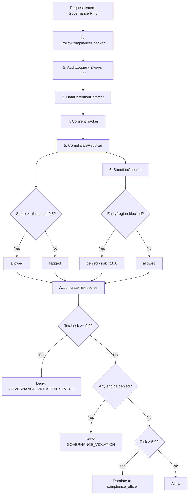

# Compliance Framework

> CHAKRAVYUH OS v1.0.0 | Regulatory Compliance
> Licensed under Apache-2.0 | Copyright VINOMOID

---

## Overview

CHAKRAVYUH OS provides built-in support for three major regulatory frameworks:
GDPR, SOC2, and HIPAA. Compliance is enforced through the Governance Ring
(Ring 8) and the Recovery Security Ring (Ring 9), which together provide
policy validation, audit logging, data retention controls, consent tracking,
sanction screening, and tamper-evident evidence collection.

The ComplianceReporter engine computes per-framework compliance scores
(0.0–1.0) and flags requests that fall below the configured threshold.

---

## Supported Frameworks

### GDPR (General Data Protection Regulation)

The GDPR compliance score is computed by the `ComplianceReporter` using
the following signal factors:

| Signal | Score Impact | Condition |
|--------|-------------|-----------|
| Base score | +0.5 | Always applied |
| Consent present | +0.3 | `consent_token` is provided |
| No data export | +0.1 | Action does not contain "export" |
| EU region handling | +0.1 | Region is not "EU" or consent exists |
| **Max possible** | **1.0** | All conditions met |

GDPR enforcement focuses on data minimization (export actions score lower),
consent basis (explicit tokens improve scores), and right to erasure
(`auto_delete: true` purges data past retention).

### SOC2 (Service Organization Control 2)

| Signal | Score Impact | Condition |
|--------|-------------|-----------|
| Base score | +0.7 | Always applied |
| Audit trail header | +0.2 | `x-audit-trail` header present |
| Admin role | +0.1 | Requester has admin role |
| **Max possible** | **1.0** | All conditions met |

SOC2 compliance ensures audit trail integrity (header-based), controlled
access (admin-role scoring), and comprehensive monitoring of all engine results.

### HIPAA (Health Insurance Portability and Accountability Act)

| Signal | Score Impact | Condition |
|--------|-------------|-----------|
| Base score (non-PHI) | 0.9 | Data classification is not "phi" |
| Base score (PHI) | +0.5 | Data classification is "phi" |
| Consent for PHI | +0.3 | `consent_token` provided for PHI data |
| Admin for PHI | +0.2 | Admin role for PHI data |
| **Max possible (PHI)** | **1.0** | All PHI conditions met |

HIPAA enforcement ensures PHI protection (requires consent + elevated roles),
minimum necessary (non-PHI auto-scores 0.9), and audit accountability
for admin PHI actions.

---

## Audit Retention

The AuditLogger engine in the Governance Ring records every governance
evaluation with a configurable retention period.

| Configuration | Default | Description |
|---------------|---------|-------------|
| `audit_logger.retention_days` | 90 | Days to retain audit entries |

Each audit entry receives a deterministic ID derived from the request ID
(`audit-{request_id}`) and is tagged with the retention period. The
AuditLogger never blocks requests — it always returns `"allowed"`.

### Tenant-Scoped Audit Trail

All audit entries include tenant context via `TenantAuditEntry`:

| Field | Type | Description |
|-------|------|-------------|
| `tenant_id` | `TenantId` | Tenant that performed the action |
| `action` | `String` | Action name (e.g., `tool_call`, `policy_eval`) |
| `outcome` | `String` | Result (`allowed`, `denied`, `challenged`) |
| `timestamp` | `String` | RFC3339 timestamp |
| `request_id` | `String` | Correlation ID for the request |
| `ring_name` | `String` | Ring where the entry was generated |

---

## Data Retention

The DataRetentionEnforcer enforces maximum data age policies:

| Configuration | Default | Description |
|---------------|---------|-------------|
| `data_retention.max_retention_days` | 365 | Maximum days data may be retained |
| `data_retention.auto_delete` | false | Whether to auto-delete expired data |

### Data Age Checking

Data age is determined from the `X-Data-Age-Days` HTTP header. When present:
- If `data_age_days <= max_retention_days`: `within_policy = true`
- If `data_age_days > max_retention_days` and `auto_delete = true`: the
  request is **denied** with auto-delete triggered
- If `data_age_days > max_retention_days` and `auto_delete = false`: the
  request is **flagged** but allowed to proceed

When no age header is present, data is assumed to be within policy.

---

## Consent Tracking

The ConsentTracker engine validates user consent for data processing:

| Configuration | Default | Description |
|---------------|---------|-------------|
| `consent_tracker.require_explicit_consent` | false | Whether explicit consent is required |

### Consent Validation Logic

When `require_explicit_consent` is **false** (default):
- Consent is valid if a `consent_token` is provided, **or** the
  `X-Consent-Granted` header is present, **or** the role is `admin`

When `require_explicit_consent` is **true**:
- Consent is valid **only** if a `consent_token` is provided

### Consent Types

| Type | Condition | Description |
|------|-----------|-------------|
| `explicit` | `consent_token` present | Token-based explicit consent |
| `implicit` | `X-Consent-Granted` header | Header-based implicit consent |
| `none` | Neither present | No consent provided |

Consent scopes are derived from either the `consent_token` (comma-separated)
or the `X-Consent-Scopes` header.

---

## Sanction Checking

The SanctionChecker screens requests against blocked entities and regions:

| Configuration | Default | Description |
|---------------|---------|-------------|
| `sanction_checker.enabled` | true | Whether sanction checking is active |
| `sanction_checker.blocked_entities` | `[]` | List of blocked entity IDs |
| `sanction_checker.blocked_regions` | `[]` | List of blocked region codes |

When a request's `entity_id` matches a blocked entity (exact match) or
its `region` matches a blocked region (case-insensitive), the request
is **denied**. Sanction violations carry the highest risk weight in the
Governance Ring: +10.0 to the risk accumulator, which exceeds the default
deny threshold of 9.0 and triggers an immediate denial.

---

## Tamper-Evident Audit and Evidence Chain

The Recovery Security Ring (Ring 9) provides forensic-grade evidence
collection through the EvidenceCollector engine.

| Configuration | Default | Description |
|---------------|---------|-------------|
| `evidence_collector.hash_algorithm` | `sha256` | Hash algorithm for evidence integrity |
| `evidence_collector.retention_days` | 365 | Days to retain evidence records |

### Evidence Collection Process

When an incident is detected (risk score >= 5.0), the EvidenceCollector
creates an `EvidenceRecord` with an `evidence_id`, SHA-256 hash (via the
`sha2` crate), RFC3339 timestamp, and collection status. Evidence is
retained for 365 days by default, aligned with the max data retention period.

---

## Compliance Reporting Flow

---

## See Also

- [GOVERNANCE.md](./GOVERNANCE.md) — Governance Ring engine details
- [RBAC.md](./RBAC.md) — Role and permission enforcement
- [ORGANIZATIONS.md](./ORGANIZATIONS.md) — Multi-tenant isolation
