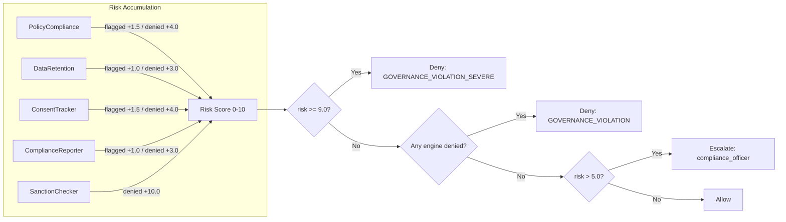

# Governance Ring

> CHAKRAVYUH OS v1.0.0 | Ring 8 — Policy, Audit, and Compliance
> Licensed under Apache-2.0 | Copyright VINOMOID

---

## Overview

The Governance Ring (Ring 8, Phase 5) is the penultimate ring in the
CHAKRAVYUH 9-ring defense pipeline. It enforces organizational policies,
regulatory compliance, and data governance rules on every AI operation.
The ring runs 6 engines in sequence with a p99 latency budget of <5ms.

Source: `src/governance/mod.rs`

### Engine Pipeline

```
Policy → Audit → Retention → Consent → ComplianceReport → Sanction
```

### Risk Accumulation Weights

Each engine contributes to a `governance_risk_score` (clamped 0.0–10.0):

| Engine | flagged | denied |
|--------|---------|--------|
| PolicyCompliance | +1.5 | +4.0 |
| AuditLogger | — | — (never blocks) |
| DataRetention | +1.0 | +3.0 |
| ConsentTracker | +1.5 | +4.0 |
| ComplianceReporter | +1.0 | +3.0 |
| SanctionChecker | — | **+10.0** |

---

## Engine 1: Policy Compliance Checker

Validates actions against configurable governance policies.

| Field | Default | Description |
|-------|---------|-------------|
| `policy_compliance.max_violations` | 3 | Maximum violations before denial |

**High-risk actions** (`delete`, `drop`, `remove`, `purge`, `truncate`,
`overwrite`) require admin or operator roles. Actions containing
`export`, `transfer`, or `copy` on `confidential`/`restricted` data
also produce violations.

| Violations | Decision |
|-----------|----------|
| 0 | `allowed` |
| 1–max_violations | `flagged` |
| > max_violations | `denied` |

---

## Engine 2: Audit Logger

| Field | Default | Description |
|-------|---------|-------------|
| `audit_logger.retention_days` | 90 | Days to retain audit entries |

Generates a deterministic audit ID (`audit-{request_id}`), never blocks
requests (always returns `allowed`), and tenant-scopes entries via
`TenantAuditEntry`.

---

## Engine 3: Data Retention Enforcer

| Field | Default | Description |
|-------|---------|-------------|
| `data_retention.max_retention_days` | 365 | Maximum data retention period |
| `data_retention.auto_delete` | false | Automatically delete expired data |

Data age is read from the `X-Data-Age-Days` header. When absent, data is
assumed within policy.

| Condition | Decision |
|-----------|----------|
| No age header / Age <= max | `allowed` |
| Age > max, auto_delete=false | `flagged` |
| Age > max, auto_delete=true | `denied` |

---

## Engine 4: Consent Tracker

| Field | Default | Description |
|-------|---------|-------------|
| `consent_tracker.require_explicit_consent` | false | Require token-based consent |

When `require_explicit_consent` is **false**, consent is valid if a
`consent_token` is present, the `X-Consent-Granted` header exists, or the
role is `admin`. When **true**, only a `consent_token` suffices.

| Condition | explicit=false | explicit=true |
|-----------|---------------|--------------|
| No consent, not admin | `flagged` | `denied` |
| Header consent only | `allowed` | `denied` |
| Token consent | `allowed` | `allowed` |
| Admin, no consent | `allowed` | `denied` |

---

## Engine 5: Compliance Reporter

| Field | Default | Description |
|-------|---------|-------------|
| `compliance_reporter.compliance_threshold` | 0.5 | Minimum score (0.0–1.0) |
| `compliance_reporter.frameworks` | `[GDPR, SOC2, HIPAA]` | Frameworks to check |

Overall score is the average of per-framework scores:

| Framework | Base | Max |
|-----------|------|-----|
| GDPR | 0.5 | 1.0 |
| SOC2 | 0.7 | 1.0 |
| HIPAA (non-PHI) | 0.9 | 0.9 |
| HIPAA (PHI) | 0.5 | 1.0 |
| Unknown | 0.8 | 0.8 |

Scores below `compliance_threshold` produce a `flagged` decision.

---

## Engine 6: Sanction Checker

| Field | Default | Description |
|-------|---------|-------------|
| `sanction_checker.enabled` | true | Enable sanction screening |
| `sanction_checker.blocked_entities` | `[]` | Blocked entity ID list |
| `sanction_checker.blocked_regions` | `[]` | Blocked region code list |

Entity matching is exact; region matching is case-insensitive. A blocked
match adds +10.0 risk — alone exceeding the default deny threshold of 9.0.
When disabled, the engine returns `allowed` with zero risk.

---

## Final Decision Logic



| Condition | Decision | Code |
|-----------|----------|------|
| risk >= deny_threshold (9.0) | Deny | `GOVERNANCE_VIOLATION_SEVERE` (retry: 300s) |
| Any engine denied | Deny | `GOVERNANCE_VIOLATION` |
| risk > 5.0 | Escalate | Approver: `compliance_officer` (timeout: 600s) |
| Otherwise | Allow | — |

---

## Integration with Recovery Ring

The Governance Ring feeds into the Recovery Security Ring (Ring 9) for
incident response. Recovery pipeline:

```
IncidentClassify → Quarantine → Evidence → Rollback → StateRestore → Notify
```

| Recovery Engine | Key Defaults |
|----------------|---------------|
| IncidentClassifier | critical: 8.0, high: 5.0 |
| QuarantineManager | max_size: 10,000, auto_quarantine_on_critical: true |
| EvidenceCollector | hash: sha256, retention: 365 days |
| StateRestorer | checkpoint_interval: 300s, max_checkpoints: 50 |
| NotificationEngine | channels: [log], severity_filter: 5.0 |

When governance escalates or denies, the Recovery Ring classifies severity,
quarantines critical requests, collects SHA-256 evidence, assesses rollback
(within 3600s window), restores state from checkpoints, and notifies via
configured channels when severity exceeds 5.0.

---

## See Also

- [COMPLIANCE.md](./COMPLIANCE.md) — Regulatory framework scoring details
- [RBAC.md](./RBAC.md) — Role and permission enforcement
- [ORGANIZATIONS.md](./ORGANIZATIONS.md) — Multi-tenant context and isolation
