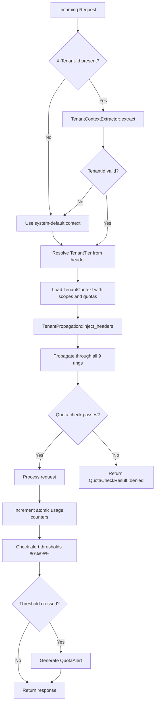

# Multi-Tenant Organizations

> CHAKRAVYUH OS v1.0.0 | Enterprise Multi-Tenancy
> Licensed under Apache-2.0 | Copyright VINOMOID

---

## Overview

CHAKRAVYUH OS provides full multi-tenant isolation for enterprise deployments.
Each tenant (organization) operates within its own security boundary, with
dedicated quotas, policies, scopes, and risk tolerance. Tenant context is
propagated through all 9 rings of the gateway, ensuring consistent enforcement.

The multi-tenant subsystem lives in `src/tenant/` and comprises three core
modules:

| Module | File | Purpose |
|--------|------|--------|
| Tenant Context | `tenant_context.rs` | Identity, tier, scopes, header extraction |
| Tenant Quota | `tenant_quota.rs` | Resource limits, usage tracking, alerting |
| Tenant Policy | `tenant_policy.rs` | Per-tenant policy overrides and custom rules |

---

## Tenant Identity: TenantId

Every tenant is identified by a `TenantId` — a newtype wrapper around a
validated string. The validation rules are strict:

- Length: 3–64 characters
- Allowed characters: ASCII alphanumeric and hyphens (`-`)
- Must not start or end with a hyphen
- Must not contain consecutive hyphens (`--`)

**Valid examples:** `acme-corp`, `tenant-12345`, `my-org-42`
**Invalid examples:** `ab` (too short), `-tenant` (leading hyphen), `tenant--corp`
(double hyphen), `tenant_corp` (underscore not allowed)

```rust
pub struct TenantId(pub String);
```

---

## TenantConfig and TenantContext

The `TenantContext` struct is the full tenant identity propagated through all
9 rings of CHAKRAVYUH. It is extracted from incoming HTTP request headers by
`TenantContextExtractor` and injected into downstream ring calls by
`TenantPropagation`.

### TenantContext Fields

| Field | Type | Description |
|-------|------|-------------|
| `tenant_id` | `TenantId` | Unique tenant identifier |
| `tenant_name` | `String` | Human-readable tenant name |
| `tier` | `TenantTier` | Service tier (Free/Standard/Premium/Enterprise) |
| `created_at` | `String` | RFC3339 creation timestamp |
| `metadata` | `HashMap<String, String>` | Freeform key-value metadata |
| `labels` | `HashMap<String, String>` | Labels for policy matching |
| `region` | `Option<String>` | Geographic region (e.g., `us-east-1`) |
| `max_risk_tolerance` | `f64` | Maximum risk tolerance (0.0–10.0) |
| `is_internal` | `bool` | Internal tenants bypass certain checks |
| `scopes` | `TenantScope` | Granted capability scopes |

---

## Tenant Tiers

Four tiers determine default risk tolerance, quotas, and feature access:

| Tier | Risk Tolerance | Default Scopes |
|------|---------------|----------------|
| **Free** | 5.0 | `READ` |
| **Standard** | 7.0 | `READ`, `WRITE`, `EXECUTE`, `VIEW_AUDIT` |
| **Premium** | 8.0 | `READ`, `WRITE`, `EXECUTE`, `VIEW_AUDIT`, `MANAGE_USERS` |
| **Enterprise** | 10.0 | `READ`, `WRITE`, `ADMIN`, `EXECUTE`, `VIEW_AUDIT`, `MANAGE_USERS` |

The risk tolerance value (0.0–10.0) determines how permissive the gateway is
for a given tenant. Higher values allow riskier operations to proceed.

---

## Tenant Isolation

CHAKRAVYUH enforces tenant isolation at multiple layers:

1. **Header-based extraction** — each request must carry `X-Tenant-Id` to
   identify the tenant. Without it, the system default context (`system-default`)
   at Free tier is used.
2. **Scope enforcement** — each tenant's `TenantScope` bitflag restricts which
   operations are available. Scopes are validated via
   `TenantPropagation::validate_scope()`.
3. **Quota boundaries** — per-tenant atomic counters track and enforce
   resource consumption limits independently.
4. **Policy separation** — each tenant can define custom policy rules via
   `TenantPolicyEngine`, including deny/challenge thresholds, tool allowlists,
   IP filtering, and ring enablement flags.
5. **Audit scoping** — all audit entries are tagged with `tenant_id`,
   `request_id`, and `ring_name` for complete tenant-scoped trails.

### HTTP Headers for Tenant Identification

| Header | Required | Description |
|--------|----------|-------------|
| `X-Tenant-Id` | Yes | Tenant identifier (validated) |
| `X-Tenant-Tier` | No | Tier override (defaults to Free) |
| `X-Tenant-Region` | No | Geographic region |
| `X-Tenant-Internal` | No | Set to `true` for internal tenants |

---

## API Key Prefixes Per Tenant

API keys follow a prefix-based convention that maps to Identity Ring roles:

| Prefix | Mapped Role | Typical Tenant Use |
|--------|-------------|---------------------|
| `sk-admin-` | admin | Tenant administrators |
| `sk-op-` | operator | Tenant operators |
| `sk-audit-` | auditor | Tenant auditors |
| `sk-svc-` | service | Machine-to-machine service accounts |
| `sk-` (other) | user | Standard tenant users |

The prefix mapping is defined in `RoleResolverConfig.api_key_prefix_roles` and
is evaluated during Identity Ring (Ring 2) resolution. When combined with
`X-Tenant-Id`, the same prefix can exist across tenants without collision
because the full identity is `tenant_id + api_key_prefix + key_body`.

---

## Tenant Quota Management

### ResourceQuota Structure

Each tenant has a `ResourceQuota` defining maximum resource consumption:

| Resource | Default (Standard) | Tracked By |
|----------|-------------------|------------|
| `max_requests_per_day` | 10,000 | Daily counter (resets at midnight UTC) |
| `max_tokens_per_day` | 500,000 | Daily counter (resets at midnight UTC) |
| `max_storage_bytes` | 100 MB | Persistent counter |
| `max_concurrent_requests` | 5 | Real-time atomic counter |
| `max_sessions_per_user` | 3 | Real-time atomic counter |
| `max_tool_calls_per_request` | 10 | Per-request counter |
| `max_api_keys` | 10 | Persistent counter |
| `bandwidth_bytes_per_day` | 500 MB | Daily counter (resets at midnight UTC) |

### Quota Enforcement Flow

1. `TenantQuotaManager::check_quota()` atomically reads current `QuotaUsage`
   counters and compares against the tenant's `ResourceQuota`.
2. If any quota is exceeded, a `QuotaCheckResult::denied()` is returned with
   a list of `ExceededQuota` entries, each containing the resource name,
   current value, limit, and excess percentage.
3. If all quotas are within bounds, `QuotaCheckResult::allowed()` is returned
   and counters are incremented for the current request.

### Threshold-Based Alerting

The `QuotaUsagePercent` tracker monitors percentage usage across all resources
and generates alerts at two thresholds:

| Level | Threshold | Action |
|-------|-----------|--------|
| **Warning** | 80% | `QuotaAlert` with `QuotaAlertSeverity::Warning` |
| **Critical** | 95% | `QuotaAlert` with `QuotaAlertSeverity::Critical` |

Alerts include the tenant ID, resource name, usage percentage, threshold
crossed, and an RFC3339 timestamp.

### Separate Configs Per Tenant

Each tenant can override global security policies via `TenantPolicyEngine`:

- **Custom rules** — pattern-matching rules with actions: `Allow`, `Deny`,
  `Challenge`, or `Escalate`
- **Deny/challenge threshold overrides** — per-tenant risk thresholds
- **Tool allowlists** — restrict which tools a tenant's agents may invoke
- **IP filtering** — allow or deny specific IP addresses or CIDR ranges
- **Ring enablement** — selectively disable or enable specific rings per tenant
- **Rate limits** — per-tenant rate limit overrides

---

## Tenant Lifecycle Diagram



---

## TenantScope Bitflags

Scopes use a `u32` bitflag representation for efficient combination and checking:

| Bit | Constant | Value | Description |
|-----|----------|-------|-------------|
| 0 | `READ` | 1 | Read access to resources |
| 1 | `WRITE` | 2 | Write/create access |
| 2 | `ADMIN` | 4 | Full administrative access |
| 3 | `EXECUTE` | 8 | Execute tool calls / code |
| 4 | `MANAGE_USERS` | 16 | Manage users within tenant |
| 5 | `VIEW_AUDIT` | 32 | View audit logs and trails |

Scopes can be combined with bitwise OR. For example, Enterprise tier grants
`READ | WRITE | ADMIN | EXECUTE | VIEW_AUDIT | MANAGE_USERS` (value: 63).

---

## See Also

- [RBAC.md](./RBAC.md) — Role-Based Access Control and permission enforcement
- [GOVERNANCE.md](./GOVERNANCE.md) — Governance Ring and compliance engine
- [COMPLIANCE.md](./COMPLIANCE.md) — Regulatory compliance framework
