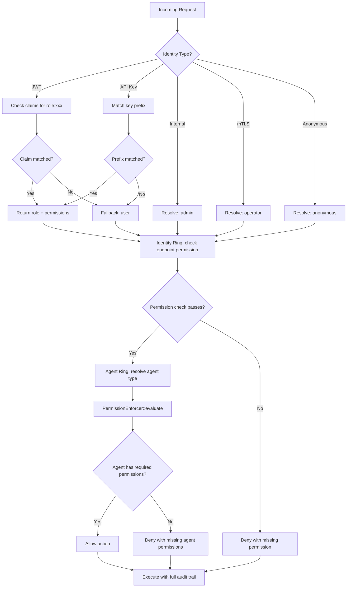

# Role-Based Access Control (RBAC)

> CHAKRAVYUH OS v1.0.0 | Identity Ring RBAC
> Licensed under Apache-2.0 | Copyright VINOMOID

---

## Overview

CHAKRAVYUH OS implements a dual-layer RBAC system across the Identity Ring
(Ring 2) and the Agent Ring. The Identity Ring resolves roles from API key
prefixes and JWT claims, granting endpoint-level permissions. The Agent Ring
evaluates action-level permissions based on agent type.

The RoleResolver engine in `src/identity/role_resolver.rs` resolves an
identity profile to a role and permission set with a latency budget of
<0.05ms per evaluation.

---

## Role Hierarchy

Six roles are defined in the `Role` enum, ordered by privilege level:

| Role | Level | Description |
|------|-------|-------------|
| **admin** | 100 | Full system access — all endpoints, all operations |
| **operator** | 80 | Read + write, no system configuration changes |
| **auditor** | 60 | Read-only with access to logs, decisions, and audit trails |
| **user** | 40 | Standard API user — chat completions, basic endpoints |
| **service** | 30 | Machine-to-machine service account, limited endpoint access |
| **anonymous** | 10 | Unauthenticated — public endpoints only |

The `level()` method returns a numeric privilege value. Higher levels always
subsume the capabilities of lower levels. This ordering is enforced by tests
in the codebase.

---

## Identity Ring Permissions (11 Types)

The Identity Ring `Permission` enum defines 11 permission types that control
endpoint-level access:

| Permission | Description |
|------------|-------------|
| `Read` | Read access to resources |
| `Write` | Write/create access to resources |
| `Delete` | Delete access to resources |
| `Execute` | Execute tool calls / API operations |
| `Configure` | Access to system configuration |
| `Audit` | Access to decision logs and audit trails |
| `Health` | Access to `/health` and `/version` endpoints |
| `Chat` | Use `/v1/chat/completions` (standard LLM access) |
| `Evaluate` | Use `/v1/evaluate` |
| `Proxy` | Use `/v1/proxy` |
| `AdminOps` | Admin operations (user management, policy changes) |

### Default Permissions Per Role

| Permission | admin | operator | auditor | user | service | anonymous |
|------------|-------|----------|---------|------|---------|-----------|
| Read | x | x | x | x | x | |
| Write | x | x | | | | |
| Delete | x | | | | | |
| Execute | x | x | | x | x | |
| Configure | x | | | | | |
| Audit | x | x | x | | | |
| Health | x | x | x | x | x | x |
| Chat | x | x | | x | x | |
| Evaluate | x | x | x | x | | |
| Proxy | x | x | | x | | |
| AdminOps | x | | | | | |
| **Total** | **11** | **8** | **4** | **6** | **4** | **1** |

---

## API Key Prefix Mapping

Roles are resolved from API key prefixes via the
`RoleResolverConfig.api_key_prefix_roles` mapping:

| API Key Prefix | Mapped Role | Resolution Method |
|----------------|-------------|-------------------|
| `sk-admin-` | admin | `api_key_prefix:sk-admin-` |
| `sk-op-` | operator | `api_key_prefix:sk-op-` |
| `sk-audit-` | auditor | `api_key_prefix:sk-audit-` |
| `sk-svc-` | service | `api_key_prefix:sk-svc-` |
| `sk-` (other) | user | `identity_type_default:api_key` |

### Resolution Priority

The RoleResolver follows a strict priority order:

1. **JWT claims** — checks for claims like `role:admin`, `scope:admin`
   in the JWT token's claim list. First matching claim wins.
2. **API key prefix** — if the identity type is `ApiKey`, iterates through
   the prefix map and matches against `credential_ref.starts_with(prefix)`.
3. **Identity type defaults** — fallback based on `IdentityType`:

| Identity Type | Default Role |
|---------------|-------------|
| `Internal` | admin |
| `Mtls` | operator |
| `Jwt` (no role claim) | user |
| `Session` | user |
| `ApiKey` (no prefix match) | user |
| `Anonymous` | anonymous |

---

## Agent-Type Permissions

The Agent Ring enforces action-level permissions via `PermissionEnforcer`
(`src/agent/permission_enforcer.rs`). Each agent type has a distinct
permission profile determining which actions it can perform:

### Agent Permission Types (15 Available)

| Permission | Description |
|------------|-------------|
| `Read` | Read files and data |
| `Write` | Write/create files |
| `Execute` | General execution |
| `NetworkAccess` | HTTP requests, network calls |
| `FileSystem` | File system operations |
| `ApiCall` | External API invocations |
| `MemoryRead` | Read from memory stores |
| `MemoryWrite` | Write to memory stores |
| `ToolUse` | Invoke tools |
| `CodeExecution` | Execute code (Python, Node, etc.) |
| `EmailSend` | Send email via SMTP |
| `FileDelete` | Delete files |
| `AdminAccess` | Administrative operations |
| `ShellAccess` | Shell/bash command execution |
| `DatabaseAccess` | SQL/database queries |

### Default Permissions Per Agent Type

| Permission | coder | researcher | assistant | analyst | custom |
|------------|-------|------------|-----------|---------|--------|
| Read | x | x | x | x | |
| Write | x | | | | |
| Execute | x | | | | |
| NetworkAccess | | x | | x | |
| FileSystem | x | | | | |
| ApiCall | x | x | | x | |
| MemoryRead | | x | x | x | |
| MemoryWrite | | | | | |
| ToolUse | x | x | x | x | |
| CodeExecution | x | | | | |
| DatabaseAccess | | | | x | |
| **Total** | **7** | **5** | **3** | **6** | **0** |

Custom agents receive an empty permission set by default. Permissions must
be explicitly granted via `permission_overrides` in the configuration.

---

## Bypass Roles

Two identity types automatically bypass standard role resolution and receive
elevated privileges:

| Identity Type | Bypass Behavior | Role |
|---------------|-----------------|------|
| `Internal` | Full system access, trust_base = 1.0 | admin |
| `Mtls` | Mutual TLS authenticated, trust_base = 0.9 | operator |

Internal identities (like the `keshav` internal engine) always resolve to
`admin` with all 11 permissions. mTLS clients resolve to `operator` with
8 permissions.

---

## Permission Enforcement Flow

---

## Config Overrides

Role permissions (`role_permissions`) and agent permissions
(`permission_overrides`) can be overridden in YAML config. When overrides
are provided for an agent type, they **completely replace** the default
set (not merged). Every resolution produces a `RoleResult` with the
role, permission set, resolution method (e.g. `jwt_claim:role:admin`,
`api_key_prefix:sk-admin-`), and a human-readable reason.

---

## See Also

- [ORGANIZATIONS.md](./ORGANIZATIONS.md) — Multi-tenant context and isolation
- [GOVERNANCE.md](./GOVERNANCE.md) — Governance Ring policy compliance
- [COMPLIANCE.md](./COMPLIANCE.md) — Regulatory compliance framework
