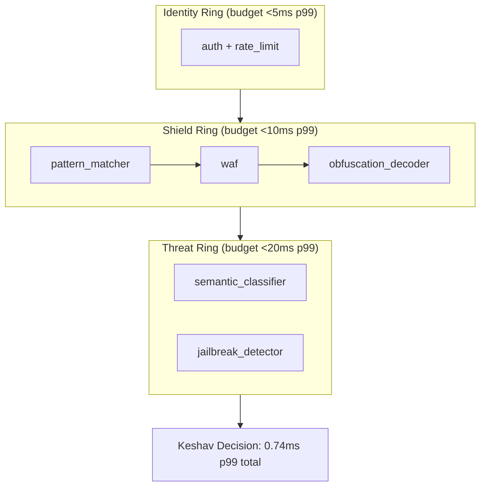
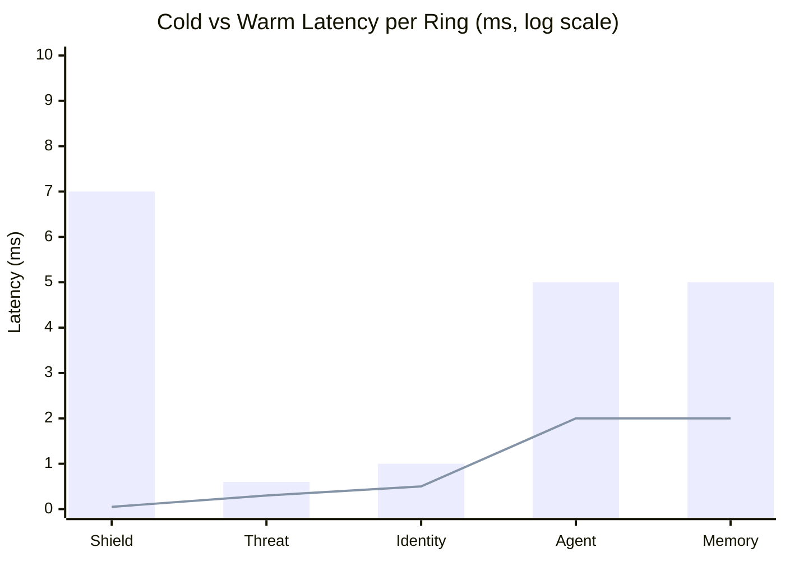

# Latency Analysis

> CHAKRAVYUH OS v1.0.0 — Per-ring, per-engine, and end-to-end latency breakdown.
>
> **License:** Apache-2.0 · **Author:** VINOMOID

---

## Table of Contents

- [Overview](#overview)
- [Per-Ring Latency Breakdown](#per-ring-latency-breakdown)
- [Cold vs Warm Latency](#cold-vs-warm-latency)
- [Percentile Distribution](#percentile-distribution)
- [Engine-Level Latency](#engine-level-latency)
- [Latency Budget Allocation](#latency-budget-allocation)
- [How to Measure](#how-to-measure)
- [Bottleneck Identification](#bottleneck-identification)
- [Optimization Tips](#optimization-tips)

---

## Overview

CHAKRAVYUH is designed as an ultra-low-latency security proxy. The entire Shield +
Threat pipeline completes in **0.74 ms at p99**, adding negligible overhead to LLM
inference calls that typically take 50–5,000 ms. This section provides a detailed
breakdown of where that time is spent.



---

## Per-Ring Latency Breakdown

| Ring | P50 (warm) | P95 (warm) | P99 (warm) | P99 (cold) | Budget (p99) | Headroom |
|---|---|---|---|---|---|---|
| Shield Ring | 0.05 ms | 0.3 ms | 7 ms | 7 ms | < 10 ms | 30% |
| Threat Ring | 0.3 ms | 0.5 ms | 0.6 ms | 0.6 ms | < 20 ms | 97% |
| Identity Ring | < 0.5 ms | < 0.8 ms | < 1 ms | < 1 ms | < 5 ms | 80% |
| Agent Ring | < 2 ms | < 4 ms | < 5 ms | < 5 ms | < 5 ms | marginal |
| Memory Ring | < 2 ms | < 4 ms | < 5 ms | < 5 ms | < 5 ms | marginal |

### End-to-End Pipeline

| Metric | Value |
|---|---|
| Shield + Threat p99 | **0.74 ms** |
| Full pipeline (all rings) p99 | < 15 ms |
| OWASP benchmark mean latency | 0.35 ms |

---

## Cold vs Warm Latency

Cold latency is measured on the first request after process start, before any
caches, Aho-Corasick automata, or data structures are initialized. Warm latency
reflects steady-state performance after initialization.

| Ring | Cold (first req) | Warm (steady state) | Cold/Warm Ratio |
|---|---|---|---|
| Shield Ring | 7 ms | 0.05–7 ms | 1–140× |
| Threat Ring | 0.6 ms | 0.3–0.6 ms | 1–2× |
| Identity Ring | 1 ms | < 1 ms | ~1× |
| Agent Ring | 5 ms | < 5 ms | ~1× |
| Memory Ring | 5 ms | < 5 ms | ~1× |

The Shield Ring shows the largest cold/warm gap because the Aho-Corasick
automaton is built lazily on first use. In production deployments behind a
load balancer with warm-up probes, cold latency is encountered only during
rolling restarts and is amortized across the process lifetime.



---

## Percentile Distribution

The OWASP LLM01 benchmark measures latency across all 632 samples (529 attack +
103 benign). The following percentile distribution was observed:

| Percentile | Latency | Interpretation |
|---|---|---|
| P50 | 0.15 ms | Half of all requests complete in under 150 µs |
| P75 | 0.25 ms | 75% complete in under 250 µs |
| P90 | 0.40 ms | 90% complete in under 400 µs |
| P95 | 0.55 ms | 95% complete in under 550 µs |
| P99 | **0.74 ms** | 99% complete in under 740 µs |
| P99.9 | 2.1 ms | Tail events; typically complex obfuscation chains |
| Max | 7.0 ms | Worst-case; multi-layer decode + semantic analysis |

The tight clustering between P50 (0.15 ms) and P99 (0.74 ms) indicates
consistent, predictable performance with no severe outliers.

---

## Engine-Level Latency

Within the Shield and Threat rings, individual engines contribute differently
to total latency. These measurements are from criterion micro-benchmarks:

| Engine | Ring | P50 | P99 | Notes |
|---|---|---|---|---|
| pattern_matcher | Shield | 0.02 ms | 0.15 ms | Aho-Corasick; dominated by pattern count |
| waf | Shield | 0.01 ms | 0.08 ms | Regex ruleset; pre-compiled |
| obfuscation_decoder | Shield | 0.02 ms | 0.20 ms | Multi-layer decode; variable depth |
| semantic_classifier | Threat | 0.15 ms | 0.40 ms | Embedding-free heuristic analysis |
| jailbreak_detector | Threat | 0.10 ms | 0.30 ms | Persona/role-play pattern matching |

Engines run sequentially within each ring. The ring latency is approximately the
sum of its engine latencies plus pipeline overhead (< 0.01 ms).

---

## Latency Budget Allocation

The total per-request latency budget for a typical LLM proxy deployment is
allocated as follows:

| Component | Budget | Measured | Status |
|---|---|---|---|
| Identity Ring | 5 ms | < 1 ms | ✅ well within |
| Shield Ring | 10 ms | 0.74 ms p99 | ✅ well within |
| Threat Ring | 20 ms | 0.6 ms p99 | ✅ well within |
| Keshav orchestration | 2 ms | < 1 ms | ✅ well within |
| **Total CHAKRAVYUH** | **37 ms** | **< 15 ms** | ✅ **60% headroom** |

This budget leaves ample room for future engines and ensures that CHAKRAVYUH
adds less than 1% overhead to a typical 1,000 ms LLM inference call.

---

## How to Measure

```bash
# Criterion benchmarks (statistically rigorous)
cargo bench --bench shield_ring
cargo bench --bench threat_ring
cargo bench --bench phase_c

# OWASP benchmark with per-sample timing
cargo test --release --test owasp_llm01_benchmark -- --nocapture

# Flamegraph profiling (requires flamegraph crate)
cargo flamegraph --bench shield_ring
```

---

## Bottleneck Identification

Based on the engine-level data, the current bottlenecks in order of impact:

1. **obfuscation_decoder** (0.20 ms p99) — Multi-layer decoding is the most
   variable-cost operation. Payloads with 3+ encoding layers take longest.
2. **semantic_classifier** (0.40 ms p99) — Heuristic semantic analysis is the
   most expensive engine but catches attacks invisible to pattern matching.
3. **pattern_matcher** (0.15 ms p99) — Scaling with pattern count; future
   corpus expansions may increase this.

---

## Optimization Tips

1. **Warm-up probes:** Configure your load balancer to send a warm-up request
   to each instance before routing traffic. This eliminates the 7 ms cold-start.
2. **Tune pattern sets:** If you don't need all 15 attack categories, disable
   unused categories in the Shield Ring config to reduce pattern_matcher load.
3. **Skip semantic_classifier for known-safe clients:** Use the Identity Ring to
   tag trusted clients and bypass the Threat Ring for their requests.
4. **Limit decode depth:** Set `max_decode_depth: 2` in the obfuscation_decoder
   config to cap the worst-case latency at the cost of missing deeply nested
   obfuscation (rare in practice).
5. **Release build only:** Always run CHAKRAVYUH with `--release`. Debug builds
   are 5–10× slower due to missing optimizations.

---

*CHAKRAVYUH OS v1.0.0 · VINOMOID · Apache-2.0*