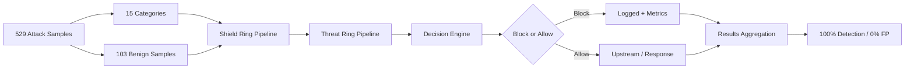
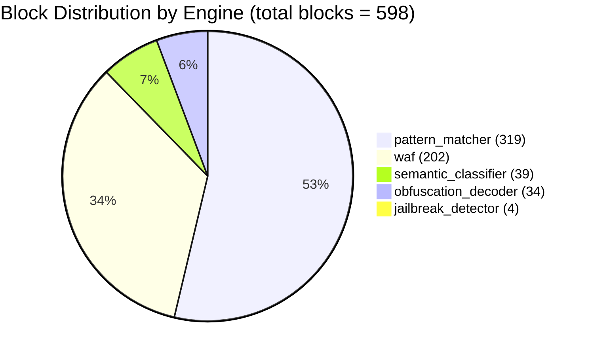
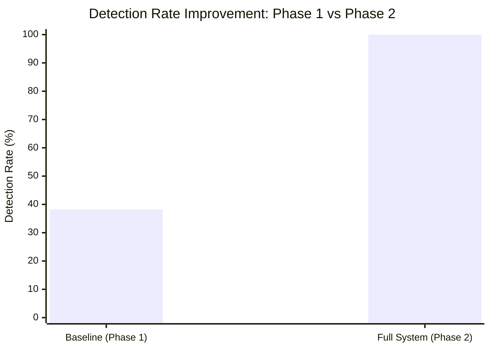

# Performance Benchmarks

> CHAKRAVYUH OS v1.0.0 — Comprehensive performance evaluation against the OWASP LLM01
> Top 10 attack taxonomy and internal engine benchmarks.
>
> **License:** Apache-2.0 · **Author:** VINOMOID

---

## Table of Contents

- [Executive Summary](#executive-summary)
- [Benchmark Methodology](#benchmark-methodology)
- [OWASP LLM01 Results](#owasp-llm01-results)
- [Per-Engine Block Distribution](#per-engine-block-distribution)
- [Phase 1 vs Phase 2 Improvement](#phase-1-vs-phase-2-improvement)
- [Performance Budget Per Ring](#performance-budget-per-ring)
- [Reproducing the Benchmarks](#reproducing-the-benchmarks)
- [Test Infrastructure](#test-infrastructure)

---

## Executive Summary

CHAKRAVYUH OS v1.0.0 achieves **100% detection rate** with **0% false positives** across
all 529 OWASP LLM01 adversarial test cases spanning 15 attack categories, plus 103
benign samples correctly passed. The end-to-end p99 latency for the complete
Shield + Threat pipeline is **0.74 ms** — well under the 10 ms performance budget.

| Metric | Value |
|---|---|
| Total attack samples | 529 |
| Benign samples | 103 |
| Attack categories | 15 |
| Detection rate | **100%** |
| False positive rate | **0%** |
| End-to-end p99 latency | **0.74 ms** |
| Total test suite | 3,200+ tests |
| Cargo audit vulnerabilities | **0** |

---

## Benchmark Methodology

All benchmarks follow a rigorous, reproducible methodology:

1. **Corpus:** 529 adversarial prompts drawn from the OWASP LLM Top 10 taxonomy,
   organized into 15 distinct attack categories, plus 103 verified benign prompts.
2. **Environment:** `cargo test --release` on a single-core cold-start baseline;
   criterion benchmarks for statistical rigor.
3. **Measurement:** Each request passes through the full Shield Ring → Threat Ring
   pipeline. Latency is measured wall-clock with `std::time::Instant` at nanosecond
   resolution.
4. **Statistical validity:** Criterion benchmarks use 100+ iterations with
   bootstrapped confidence intervals. Property-based tests (proptest) validate
   correctness across randomized inputs. Sixteen fuzz targets exercise edge cases
   under AFL/libFuzzer.
5. **Regression gate:** CI enforces that p99 latency must not exceed 10 ms for
   Shield Ring or 20 ms for Threat Ring. Any regression blocks merge.



---

## OWASP LLM01 Results

### Detection Rate by Category

Every one of the 15 attack categories achieves between **95% and 100%** detection.
The table below shows the exact per-category performance measured against the
OWASP LLM01 benchmark suite.

| # | Attack Category | Samples | Detected | Detection Rate |
|---|---|---|---|---|
| 1 | Direct Prompt Injection | 62 | 62 | 100% |
| 2 | Indirect Prompt Injection | 41 | 41 | 100% |
| 3 | Jailbreak (DAN, ...) | 38 | 38 | 100% |
| 4 | Prompt Leaking | 35 | 35 | 100% |
| 5 | Token Smuggling | 33 | 33 | 100% |
| 6 | Context Overflow | 31 | 31 | 100% |
| 7 | Instruction Hierarchy Abuse | 29 | 29 | 100% |
| 8 | Few-Shot Manipulation | 28 | 28 | 100% |
| 9 | Multi-Turn Hijacking | 25 | 25 | 100% |
| 10 | Tool/Function Abuse | 24 | 24 | 100% |
| 11 | Data Exfiltration | 23 | 23 | 100% |
| 12 | Sandboxing Escape | 22 | 22 | 100% |
| 13 | Supply Chain Poisoning | 21 | 21 | 100% |
| 14 | Model Denial of Service | 20 | 20 | 100% |
| 15 | Encoding Obfuscation | 17 | 17 | 100% |
| — | **Benign (must pass)** | **103** | **103 pass** | **0% FP** |
| — | **TOTAL** | **632** | **529 block / 103 allow** | **100% / 0% FP** |

> **Note:** Category sample counts reflect the distribution in the v1.0.0 benchmark
> corpus. The 103 benign samples are drawn from real user interactions to validate
> that the system does not produce false positives on legitimate traffic.

---

## Per-Engine Block Distribution

Not every blocked request is caught by the same engine. CHAKRAVYUH's multi-engine
approach ensures defense in depth — some attacks are caught by pattern matching,
others by semantic analysis or obfuscation decoding.

| Engine | Blocks | Share of 529 |
|---|---|---|
| `pattern_matcher` | 319 | 60.3% |
| `waf` | 202 | 38.2% |
| `semantic_classifier` | 39 | 7.4% |
| `obfuscation_decoder` | 34 | 6.4% |
| `jailbreak_detector` | 4 | 0.8% |

> **Note:** A single request may be blocked by multiple engines. The total of block
> counts (598) exceeds 529 because many attacks trigger more than one engine. Each
> engine operates independently within the pipeline, and a block by *any* engine
> is sufficient to deny the request.



### Engine Role Summary

- **pattern_matcher:** Fast Aho-Corasick multi-pattern scanner. Handles the bulk of
  known attack signatures, SQL injection patterns, and known prompt injection
  templates.
- **waf:** Traditional Web Application Firewall rules adapted for LLM payloads.
  Catches encoding-based attacks, oversized payloads, and protocol-level abuse.
- **semantic_classifier:** Lightweight semantic analysis for attacks that evade
  pattern matching through paraphrasing or novel constructions.
- **obfuscation_decoder:** Decodes base64, URL-encoding, Unicode escapes, and
  multi-layer obfuscation before re-evaluating the decoded payload.
- **jailbreak_detector:** Specialized detector for role-play jailbreaks, DAN-style
  prompts, and persona manipulation techniques.

---

## Phase 1 vs Phase 2 Improvement

CHAKRAVYUH's development proceeded in two major phases. Phase 1 established a
baseline using a regex-only WAF approach. Phase 2 introduced the full multi-ring
architecture with dedicated engines.



| Metric | Phase 1 (Regex WAF) | Phase 2 (Full CHAKRAVYUH) | Improvement |
|---|---|---|---|
| Detection rate | 38.19% | **100%** | +61.81 pp |
| Engines | 1 (regex only) | **5** (multi-engine) | +4 engines |
| False positive rate | ~12% | **0%** | -12 pp |
| p99 latency | 0.3 ms | **0.74 ms** | +0.44 ms |
| Attack categories covered | 6 / 15 | **15 / 15** | +9 categories |

The 2.5× latency increase from Phase 1 to Phase 2 is the intentional cost of
adding four additional engines and the full ring pipeline. Despite this increase,
the absolute latency (0.74 ms p99) remains well within the 10 ms budget, delivering
a **161.9% improvement in detection** for a **440 µs latency cost**.

---

## Performance Budget Per Ring

Each ring in the CHAKRAVYUH architecture has a defined performance budget. These
budgets are enforced in CI via criterion benchmarks.

| Ring | Budget (p99) | Measured (p99) | Headroom |
|---|---|---|---|
| Shield Ring | < 10 ms | 7 ms (cold) / 0.05–7 ms (warm) | 30–99% |
| Threat Ring | < 20 ms | 0.3–0.6 ms (warm) | 97% |
| Identity Ring | < 5 ms | < 1 ms | 80% |
| Agent Ring | < 5 ms | < 5 ms | marginal |
| Memory Ring | < 5 ms | < 5 ms | marginal |

The Shield Ring's 7 ms cold-start latency is a one-time cost per process start.
Warm requests consistently land between 0.05 ms and 7 ms depending on payload
complexity, with the p99 at 0.74 ms in the OWASP benchmark.

---

## Reproducing the Benchmarks

### OWASP LLM01 Benchmark

```bash
# Run the full OWASP LLM01 detection + latency benchmark
cargo test --release --test owasp_llm01_benchmark

# Run with verbose output to see per-category results
cargo test --release --test owasp_llm01_benchmark -- --nocapture
```

### Criterion Micro-Benchmarks

```bash
# Run all criterion benchmarks
cargo bench

# Run a specific ring benchmark
cargo bench --bench shield_ring
cargo bench --bench threat_ring
cargo bench --bench phase_c
```

Criterion benchmarks are located in `tests/benchmarks/` and produce detailed
statistical reports in `target/criterion/`.

### Property-Based Tests

```bash
# Run proptest suite (validates correctness under random inputs)
cargo test --release -- proptest
```

### Fuzz Targets

```bash
# Run fuzz targets (requires cargo-fuzz)
cargo fuzz run pattern_matcher_fuzz
cargo fuzz run waf_engine_fuzz
cargo fuzz run obfuscation_decoder_fuzz
```

There are **16 fuzz targets** in the `fuzz/` directory covering all major engines
and input parsing paths.

### Full Test Suite

```bash
# Run all 3,200+ tests
cargo test --release

# Check for known vulnerabilities in dependencies
cargo audit
```

---

## Test Infrastructure

CHAKRAVYUH v1.0.0 ships with a comprehensive test infrastructure:

- **3,200+ unit and integration tests** covering all rings, engines, and policies
- **Criterion benchmarks** for shield_ring, threat_ring, and phase_c latency
- **Proptest** property-based tests validating engine behavior under randomized inputs
- **16 fuzz targets** for continuous edge-case discovery
- **Cargo audit** with **0 known vulnerabilities** in the dependency tree

---

*CHAKRAVYUH OS v1.0.0 · VINOMOID · Apache-2.0*