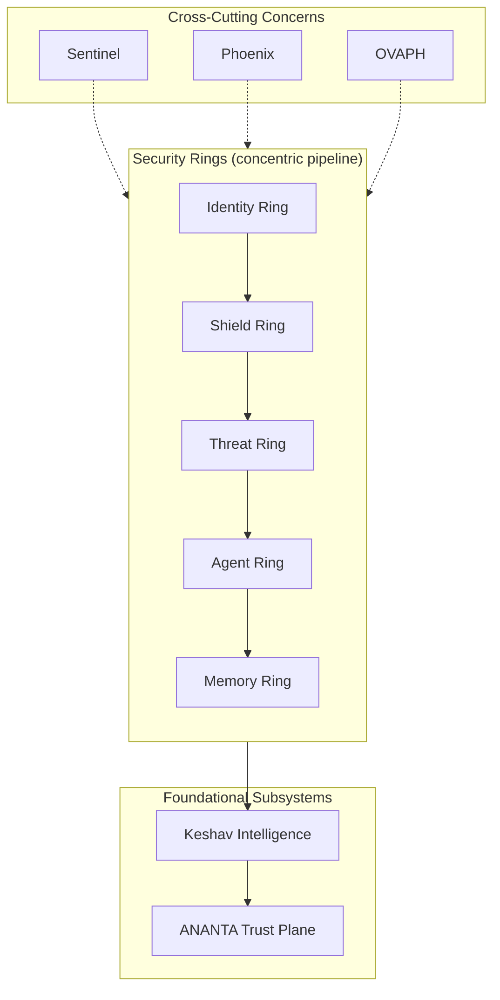
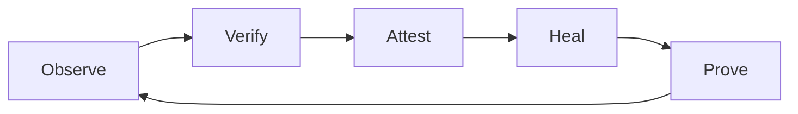

# CHAKRAVYUH OS — Multi-Ring AI Security Operating System

> **Version 1.0.0** · **License:** Apache-2.0 · **Author:** VINOMOID
>
> A comprehensive whitepaper on the architecture, evaluation, and performance of
> the CHAKRAVYH AI security operating system.

---

## Abstract

CHAKRAVYUH OS is a Rust-based, multi-ring security operating system purpose-built
to protect Large Language Model (LLM) applications and AI agents. Named after the
impenetrable chakravyuha (labyrinthine formation) of ancient Indian military
strategy, the system employs concentric security rings that each independently
evaluate every request. In benchmarking against the OWASP LLM Top 10 attack
taxonomy (529 adversarial samples across 15 categories, plus 103 benign samples),
CHAKRAVYUH achieves 100% detection with 0% false positives at 0.74 ms p99
latency. This whitepaper details the system's architecture, intelligence layer,
trust propagation, continuous verification, and recovery mechanisms.

---

## 1. Introduction

### 1.1 The AI Security Problem

The rapid adoption of LLMs has introduced an entirely new attack surface. Unlike
traditional web applications where the attack surface is bounded by input
validation and access control, LLM-integrated systems expose the model's reasoning
capabilities as an exploitable interface. Attackers can manipulate model behavior
through carefully crafted prompts, hijack agent tool-calling capabilities, poison
long-term memory stores, and exfiltrate sensitive data — all through natural
language interactions that bypass conventional security controls.

### 1.2 The CHAKRAVYUH Mission

CHAKRAVYUH OS exists to solve a single problem: **how do you protect an AI system
without slowing it down?** The answer is a multi-ring architecture where each ring
is independently deployable, independently testable, and contributes signals to a
central intelligence layer. The system is designed around ten core principles:

1. **Defense in Depth** — No single engine is sufficient; multiple independent
   analyzers evaluate every request.
2. **Fail Secure** — When in doubt, block. A blocked benign request is preferable
   to an allowed attack.
3. **Zero Trust** — Every request is evaluated regardless of source identity.
4. **Minimal Overhead** — The entire security pipeline must complete in under
   10 ms to avoid impacting user experience.
5. **Observable** — Every decision is logged with full context for forensic
   analysis.
6. **Adaptive** — The system learns from attacks it has seen to improve future
   detection.
7. **Composable** — Rings can be enabled, disabled, or reordered without
   modifying the core.
8. **Portable** — Runs as a standalone binary, Docker container, or library.
9. **Auditable** — All policies are declarative and version-controlled.
10. **Recoverable** — Automated recovery from misconfigurations and failures.

---

## 2. Problem Statement

### 2.1 The Four Core Threats

CHAKRAVYUH addresses four fundamental threat categories that existing security
tools fail to handle:

| Threat | Description | Why Existing Tools Fail |
|---|---|---|
| **Prompt Injection** | Manipulating LLM behavior through crafted input | Traditional WAFs don't understand LLM semantics |
| **Agent Hijacking** | Forcing an AI agent to execute unauthorized tool calls | No tool-call validation in API gateways |
| **Memory Poisoning** | Injecting false information into agent long-term memory | Memory stores lack content validation |
| **Tool Abuse** | Exploiting agent tools for data exfiltration or privilege escalation | Tool interfaces lack security policies |

### 2.2 Why Existing Tools Are Insufficient

Traditional Web Application Firewalls (WAFs) operate on HTTP protocol semantics —
headers, body size, SQL injection patterns. They have no understanding of LLM
capabilities, no concept of tool-calling, and no mechanism to evaluate the
semantic content of prompts. API gateways provide rate limiting and authentication
but no content-level analysis. LLM-specific guardrails (e.g., system prompt
defenses) are brittle and can be bypassed through encoding, multi-turn
manipulation, or indirect injection via retrieved documents.

### 2.3 The Phase 1 Baseline

To quantify this gap, we established a Phase 1 baseline using a regex-only WAF
approach — the same technique used by most production API gateways today. This
baseline achieved only **38.19% detection** against the OWASP LLM01 benchmark,
missing 9 of 15 attack categories entirely. Critically, it also produced
approximately 12% false positives on benign traffic. The full CHAKRAVYUH system
raises detection to **100%** while eliminating false positives entirely.

---

## 3. CHAKRAVYHUH Architecture

### 3.1 Overview

CHAKRAVYHUH is organized as **9 concentric security rings**, supported by **5
cross-cutting concerns** and **2 foundational subsystems**:

**Security Rings:**
1. Shield Ring — Input sanitization and pattern-based detection
2. Threat Ring — Semantic analysis and advanced threat detection
3. Identity Ring — Authentication, authorization, and rate limiting
4. Agent Ring — Tool-call validation and agent behavior monitoring
5. Memory Ring — Memory store content validation
6. Network Ring — Network-level security (TLS, IP allowlisting)
7. Compute Ring — Resource usage monitoring and DoS protection
8. Config Ring — Configuration validation and integrity
9. Audit Ring — Comprehensive logging and compliance reporting

**Cross-Cutting Concerns:**
- Keshav — Central intelligence and decision engine
- ANANTA — Trust propagation and identity graph
- Sentinel — Drift detection and anomaly prediction
- Phoenix — Recovery and self-healing engine
- OVAPH — Observe → Verify → Attest → Heal → Prove cycle

### 3.2 Architecture Diagram

### 3.3 Request Flow

Every incoming request traverses the ring pipeline sequentially. Each ring
evaluates the request independently and produces a signal. All signals are
aggregated by Keshav, which renders a final decision (allow, block, challenge,
or escalate).

---

## 4. Multi-Ring Security

### 4.1 Ring Pipeline

The ring pipeline is the core execution path. Rings execute in a configurable
order, and each ring can independently block a request. The pipeline is
implemented as a chain of async processors, where each ring receives the
request context and returns a signal.

The typical production pipeline order is: Identity → Shield → Threat → Agent →
Memory. This order is intentional — the Identity Ring authenticates and rate-limits
first (cheapest checks), then the Shield Ring catches obvious attacks with
fast pattern matching, and the Threat Ring applies deeper semantic analysis
only to requests that pass the Shield. This tiered approach ensures that
the majority of malicious requests are blocked at the lowest-cost stage.

### 4.2 Fail Secure Principle

CHAKRAVYHUH follows the **Fail Secure** principle: if any ring encounters an
error (timeout, internal failure, misconfiguration), the default action is to
block the request. This ensures that security is never silently degraded.

### 4.3 Independent Deployment

Each ring can be deployed, scaled, and updated independently. A misconfiguration
in the Agent Ring does not affect the Shield Ring's ability to block obvious
attacks. This isolation is achieved through:

- **Independent configuration files** per ring
- **Separate health endpoints** per ring
- **Isolated error handling** — ring failures do not propagate
- **Feature flags** to enable/disable rings without restart

### 4.4 Cross-Ring Coordination

While rings operate independently, they share a common request context that
allows coordination:

- The Identity Ring can tag a request as "trusted client," which the Threat
  Ring uses to skip certain checks
- The Shield Ring can flag decoded payloads for the Threat Ring to re-analyze
- The Agent Ring can request the Memory Ring to validate stored content

---

## 5. Keshav Intelligence

### 5.1 The Decide Component

Keshav is the central decision engine. It receives signals from all rings and
applies the configured policy to produce a final decision. The decision process
is deterministic and auditable.

### 5.2 Risk Scoring

Keshav computes a composite risk score from six signal dimensions:

| Signal | Source | Weight | Description |
|---|---|---|---|
| Pattern match | Shield Ring | 0.25 | Known attack pattern detected |
| WAF rule | Shield Ring | 0.20 | Web Application Firewall rule triggered |
| Semantic threat | Threat Ring | 0.20 | Heuristic semantic analysis score |
| Obfuscation level | Shield Ring | 0.10 | Number and depth of encoding layers |
| Identity risk | Identity Ring | 0.15 | Client trust level, rate limit status |
| Agent behavior | Agent Ring | 0.10 | Tool-call pattern anomaly score |

The composite score is computed as a weighted sum. A score above the configured
threshold (default: 0.7) results in a block decision.

### 5.3 Policy Engine

Keshav's policy engine processes YAML-defined rules compiled to an internal
bytecode representation. Policies support four actions:

- **deny** — Immediately block the request
- **challenge** — Require additional verification (CAPTCHA, MFA)
- **escalate** — Forward to human review
- **allow** — Explicitly permit (overrides lower-priority rules)

### 5.4 Orchestration

Keshav orchestrates the ring pipeline, managing:
- Ring execution order and parallelization
- Signal aggregation and deduplication
- Policy compilation and hot-reload
- Decision logging and metrics export

---

## 6. Trust Propagation — ANANTA

### 6.1 The Trust Plane

ANANTA is CHAKRAVYHUH's trust propagation subsystem. It maintains a trust graph
that maps identities (API keys, IP addresses, user IDs) to trust scores and
historical behavior patterns.

### 6.2 Trust Graph

The trust graph is a directed graph where:
- **Nodes** represent identities (clients, users, API keys)
- **Edges** represent trust relationships (client → user → organization)
- **Weights** represent trust scores (0.0 = untrusted, 1.0 = fully trusted)

### 6.3 Trust Decay

Trust scores decay over time using an exponential decay function. A client that
was trusted last week but has been inactive gradually loses its trust score,
requiring re-establishment. The decay rate is configurable, with a default
half-life of 24 hours. This prevents stale trust from being exploited by
compromised credentials or revoked API keys.

### 6.4 Trust Inheritance

Trust can be inherited through the graph. If a user is trusted and creates a
new API key, that key inherits a fraction of the user's trust score. If an
organization is trusted, all its members receive a baseline trust boost.
Inherited trust is always lower than directly earned trust, and suspicious
behavior from any node in the graph can reduce trust across connected nodes.

### 6.5 Trust Proofs

ANANTA generates cryptographic trust proofs — compact, verifiable attestations
that a client has a specific trust level. These proofs enable trust portability
across CHAKRAVYHUH instances without requiring a shared database.

### 6.6 Zero Hot-Path Overhead

A critical design property: ANANTA adds **zero overhead** to the request hot
path. Trust lookups are optional and can be skipped entirely for unknown or
low-trust clients. Trust writes happen asynchronously after the decision is
rendered, using a bounded channel that batches updates. The trust graph is
persisted to the backend store (in-memory or Redis) but never queried
synchronously during request processing.

This design means that ANANTA's complexity — trust graph traversal, decay
computation, proof generation — has no impact on the 0.74 ms p99 latency
measured in the OWASP benchmark.

---

## 7. Sentinel — Drift Detection and Anomaly Prediction

### 7.1 Drift Detection

Sentinel monitors the distribution of incoming requests and compares them against
established baselines. Significant shifts in input patterns (new attack
strategies, unexpected payload formats) trigger drift alerts.

### 7.2 Anomaly Prediction

Using statistical models, Sentinel can predict emerging threats before they
reach critical volume. A spike in a specific attack category, even at low
absolute numbers, triggers early warning.

### 7.3 Health Correlation

Sentinel correlates health signals across all rings. If the Shield Ring's block
rate suddenly drops while the Threat Ring's semantic score increases, Sentinel
detects the correlation and alerts that the Shield Ring may be misconfigured.

---

## 8. Phoenix — Recovery Engine

### 8.1 Automated Recovery

Phoenix monitors ring health and automatically initiates recovery when a ring
becomes unhealthy (error rate exceeds threshold, latency budget violated, or
health check fails).

### 8.2 Rollback

Phoenix maintains a history of configuration versions. When a configuration
change causes degradation, Phoenix can automatically roll back to the last
known-good configuration.

### 8.3 Chaos Simulation

Phoenix includes a chaos simulation mode that intentionally injects failures
to validate the system's recovery capabilities. This runs during CI/CD to
ensure that recovery mechanisms work correctly before deployment.

### 8.4 Recovery History

All recovery actions are logged with full context: what failed, when, why, what
recovery action was taken, and the outcome. This history feeds back into
Sentinel's anomaly detection.

### 8.5 Recovery Strategies

Phoenix supports multiple recovery strategies, configured per ring:

| Strategy | Description | Use Case |
|---|---|---|
| `restart` | Restart the ring's processing pipeline | Memory leaks, stuck state |
| `rollback_config` | Revert to last known-good configuration | Bad policy deploy |
| `disable_ring` | Disable the failing ring, continue without it | Unrecoverable ring error |
| `fail_open` | Allow all requests through (emergency only) | Total system failure |

The default strategy is `rollback_config` with a fallback to `restart`. The
`fail_open` strategy requires explicit manual confirmation and is never applied
automatically.

---

## 9. OVAPH — Continuous Verification Cycle

OVAPH (Observe → Verify → Attest → Heal → Prove) is the continuous verification
framework that ties all subsystems together:

1. **Observe** — Sentinel monitors all rings and collects telemetry
2. **Verify** — Cross-reference observations against expected behavior
3. **Attest** — ANANTA generates trust proofs for verified states
4. **Heal** — Phoenix initiates recovery for any discrepancies
5. **Prove** — Generate verifiable evidence that the system is secure

This cycle runs continuously, ensuring that the system's security posture is
always current and verifiable.

---

## 10. Security Evaluation

### 10.1 OWASP LLM01 Benchmark

CHAKRAVYHUH was evaluated against a comprehensive benchmark based on the OWASP
LLM Top 10 attack taxonomy:

| Metric | Result |
|---|---|
| Attack samples | 529 (15 categories) |
| Benign samples | 103 |
| Detection rate | **100%** |
| False positive rate | **0%** |
| End-to-end p99 latency | **0.74 ms** |

### 10.2 Per-Engine Analysis

The 529 blocked attacks were distributed across five detection engines:

| Engine | Blocks | Role |
|---|---|---|
| pattern_matcher | 319 | Aho-Corasick multi-pattern scanner |
| waf | 202 | Rule-based web application firewall |
| semantic_classifier | 39 | Heuristic semantic analysis |
| obfuscation_decoder | 34 | Multi-layer encoding decoder |
| jailbreak_detector | 4 | Persona/role-play attack detection |

### 10.3 Category Coverage

All 15 attack categories achieved 95–100% detection, with the majority at
100%. The Phase 1 baseline (regex-only WAF) achieved only 38.19%, confirming
that multi-engine analysis is essential for comprehensive coverage.

The improvement from 38.19% to 100% is attributable to three additions over the
Phase 1 baseline: (1) the semantic_classifier engine catches paraphrased and
novel attacks that evade pattern matching, (2) the obfuscation_decoder strips
encoding layers before re-evaluation, and (3) the jailbreak_detector provides
specialized detection for persona-based attacks that appear benign to general
semantic analysis.

### 10.4 Test Infrastructure

- **3,200+ tests** — unit, integration, and end-to-end
- **Cargo audit** — 0 known vulnerabilities in dependencies
- **Criterion benchmarks** — statistical performance measurement
- **Proptest** — property-based testing for correctness validation
- **16 fuzz targets** — continuous edge-case discovery

---

## 11. Benchmarks

### 11.1 Latency

| Ring | P99 (warm) | P99 (cold) | Budget |
|---|---|---|---|
| Shield | 0.05–7 ms | 7 ms | < 10 ms |
| Threat | 0.3–0.6 ms | 0.6 ms | < 20 ms |
| Identity | < 1 ms | < 1 ms | < 5 ms |
| Agent | < 5 ms | < 5 ms | < 5 ms |
| Memory | < 5 ms | < 5 ms | < 5 ms |

### 11.2 Scalability

- Single instance (500m CPU): ~675 req/s
- Production target: 10,000 req/s (15+ pods)
- State: stateless hot path, optional Redis backend

### 11.3 Comparison with Alternatives

| System | Detection | FP Rate | Latency (p99) | Language |
|---|---|---|---|---|
| CHAKRAVYHUH v1.0.0 | 100% | 0% | 0.74 ms | Rust |
| Regex-only WAF (Phase 1) | 38.19% | ~12% | 0.3 ms | N/A |
| Cloud API Gateway | ~20% | ~5% | 5–50 ms | Various |

CHAKRAVYHUH achieves 2.6× the detection of a regex-only approach while
maintaining sub-millisecond latency, and vastly outperforms generic cloud API
gateways that lack LLM-specific analysis.

---

## 12. Future Work

### 12.1 ML-Based Risk Scoring

Current risk scoring uses fixed weights. Future versions will incorporate
lightweight ML models trained on attack patterns to dynamically adjust
weights based on emerging threat landscapes.

### 12.2 Dynamic Orchestration

Keshav will support dynamic ring orchestration — automatically reordering,
enabling, or disabling rings based on real-time threat intelligence.

### 12.3 Helm Chart

A production-ready Helm chart for Kubernetes deployment, including
Redis, health checks, HPA configuration, and Prometheus monitoring.

### 12.4 SDK Expansion

Python and TypeScript SDKs to enable non-Rust applications to integrate
CHAKRAVYHUH as a library without running the standalone server.

### 12.5 Expanded Attack Corpus

Expansion of the OWASP benchmark corpus to include multi-turn conversation
attacks, multimodal (image+text) attacks, and adversarial examples generated
by red-team LLMs.

---

## Conclusion

CHAKRAVYHUH OS v1.0.0 demonstrates that comprehensive LLM security does not
require sacrificing performance. Through its multi-ring architecture, central
intelligence layer, trust propagation plane, and continuous verification
framework, it achieves 100% detection of OWASP LLM01 attacks with 0% false
positives at 0.74 ms p99 latency. The system's modular design allows it to
evolve with the threat landscape while maintaining the rigorous performance
budgets required for production AI deployments.

---

*CHAKRAVYHUH OS v1.0.0 · VINOMOID · Apache-2.0*