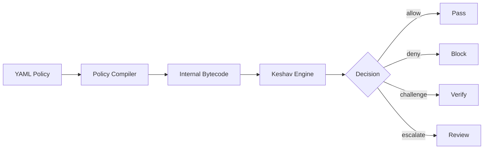

# Writing Custom Keshav Policies

> Define, compile, and hot-reload YAML security policies for CHAKRAVYHUH's
> Keshav decision engine.
>
> **License:** Apache-2.0 · **Author:** VINOMOID

---

## Table of Contents

- [Policy Overview](#policy-overview)
- [Rule Format](#rule-format)
- [Rule Types](#rule-types)
- [Conditions](#conditions)
- [Policy Compilation](#policy-compilation)
- [Hot-Reload](#hot-reload)
- [Policy Evaluation Flow](#policy-evaluation-flow)
- [Complete Examples](#complete-examples)

---

## Policy Overview

Keshav policies are YAML files that define how the decision engine interprets
ring signals. Policies are compiled to an internal bytecode representation at
load time, enabling fast evaluation without repeated YAML parsing.



Policies are evaluated in **priority order** (lowest number = highest priority).
The first matching rule wins.

---

## Rule Format

```yaml
# policies/default.yaml
version: "1.0"
name: default-policy

globals:
  risk_threshold: 0.7
  log_all_decisions: true

rules:
  - id: block-high-risk
    priority: 10
    action: deny
    description: "Block any request with risk score above 0.9"
    conditions:
      - type: risk_score
        operator: gte
        value: 0.9

  - id: challenge-medium-risk
    priority: 20
    action: challenge
    conditions:
      - type: risk_score
        operator: gte
        value: 0.5
        and:
          operator: lt
          value: 0.9

  - id: allow-trusted-client
    priority: 5
    action: allow
    conditions:
      - type: metadata
        field: trust_level
        operator: eq
        value: "high"
```

---

## Rule Types

Each rule specifies an `action` that determines the outcome:

| Action | Description | Use Case |
|---|---|---|
| `deny` | Immediately block the request | Known attack patterns, high risk |
| `challenge` | Require additional verification | Suspicious but ambiguous requests |
| `escalate` | Queue for human review | Novel attack patterns, edge cases |
| `allow` | Explicitly permit the request | Trusted clients, whitelisted paths |

### Action: deny

The request is blocked and the client receives a 403 response.

```yaml
- id: deny-sql-injection
  priority: 10
  action: deny
  description: "Block SQL injection attempts"
  conditions:
    - type: engine_signal
      ring: shield
      engine: waf
      field: rule_id
      operator: eq
      value: "sqli_detected"
```

### Action: challenge

The request is held pending additional verification (e.g., CAPTCHA, MFA).

```yaml
- id: challenge-new-device
  priority: 15
  action: challenge
  description: "Challenge requests from new devices"
  conditions:
    - type: metadata
      field: device_seen_before
      operator: eq
      value: false
```

### Action: escalate

The request is queued for human review but not immediately blocked.

```yaml
- id: escalate-novel-pattern
  priority: 25
  action: escalate
  description: "Escalate novel threat patterns"
  conditions:
    - type: risk_score
      operator: gte
      value: 0.4
    - type: engine_signal
      ring: threat
      engine: semantic_classifier
      field: novelty_score
      operator: gte
      value: 0.8
```

### Action: allow

Explicitly allow the request, overriding lower-priority deny rules.

```yaml
- id: allow-internal-services
  priority: 1
  action: allow
  description: "Allow all requests from internal services"
  conditions:
    - type: metadata
      field: source_network
      operator: in
      value: ["10.0.0.0/8", "172.16.0.0/12"]
```

---

## Conditions

Conditions define when a rule triggers. Multiple conditions within a rule
are AND-combined (all must match).

| Condition Type | Fields | Operators |
|---|---|---|
| `risk_score` | (none) | `eq`, `neq`, `gt`, `gte`, `lt`, `lte` |
| `engine_signal` | `ring`, `engine`, `field` | `eq`, `neq`, `contains` |
| `metadata` | `field` | `eq`, `neq`, `in`, `not_in`, `contains`, `regex` |
| `request` | `path`, `method`, `content_type` | `eq`, `regex`, `in` |
| `geo` | `country` | `eq`, `neq`, `in`, `not_in` |

### Operator Reference

| Operator | Meaning | Types |
|---|---|---|
| `eq` | Equal to | All |
| `neq` | Not equal to | All |
| `gt` | Greater than | Numeric |
| `gte` | Greater than or equal | Numeric |
| `lt` | Less than | Numeric |
| `lte` | Less than or equal | Numeric |
| `in` | In list | String, Geo |
| `not_in` | Not in list | String, Geo |
| `contains` | Substring match | String |
| `regex` | Regex match | String |

---

## Policy Compilation

When CHAKRAVYHUH loads a policy file, the YAML is compiled to an internal
bytecode representation:

1. **Parsing** — YAML is deserialized into an AST
2. **Validation** — Rules are checked for conflicts, cycles, and type errors
3. **Compilation** — The AST is compiled to bytecode with indexed condition
   lookups and jump tables for priority ordering
4. **Loading** — Bytecode is loaded into the Keshav engine, replacing the
   previous policy atomically

```bash
# Validate a policy file without loading it
chakravyuh policy validate --file policies/default.yaml

# Compile and check for errors
chakravyuh policy compile --file policies/default.yaml --output /dev/null
```

---

## Hot-Reload

Keshav supports hot-reloading policies without restarting the server:

```bash
# Send SIGHUP to reload policies
kill -HUP $(pgrep chakravyuh)

# Or use the admin API
curl -X POST http://localhost:8080/admin/reload-policies
```

The reload process is atomic: the new policy is compiled and loaded as a single
operation. If compilation fails, the current policy remains active.

Configuration:

```toml
[keshav]
policy_path = "policies/default.yaml"
watch_policy = true  # Auto-reload on file changes (dev mode)
```

> **Production note:** `watch_policy = true` uses filesystem watching and is
> intended for development. In production, use SIGHUP or the admin API.

---

## Policy Evaluation Flow

```mermaid
flowchart TD
    A[Incoming Request] --> B{Ring Signals}
    B --> C[Policy Rule 1
    Priority 5]
    C -->|match| D[Execute Action]
    C -->|no match| E[Policy Rule 2
    Priority 10]
    E -->|match| D
    E -->|no match| F[Policy Rule 3
    Priority 20]
    F -->|match| D
    F -->|no match| G[Default Action
    (block if risk > threshold)]
    G --> D
    D --> H{Action}
    H -->|allow| I[Pass Request]
    H -->|deny| J[403 Forbidden]
    H -->|challenge| K[401 + Verification]
    H -->|escalate| L[202 + Queue]
```

---

## Complete Examples

### Example 1: Healthcare Application

```yaml
version: "1.0"
name: healthcare-policy
globals:
  risk_threshold: 0.5  # Lower threshold for healthcare

rules:
  - id: deny-all-phi-extraction
    priority: 5
    action: deny
    description: "Block attempts to extract patient health information"
    conditions:
      - type: risk_score
        operator: gte
        value: 0.4
      - type: metadata
        field: contains_phi
        operator: eq
        value: true

  - id: allow-verified-clinician
    priority: 1
    action: allow
    conditions:
      - type: metadata
        field: role
        operator: eq
        value: "clinician"
      - type: metadata
        field: mfa_verified
        operator: eq
        value: true
```

### Example 2: E-Commerce Chatbot

```yaml
version: "1.0"
name: ecommerce-policy

rules:
  - id: deny-price-manipulation
    priority: 10
    action: deny
    conditions:
      - type: engine_signal
        ring: threat
        engine: semantic_classifier
        field: category
        operator: eq
        value: "instruction_hierarchy_abuse"

  - id: deny-data-exfiltration
    priority: 10
    action: deny
    conditions:
      - type: engine_signal
        ring: shield
        engine: pattern_matcher
        field: category
        operator: eq
        value: "data_exfiltration"

  - id: challenge-rapid-requests
    priority: 20
    action: challenge
    conditions:
      - type: metadata
        field: requests_last_minute
        operator: gt
        value: 30
```

---

*CHAKRAVYHUH OS v1.0.0 · VINOMOID · Apache-2.0*