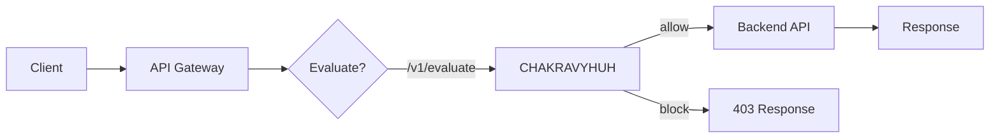

# Protecting REST APIs with CHAKRAVYUH

> Integrate CHAKRAVYHUH's `/v1/evaluate` endpoint into any API gateway or backend.
>
> **License:** Apache-2.0 · **Author:** VINOMOID

---

## Table of Contents

- [When to Use Evaluate Mode](#when-to-use-evaluate-mode)
- [Integration Patterns](#integration-patterns)
- [Evaluate Request Format](#evaluate-request-format)
- [Evaluate Response Format](#evaluate-response-format)
- [Source IP Forwarding](#source-ip-forwarding)
- [Rate Limiting Per Client](#rate-limiting-per-client)
- [WAF Rules](#waf-rules)
- [Geo Fencing](#geo-fencing)
- [Bot Detection](#bot-detection)
- [Full Integration Example](#full-integration-example)

---

## When to Use Evaluate Mode

Use `/v1/evaluate` (instead of `/v1/proxy`) when:

- Your backend is not LLM-based (e.g., traditional REST API, GraphQL, gRPC)
- You need to integrate CHAKRAVYHUH into an existing API gateway (Kong, Traefik, NGINX)
- You want to evaluate arbitrary text payloads, not just chat completions
- You need fine-grained control over how decisions are handled



---

## Integration Patterns

### Pattern A: Gateway Plugin

Your API gateway calls CHAKRAVYHUH before forwarding to the backend. This is
the simplest integration and works with Kong, Traefik, or any gateway that
supports external auth/evaluation.

```bash
# Gateway forwards request body to CHAKRAVYHUH
RESPONSE=$(curl -s -X POST http://chakravyuh:8080/v1/evaluate \
  -H "Content-Type: application/json" \
  -d '{"prompt":"$REQUEST_BODY","metadata":{"source_ip":"$CLIENT_IP"}}')

DECISION=$(echo $RESPONSE | jq -r .decision)
if [ "$DECISION" != "allow" ]; then
  # Return 403
  exit 1
fi
# Forward to backend
```

### Pattern B: Sidecar

CHAKRAVYHUH runs as a sidecar container alongside your API. Your application
calls `/v1/evaluate` internally before processing the request.

### Pattern C: Inline Library

Use CHAKRAVYHUH as a Rust library and call `chakravyuh.evaluate()` directly
in your request handler.

---

## Evaluate Request Format

```json
{
  "prompt": "The text content to evaluate",
  "metadata": {
    "source_ip": "203.0.113.50",
    "user_id": "user_abc",
    "user_agent": "Mozilla/5.0...",
    "endpoint": "/api/v1/search",
    "method": "POST",
    "api_key_id": "key_xyz"
  }
}
```

The `prompt` field accepts any text content — it does not need to be an LLM
prompt. For traditional APIs, pass the request body, query parameters, or any
text that should be screened for threats.

---

## Evaluate Response Format

```json
{
  "decision": "block",
  "risk_score": 0.85,
  "signals": {
    "shield": { "blocked": true, "engine": "waf" },
    "threat": { "blocked": false, "engine": null }
  },
  "reason": "sql_injection_detected",
  "request_id": "req_7f3a1b",
  "latency_ms": 0.09
}
```

| Field | Type | Description |
|---|---|---|
| `decision` | string | `allow`, `block`, `challenge`, or `escalate` |
| `risk_score` | float | 0.0 (safe) to 1.0 (dangerous) |
| `signals.shield.blocked` | bool | Whether the Shield Ring blocked |
| `signals.threat.blocked` | bool | Whether the Threat Ring blocked |
| `reason` | string | Human-readable reason for the decision |
| `request_id` | string | Unique identifier for logging/correlation |
| `latency_ms` | float | Total evaluation time in milliseconds |

---

## Source IP Forwarding

When CHAKRAVYHUH is behind a reverse proxy or load balancer, configure IP
forwarding so the Identity Ring sees the real client IP:

```toml
[identity]
enabled = true
real_ip_header = "X-Forwarded-For"
# Alternatives: "X-Real-IP", "CF-Connecting-IP" (Cloudflare)
```

Configure your load balancer to pass the client IP:

```nginx
# NGINX example
proxy_set_header X-Forwarded-For $remote_addr;
```

---

## Rate Limiting Per Client

The Identity Ring supports rate limiting per client identifier:

```toml
[identity]
enabled = true
rate_limit = { requests = 100, window_secs = 60 }
rate_limit_by = "ip"  # or "api_key", "user_id"
```

| `rate_limit_by` | Description |
|---|---|
| `ip` | Rate limit by source IP address |
| `api_key` | Rate limit by API key ID (from metadata) |
| `user_id` | Rate limit by user ID (from metadata) |

When a client exceeds the rate limit, the evaluate endpoint returns:

```json
{
  "decision": "block",
  "risk_score": 1.0,
  "reason": "rate_limit_exceeded",
  "retry_after_secs": 45
}
```

---

## WAF Rules

The Shield Ring's WAF engine applies traditional web security rules. These are
effective against SQL injection, XSS, and path traversal in API inputs:

```toml
[shields]
enabled = true
engines = ["pattern_matcher", "waf"]

[shields.waf_config]
ruleset = "owasp_crs"  # or "custom"
max_body_size_bytes = 1048576  # 1 MB
block_on_missing_content_type = true
```

The WAF engine blocks 202 of 529 OWASP LLM01 attacks, handling encoding-based
attacks and protocol-level abuse that semantic engines might miss.

---

## Geo Fencing

Restrict access by geographic region using the Identity Ring:

```toml
[identity]
enabled = true
geo_allow = ["US", "CA", "GB", "DE", "JP"]
geo_block = ["KP", "IR"]
geo_db_path = "/etc/chakravyuh/GeoLite2-Country.mmdb"
```

Clients from blocked countries receive an immediate block at the Identity Ring,
before any engine processing occurs.

---

## Bot Detection

CHAKRAVYHUH provides basic bot detection at the Identity Ring:

```toml
[identity]
enabled = true
bot_detection = true
known_bots_allowlist = ["Googlebot", "Bingbot", "Slackbot"]
```

Bot detection heuristics include:
- Known bot user-agent patterns
- Missing or suspicious `User-Agent` headers
- Request patterns consistent with automated tools (uniform timing, no referer)

Detected bots that are not on the allowlist are challenged or blocked based on
policy configuration.

---

## Full Integration Example

A complete example of protecting a REST API using the evaluate endpoint:

```rust
use chakravyuh::{Chakravyuh, Config, EvaluateRequest, EvaluateResponse};
use axum::{Json, extract::State, http::StatusCode};
use serde::{Deserialize, Serialize};
use std::path::Path;

#[derive(Deserialize)]
struct ApiRequest {
    query: String,
}

#[derive(Serialize)]
struct ApiResponse {
    result: String,
}

async fn handle_search(
    State(cv): State<Chakravyuh>,
    Json(req): Json<ApiRequest>,
) -> Result<Json<ApiResponse>, StatusCode> {
    // Evaluate the query with CHAKRAVYHUH
    let result = cv.evaluate(EvaluateRequest {
        prompt: req.query.clone(),
        metadata: Default::default(),
    }).await.map_err(|_| StatusCode::INTERNAL_SERVER_ERROR)?;

    match result.decision.as_str() {
        "allow" => {
            // Process the request normally
            Ok(Json(ApiResponse {
                result: format!("Results for: {}", req.query),
            }))
        }
        "block" => Err(StatusCode::FORBIDDEN),
        "challenge" => Err(StatusCode::UNAUTHORIZED),
        _ => Err(StatusCode::FORBIDDEN),
    }
}
```

---

*CHAKRAVYHUH OS v1.0.0 · VINOMOID · Apache-2.0*